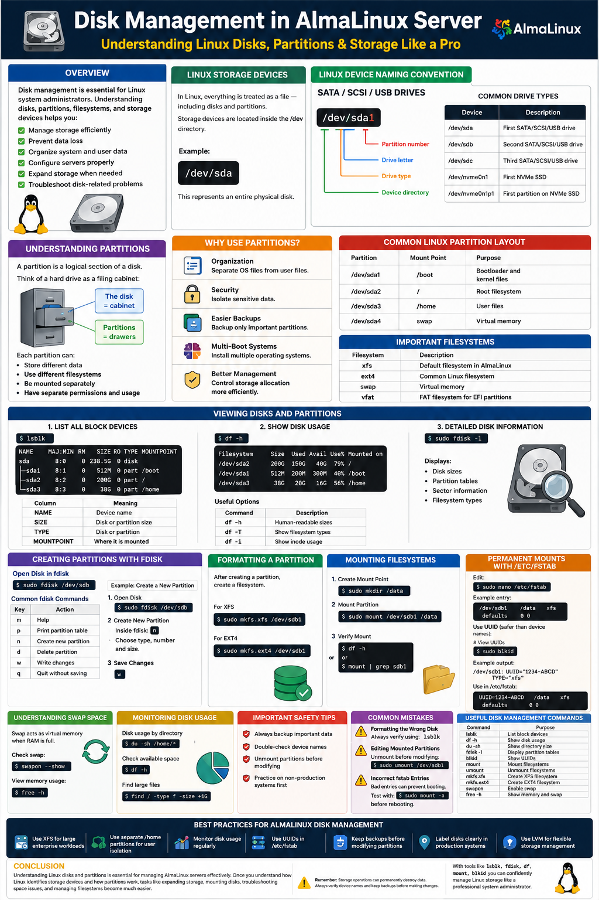
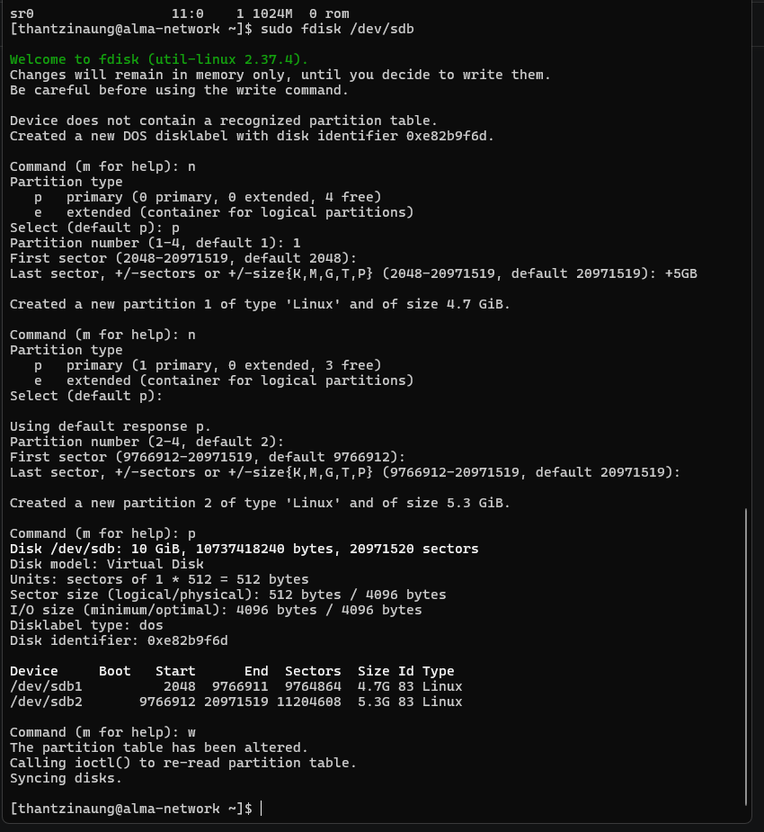
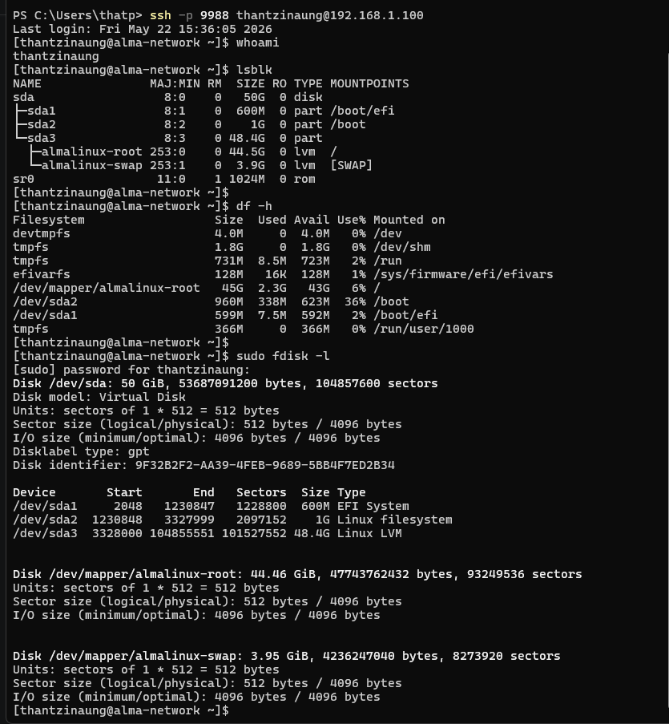
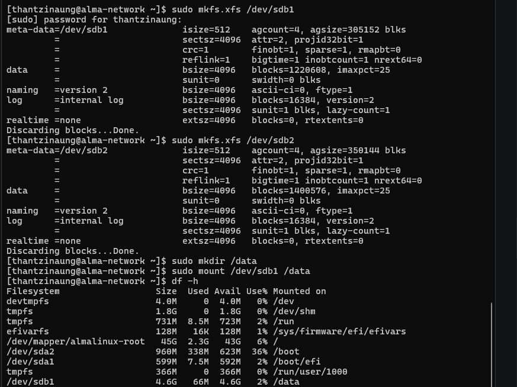

# Disk Management in AlmaLinux Server 💾

Ever wondered why your hard drive shows up as `/dev/sda` and what those numbers after it mean? Let’s dive into the world of Linux storage and decode the mystery of disks, partitions, and how Linux sees your storage devices.

---

# Overview

Disk management is one of the most important skills for Linux system administrators. In an AlmaLinux server environment, understanding disks, partitions, filesystems, and storage devices helps me:

- Manage storage efficiently
- Prevent data loss
- Organize system and user data
- Configure servers properly
- Expand storage when needed
- Troubleshoot disk-related problems

In this hands-on lab:

- Linux disk naming conventions
- Disk and partition structure
- Common partition layouts
- Viewing disks and partitions
- Filesystem concepts
- Mounting and unmounting storage
- Essential disk management commands
- Important safety precautions

---

# Understanding Linux Storage Devices

In Linux, everything is treated as a file — including disks and partitions.

Storage devices are located inside the `/dev` directory.

Example:

```bash
/dev/sda
```

This represents an entire physical disk.

---

# Linux Device Naming Convention

## SATA / SCSI / USB Drives

```bash
/dev/sda
```

### Breakdown

```text
/dev/sda1
│ │  │ │└── Partition number
│ │  │ └─── Drive letter
│ │  └──── Drive type
│ └───── Device directory
```

## Common Drive Types

| Device Type | Description |
|---|---|
| `/dev/sda` | First SATA/SCSI/USB drive |
| `/dev/sdb` | Second SATA/SCSI/USB drive |
| `/dev/sdc` | Third SATA/SCSI/USB drive |
| `/dev/nvme0n1` | First NVMe SSD |
| `/dev/nvme0n1p1` | First partition on NVMe SSD |

---

# Understanding Partitions 🗂

A partition is a logical section of a disk.

Think of a hard drive as a filing cabinet:

- The disk = cabinet
- Partitions = drawers

Each partition can:

- Store different data
- Use different filesystems
- Be mounted separately
- Have separate permissions and usage

---

# Why Use Partitions?

## Organization

Separate operating system files from user files.

## Security

Isolate sensitive data.

## Easier Backups

Backup only important partitions.

## Multi-Boot Systems

Install multiple operating systems.

## Better Management

Control storage allocation more efficiently.

---

# Common Linux Partition Layout

| Partition | Mount Point | Purpose |
|---|---|---|
| `/dev/sda1` | `/boot` | Bootloader and kernel files |
| `/dev/sda2` | `/` | Root filesystem |
| `/dev/sda3` | `/home` | User files |
| `/dev/sda4` | `swap` | Virtual memory |

---

# Important Filesystems in Linux

| Filesystem | Description |
|---|---|
| `xfs` | Default filesystem in AlmaLinux |
| `ext4` | Common Linux filesystem |
| `swap` | Virtual memory |
| `vfat` | FAT filesystem for EFI partitions |

---

# Viewing Disks and Partitions 🔍

## 1. List All Block Devices

Use:

```bash
lsblk
```

Example output:

```text
NAME        MAJ:MIN RM   SIZE RO TYPE MOUNTPOINT
sda           8:0    0 238.5G  0 disk
├─sda1        8:1    0   512M  0 part /boot
├─sda2        8:2    0   200G  0 part /
└─sda3        8:3    0    38G  0 part /home
```

### Explanation

| Column | Meaning |
|---|---|
| `NAME` | Device name |
| `SIZE` | Disk or partition size |
| `TYPE` | Disk or partition |
| `MOUNTPOINT` | Where it is mounted |

---

## 2. Show Disk Usage

Use:

```bash
df -h
```

Example:

```text
Filesystem      Size  Used Avail Use% Mounted on
/dev/sda2       200G  150G   40G  79% /
/dev/sda1       512M  200M  300M  40% /boot
/dev/sda3        38G   20G   16G  56% /home
```

### Useful Options

| Command | Description |
|---|---|
| `df -h` | Human-readable sizes |
| `df -T` | Show filesystem types |
| `df -i` | Show inode usage |

---

## 3. Detailed Disk Information

Use:

```bash
sudo fdisk -l
```

This command displays:

- Disk sizes
- Partition tables
- Sector information
- Filesystem types

---

# Creating Partitions with fdisk

## Open Disk in fdisk

Example:

```bash
sudo fdisk /dev/sdb
```

## Common fdisk Commands

| Key | Action |
|---|---|
| `m` | Help |
| `p` | Print partition table |
| `n` | Create new partition |
| `d` | Delete partition |
| `w` | Write changes |
| `q` | Quit without saving |

---

## Example: Create a New Partition

### Step 1 — Open Disk

```bash
sudo fdisk /dev/sdb
```

### Step 2 — Create New Partition

Inside fdisk:

```bash
n
```

Choose:

- Partition type
- Partition number
- Size

### Step 3 — Save Changes

```bash
w
```

---

# Formatting a Partition

After creating a partition, create a filesystem.

Example:

```bash
sudo mkfs.xfs /dev/sdb1
sudo mkfs.xfs /dev/sdb2
```

For ext4:

```bash
sudo mkfs.ext4 /dev/sdb1
sudo mkfs.ext4 /dev/sdb2
```

---

# Mounting Filesystems

## Create Mount Point

```bash
sudo mkdir /data
```

## Mount Partition

```bash
sudo mount /dev/sdb1 /data
```

## Verify Mount

```bash
df -h
```

or

```bash
mount | grep sdb1
```

---

# Permanent Mounts with /etc/fstab

To automatically mount storage after reboot:

Edit:

```bash
sudo nano /etc/fstab
```

Example entry:

```text
/dev/sdb1   /data   xfs   defaults   0 0
```
| Option | Meaning |
|---|---|
| /dev/sda1 | Device (or) set mount which partition/disk |
| /data | Mount Point (or) add folder |
| xfs | File System Type |
| defaults | Mount Option (or) set defaults for read & write permission |
| 0 | dump (or) no backup |
| 0 | FSCK (or) no check disk error when os boot |


# Verify
```bash
sudo mount -a
```

---

# Understanding Swap Space

Swap acts as virtual memory when RAM is full.

Check swap:

```bash
swapon --show
```

View memory usage:

```bash
free -h
```

---

# Checking Filesystem UUIDs (Universally Unique Identifier)

UUIDs are safer than device names because device names can change.

View UUIDs:

```bash
sudo blkid
```

Example:

```text
/ dev/sdb1: UUID="1234-ABCD" TYPE="xfs"
```

Use UUID in `/etc/fstab`:

```text
UUID=1234-ABCD   /data   xfs   defaults   0 0
```

---

# Monitoring Disk Usage

## Disk Usage by Directory

```bash
du -sh /home/*
```

## Check Available Space

```bash
df -h
```

## Find Large Files

```bash
find / -type f -size +1G
```

---

# Important Safety Tips ⚠

## Before Partitioning

- Always backup important data
- Double-check device names
- Unmount partitions before modifying
- Practice on non-production systems first

---

## Common Mistakes

### Formatting the Wrong Disk

Always verify using:

```bash
lsblk
```

### Editing Mounted Partitions

Unmount before modifying:

```bash
sudo umount /dev/sdb1
```

### Incorrect fstab Entries

Bad entries can prevent booting.

Test with:

```bash
sudo mount -a
```

before rebooting.

---

# Useful Disk Management Commands

| Command | Purpose |
|---|---|
| `lsblk` | List block devices |
| `df -h` | Show disk usage |
| `du -sh` | Show directory size |
| `fdisk -l` | Display partition tables |
| `blkid` | Show UUIDs |
| `mount` | Mount filesystems |
| `umount` | Unmount filesystems |
| `mkfs.xfs` | Create XFS filesystem |
| `mkfs.ext4` | Create EXT4 filesystem |
| `swapon` | Enable swap |
| `free -h` | Show memory and swap |

---

# Best Practices for AlmaLinux Disk Management

- Use XFS for large enterprise workloads
- Use separate `/home` partitions for user isolation
- Monitor disk usage regularly
- Use UUIDs in `/etc/fstab`
- Keep backups before modifying partitions
- Label disks clearly in production systems
- Use Logical Volume Manager (LVM) for flexible storage management

---

# Conclusion

Understanding Linux disks and partitions is essential for managing AlmaLinux servers effectively. Understand how Linux identifies storage devices and how partitions work, tasks like expanding storage, mounting disks, troubleshooting space issues, and managing filesystems become much easier.

With tools like:

- `lsblk`
- `fdisk`
- `df`
- `mount`
- `blkid`

you can confidently manage Linux storage like a professional system administrator.

## Remember

Storage operations can permanently destroy data. Always verify device names and keep backups before making changes.




