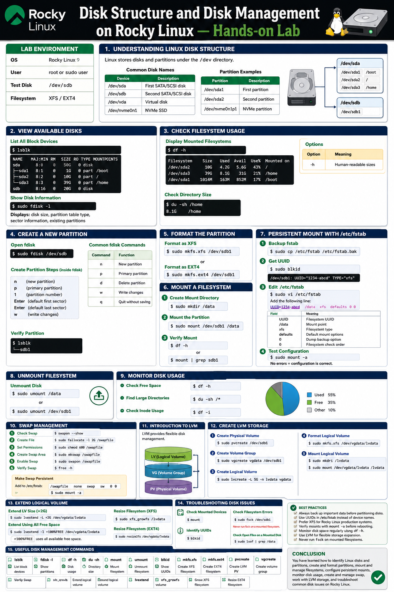
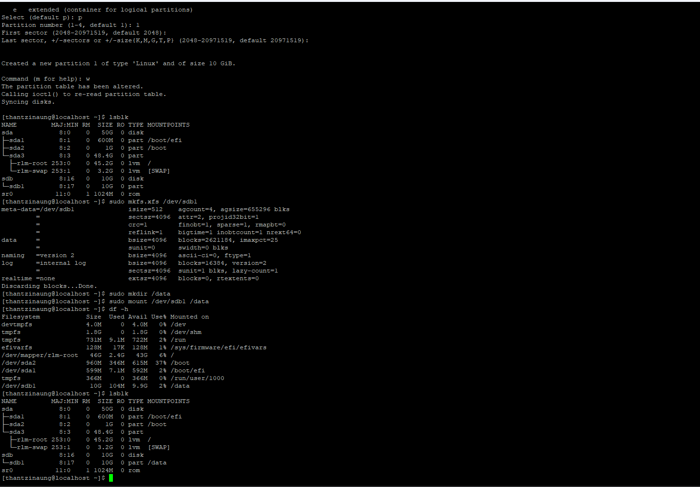
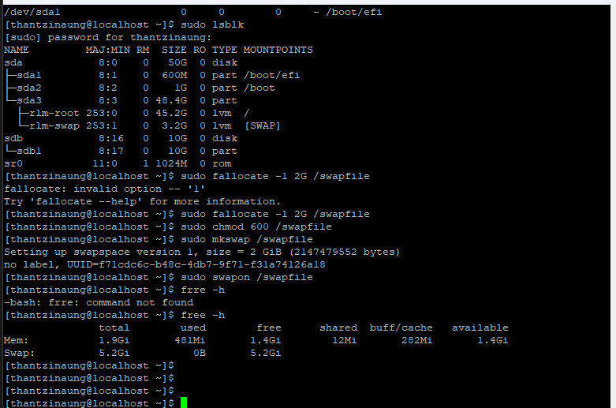
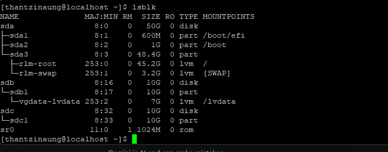
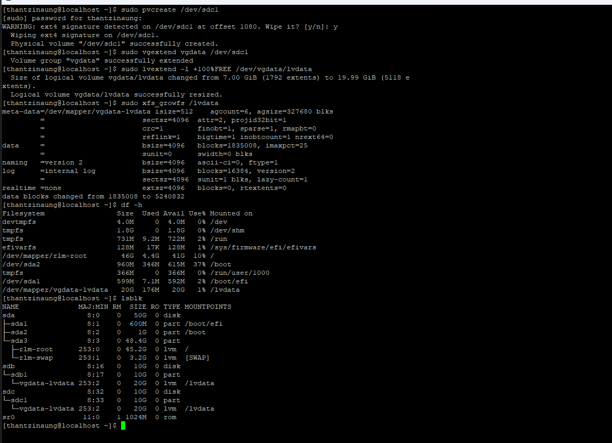

# Disk Structure and Disk Management on Rocky Linux — Hands-on Lab

## Overview

- Understanding Linux disk structure
- Viewing storage devices
- Creating partitions
- Formatting disks
- Mounting and unmounting filesystems
- Managing disk usage
- Working with `/etc/fstab`
- Basic LVM management
- Disk troubleshooting

---

# Lab Environment

| Component | Example |
|---|---|
| OS | Rocky Linux 9 |
| User | root or sudo user |
| Test Disk | `/dev/sdb` |
| Filesystem | XFS / EXT4 |

---

# 1. Understanding Linux Disk Structure

Linux stores disks and partitions under the `/dev` directory.

## Common Disk Names

| Device | Description |
|---|---|
| `/dev/sda` | First SATA/SCSI disk |
| `/dev/sdb` | Second SATA/SCSI disk |
| `/dev/vda` | Virtual disk |
| `/dev/nvme0n1` | NVMe SSD |

## Partition Examples

| Partition | Description |
|---|---|
| `/dev/sda1` | First partition |
| `/dev/sda2` | Second partition |
| `/dev/nvme0n1p1` | NVMe partition |

---

# 2. View Available Disks

## List All Block Devices

```bash
lsblk
```

Example Output:

```bash
NAME   MAJ:MIN RM  SIZE RO TYPE MOUNTPOINTS
sda      8:0    0   50G  0 disk
├─sda1   8:1    0    1G  0 part /boot
├─sda2   8:2    0   10G  0 part /
└─sda3   8:3    0   39G  0 part /home
sdb      8:16   0   20G  0 disk
```

---

## Show Disk Information

```bash
sudo fdisk -l
```

This command displays:

- Disk size
- Partition table type
- Sector information
- Existing partitions

---

# 3. Check Filesystem Usage

## Display Mounted Filesystems

```bash
df -h
```

Options:

| Option | Meaning |
|---|---|
| `-h` | Human-readable sizes |

---

## Check Directory Size

```bash
du -sh /home
```

---

# 4. Create a New Partition

> WARNING: Use a secondary disk such as `/dev/sdb` for practice.

## Open fdisk

```bash
sudo fdisk /dev/sdb
```

---

## Common fdisk Commands

| Command | Function |
|---|---|
| `n` | New partition |
| `p` | Primary partition |
| `d` | Delete partition |
| `w` | Write changes |
| `q` | Quit without saving |

---

## Create Partition Steps

Inside `fdisk`:

```text
n
p
1
Enter
Enter
w
```

---

## Verify Partition

```bash
lsblk
```

Example:

```bash
sdb
└─sdb1
```

---

# 5. Format the Partition

## Format as XFS

```bash
sudo mkfs.xfs /dev/sdb1
```

---

## Format as EXT4

```bash
sudo mkfs.ext4 /dev/sdb1
```

---

# 6. Mount a Filesystem

## Create Mount Directory

```bash
sudo mkdir /data
```

---

## Mount the Partition

```bash
sudo mount /dev/sdb1 /data
```

---

## Verify Mount

```bash
df -h
```

or

```bash
mount | grep sdb1
```

---

# 7. Persistent Mount with /etc/fstab

Without configuration, mounts disappear after reboot.

## Backup fstab

```bash
sudo cp /etc/fstab /etc/fstab.bak
```

---

## Get UUID

```bash
sudo blkid
```

Example:

```bash
/dev/sdb1: UUID="1234-abcd" TYPE="xfs"
```

---

## Edit fstab

```bash
sudo vi /etc/fstab
```

Add:

```bash
UUID=1234-abcd  /data  xfs  defaults  0 0
```

---

## Test Configuration

```bash
sudo mount -a
```

If no errors appear, configuration is correct.

---

# 8. Unmount Filesystem

## Unmount Disk

```bash
sudo umount /data
```

or

```bash
sudo umount /dev/sdb1
```

---

# 9. Monitor Disk Usage

## Check Free Space

```bash
df -h
```

---

## Find Large Directories

```bash
du -sh /*
```

---

## Check Inode Usage

```bash
df -i
```

---

# 10. Swap Management

## Check Swap

```bash
swapon --show
```

---

## Create Swap File

### Create File

```bash
sudo fallocate -l 2G /swapfile
```

---

### Set Permissions

```bash
sudo chmod 600 /swapfile
```

---

### Create Swap Area

```bash
sudo mkswap /swapfile
```

---

### Enable Swap

```bash
sudo swapon /swapfile
```

---

### Verify Swap

```bash
free -h
```

---

# 11. Introduction to LVM (Logical Volume Manager)

LVM provides flexible disk management.

## LVM Components

| Component | Description |
|---|---|
| PV | Physical Volume |
| VG | Volume Group |
| LV | Logical Volume |

---

# 12. Create LVM Storage (Logical Value Manager)

## Step 1 — Create Physical Volume

```bash
sudo pvcreate /dev/sdb1
```

---

## Step 2 — Create Volume Group

```bash
sudo vgcreate vgdata /dev/sdb1
```

---

## Step 3 — Create Logical Volume

```bash
sudo lvcreate -L 5G -n lvdata vgdata
```

---

## Step 4 — Format Logical Volume

```bash
sudo mkfs.xfs /dev/vgdata/lvdata
```

---

## Step 5 — Mount Logical Volume

```bash
sudo mkdir /lvdata
sudo mount /dev/vgdata/lvdata /lvdata

```

---

# 13. Extend Logical Volume

## Extend LV Size

```bash
sudo lvextend -L +2G /dev/vgdata/lvdata
```

## note :: extend other partion 100% fully
`+100%FREE = extend all space `
```bash
sudo lvextend -l +100%FREE /dev/vgdata/lvdata
```

---

## Resize Filesystem (XFS)

```bash
sudo xfs_growfs /lvdata
```

---

# 14. Troubleshooting Disk Issues

## Check Mounted Devices

```bash
mount
```

---

## Identify UUIDs

```bash
blkid
```

---

## Check Filesystem Errors

```bash
sudo fsck /dev/sdb1
```

> Never run `fsck` on a mounted filesystem.

---

# 15. Useful Disk Management Commands

| Command | Purpose |
|---|---|
| `lsblk` | List block devices |
| `fdisk -l` | Show partitions |
| `df -h` | Disk usage |
| `du -sh` | Directory size |
| `mount` | Mount filesystem |
| `umount` | Unmount filesystem |
| `blkid` | Show UUIDs |
| `mkfs.xfs` | Create XFS filesystem |
| `mkfs.ext4` | Create EXT4 filesystem |
| `pvcreate` | Create LVM PV |
| `vgcreate` | Create LVM VG |
| `lvcreate` | Create LVM LV |

---

# Hands-on practice

## Create and Mount New Partition

Tasks:

1. Create partition on `/dev/sdb`
2. Format with XFS
3. Mount to `/backup`
4. Configure persistent mount

---

## Create LVM Volume

Tasks:

1. Create PV
2. Create VG named `vgstore`
3. Create LV named `lvstore`
4. Mount to `/storage`

---

##  Extend LVM

Tasks:

1. Extend LV by 1GB
2. Grow filesystem
3. Verify new size

---

# Best Practices

- Always backup important data before partitioning
- Use UUID in `/etc/fstab`
- Monitor disk usage regularly
- Use LVM for flexible storage management
- Keep separate partitions for critical directories
- Avoid running out of disk space on `/`

---

# Conclusion

In this lab, you learned how to:

- Understand Rocky Linux disk structure
- Create and manage partitions
- Format and mount filesystems
- Configure persistent mounts
- Monitor storage usage
- Create and extend LVM storage

These skills are essential for Linux system administration and server management.





