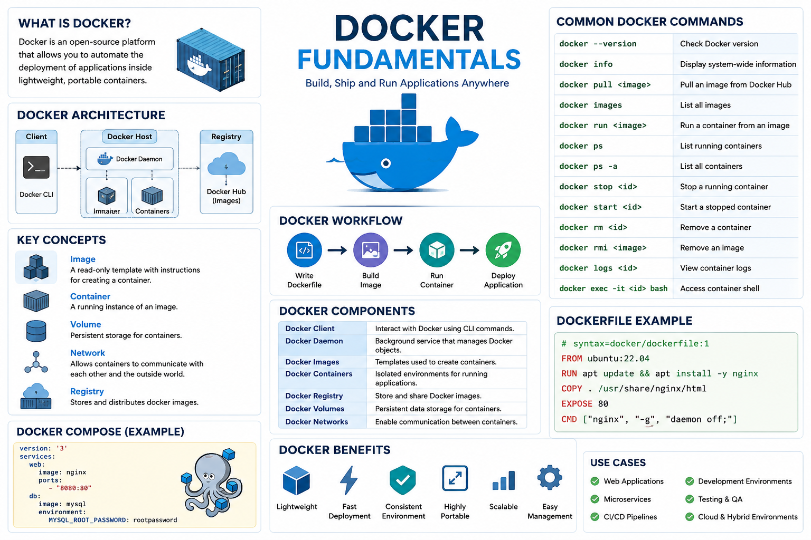

# Docker Fundamentals Documentation

## Introduction to Docker

Docker is an open-source platform used to develop, ship, and run applications inside lightweight, portable environments called **containers**. Containers package an application together with its dependencies, libraries, and configuration files, ensuring consistency across development, testing, and production environments.

Docker helps solve the classic problem:

> “It works on my machine, but not on the server.”

---

# What is a Container?

A **container** is an isolated environment that runs applications independently from the host operating system.

Containers are:

- Lightweight
- Fast to start
- Portable
- Easy to scale
- Consistent across systems

Unlike virtual machines, containers share the host OS kernel, making them more efficient.

---

# Docker Architecture

Docker consists of several core components:

## 1. Docker Engine

The main service responsible for building and running containers.

## 2. Docker Client

The command-line interface (CLI) used to interact with Docker.

Example:

```bash
docker version
```

## 3. Docker Daemon

Runs in the background and manages images, containers, networks, and volumes.

## 4. Docker Images

Read-only templates used to create containers.

## 5. Docker Containers

Running instances of Docker images.

## 6. Docker Registry

Stores Docker images.

Popular registries:

- Docker Hub
- GitHub Container Registry
- Amazon ECR

---

# Installing Docker

## Ubuntu / Debian

```bash
sudo apt update
sudo apt install docker.io -y
```

Enable and start Docker:

```bash
sudo systemctl enable docker
sudo systemctl start docker
```

Verify installation:

```bash
docker --version
```

---

# Basic Docker Commands

## Check Docker Version

```bash
docker --version
```

## Display System Information

```bash
docker info
```

## Pull an Image

Download an image from Docker Hub.

```bash
docker pull nginx
```

## List Images

```bash
docker images
```

## Run a Container

```bash
docker run nginx
```

## Run Container in Background

```bash
docker run -d nginx
```

## List Running Containers

```bash
docker ps
```

## List All Containers

```bash
docker ps -a
```

## Stop a Container

```bash
docker stop CONTAINER_ID
```

## Start a Container

```bash
docker start CONTAINER_ID
```

## Restart a Container

```bash
docker restart CONTAINER_ID
```

## Remove a Container

```bash
docker rm CONTAINER_ID
```

## Remove an Image

```bash
docker rmi IMAGE_ID
```

---

# Understanding Docker Images

Docker images are templates used to create containers.

Example workflow:

```bash
docker pull ubuntu
docker run ubuntu
```

### Common Image Commands

```bash
docker search ubuntu
docker pull ubuntu
docker images
docker rmi ubuntu
```

---

# Understanding Docker Containers

A container is a running instance of an image.

## Run Interactive Container

```bash
docker run -it ubuntu bash
```

Explanation:

- `-i` → Interactive mode
- `-t` → Terminal access

Exit the container:

```bash
exit
```

---

# Port Mapping

Containers can expose services to the host machine using ports.

Example:

```bash
docker run -d -p 8080:80 nginx
```

Meaning:

- Host Port → `8080`
- Container Port → `80`

Access in browser:

```text
http://localhost:8080
```

---

# Container Naming

Assign custom names to containers.

```bash
docker run -d --name webserver nginx
```

View named container:

```bash
docker ps
```

---

# Executing Commands Inside Containers

Run commands inside active containers.

```bash
docker exec -it webserver bash
```

---

# Docker Logs

View container logs.

```bash
docker logs webserver
```

Follow live logs:

```bash
docker logs -f webserver
```

---

# Docker Volumes

Volumes provide persistent storage.

## Create a Volume

```bash
docker volume create myvolume
```

## List Volumes

```bash
docker volume ls
```

## Mount a Volume

```bash
docker run -d \
-v myvolume:/data \
nginx
```

---

# Docker Networking

Docker allows containers to communicate through networks.

## List Networks

```bash
docker network ls
```

## Create Network

```bash
docker network create mynetwork
```

## Run Container in Network

```bash
docker run -d --network mynetwork nginx
```

---

# Dockerfile Fundamentals

A **Dockerfile** is a text file containing instructions for building Docker images.

## Example Dockerfile

```dockerfile
FROM ubuntu:24.04

RUN apt update && apt install -y nginx

CMD ["nginx", "-g", "daemon off;"]
```

---

# Building Docker Images

## Build Image

```bash
docker build -t mynginx .
```

## Run Custom Image

```bash
docker run -d -p 8080:80 mynginx
```

---

# Docker Compose Fundamentals

Docker Compose manages multi-container applications.

## Example docker-compose.yml

```yaml
version: '3'

services:
  web:
    image: nginx
    ports:
      - "8080:80"

  database:
    image: mysql
    environment:
      MYSQL_ROOT_PASSWORD: rootpassword
```

## Start Services

```bash
docker compose up -d
```

## Stop Services

```bash
docker compose down
```

---

# Useful Docker Commands Summary

| Command | Description |
|---|---|
| `docker ps` | List running containers |
| `docker images` | List images |
| `docker pull IMAGE` | Download image |
| `docker run IMAGE` | Run container |
| `docker stop ID` | Stop container |
| `docker rm ID` | Remove container |
| `docker exec -it ID bash` | Access container shell |
| `docker logs ID` | View logs |
| `docker network ls` | List networks |
| `docker volume ls` | List volumes |

---

# Docker Best Practices

- Use lightweight images
- Keep containers stateless
- Use volumes for persistent data
- Remove unused images and containers
- Use official images when possible
- Avoid running containers as root
- Tag image versions properly

---

# Cleaning Docker Resources

## Remove Unused Containers

```bash
docker container prune
```

## Remove Unused Images

```bash
docker image prune
```

## Remove Unused Volumes

```bash
docker volume prune
```

## Remove Everything Unused

```bash
docker system prune -a
```

---

# Advantages of Docker

- Faster deployment
- Consistent environments
- Lightweight virtualization
- Improved scalability
- Easier CI/CD integration
- Simplified application management

---

# Common Use Cases

Docker is widely used for:

- Web applications
- Microservices
- Development environments
- CI/CD pipelines
- Cloud-native applications
- Testing environments
- DevOps automation

---

# Conclusion

Docker is one of the most important tools in modern system administration, DevOps, and cloud computing. Understanding Docker fundamentals allows administrators and developers to build portable, scalable, and efficient applications quickly and reliably.

Learning Docker basics such as:

- Images
- Containers
- Volumes
- Networks
- Dockerfiles
- Docker Compose

provides a strong foundation for advanced container orchestration tools like Kubernetes.

