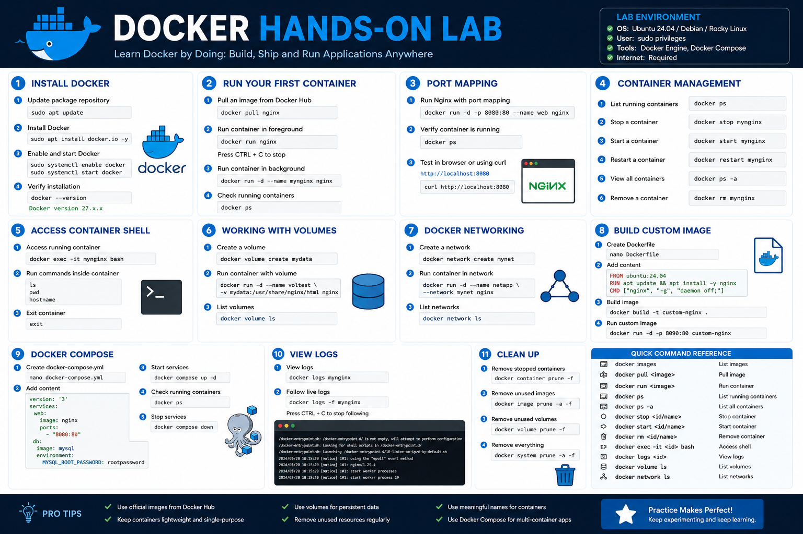

# Docker Fundamentals Hands-On Lab

## Lab Overview

This hands-on lab introduces the core concepts of Docker through practical exercises. You will learn how to:

- Install Docker
- Pull images from Docker Hub
- Run and manage containers
- Use port forwarding
- Access containers
- Create Docker volumes
- Build custom Docker images
- Use Docker Compose

---

# Lab Requirements

## System Requirements

- Ubuntu 24.04 / Debian / Rocky Linux
- Internet connection
- Sudo privileges

## Verify Operating System

```bash
cat /etc/os-release
```

---

# Lab 1 — Install Docker

## Step 1: Update Package Repository

```bash
sudo apt update
```

## Step 2: Install Docker

```bash
sudo apt install docker.io -y
```

## Step 3: Enable Docker Service

```bash
sudo systemctl enable docker
sudo systemctl start docker
```

## Step 4: Verify Docker Installation

```bash
docker --version
```

Expected Output:

```text
Docker version 27.x.x
```

## Step 5: Check Docker Status

```bash
sudo systemctl status docker
```

---

# Lab 2 — Running Your First Container

## Step 1: Pull the Nginx Image

```bash
docker pull nginx
```

## Step 2: Verify Downloaded Images

```bash
docker images
```

Expected Output:

```text
REPOSITORY   TAG       IMAGE ID
nginx        latest    xxxxxxxxx
```

## Step 3: Run the Nginx Container

```bash
docker run nginx
```

The terminal will attach to the container process.

Stop it using:

```bash
CTRL + C
```

---

# Lab 3 — Running Containers in Background

## Step 1: Run Detached Container

```bash
docker run -d nginx
```

Example Output:

```text
d92f1c4b2d7e...
```

## Step 2: View Running Containers

```bash
docker ps
```

## Step 3: View All Containers

```bash
docker ps -a
```

---

# Lab 4 — Port Mapping

## Step 1: Run Nginx with Port Forwarding

```bash
docker run -d -p 8080:80 nginx
```

Explanation:

- Host Port: `8080`
- Container Port: `80`

## Step 2: Test in Browser

Open:

```text
http://localhost:8080
```

Or use curl:

```bash
curl http://localhost:8080
```

Expected Output:

```html
Welcome to nginx!
```

---

# Lab 5 — Container Management

## Step 1: View Running Containers

```bash
docker ps
```

## Step 2: Stop a Container

```bash
docker stop CONTAINER_ID
```

Example:

```bash
docker stop d92f1c4b2d7e
```

## Step 3: Start Container Again

```bash
docker start CONTAINER_ID
```

## Step 4: Restart Container

```bash
docker restart CONTAINER_ID
```

## Step 5: Remove Container

```bash
docker rm CONTAINER_ID
```

---

# Lab 6 — Naming Containers

## Step 1: Run Container with Custom Name

```bash
docker run -d --name myweb nginx
```

## Step 2: Verify Container Name

```bash
docker ps
```

Expected Output:

```text
NAMES
myweb
```

---

# Lab 7 — Accessing Containers

## Step 1: Access Container Shell

```bash
docker exec -it myweb bash
```

You are now inside the container.

## Step 2: Test Commands

```bash
ls
pwd
hostname
```

## Step 3: Exit Container

```bash
exit
```

---

# Lab 8 — Viewing Container Logs

## Step 1: View Logs

```bash
docker logs myweb
```

## Step 2: Follow Live Logs

```bash
docker logs -f myweb
```

Stop monitoring using:

```bash
CTRL + C
```

---

# Lab 9 — Docker Volumes

## Step 1: Create Volume

```bash
docker volume create mydata
```

## Step 2: List Volumes

```bash
docker volume ls
```

## Step 3: Mount Volume

```bash
docker run -d \
--name volume-test \
-v mydata:/usr/share/nginx/html \
nginx
```

## Step 4: Inspect Volume

```bash
docker volume inspect mydata
```

---

# Lab 10 — Docker Networking

## Step 1: Create Network

```bash
docker network create mynetwork
```

## Step 2: Verify Network

```bash
docker network ls
```

## Step 3: Run Container in Network

```bash
docker run -d \
--name network-test \
--network mynetwork \
nginx
```

---

# Lab 11 — Building Custom Docker Images

## Step 1: Create Project Directory

```bash
mkdir docker-lab
cd docker-lab
```

## Step 2: Create Dockerfile

```bash
nano Dockerfile
```

Add:

```dockerfile
FROM ubuntu:24.04

RUN apt update && apt install -y nginx

CMD ["nginx", "-g", "daemon off;"]
```

Save and exit.

---

## Step 3: Build Docker Image

```bash
docker build -t custom-nginx .
```

## Step 4: Verify Image

```bash
docker images
```

## Step 5: Run Custom Image

```bash
docker run -d -p 8090:80 custom-nginx
```

## Step 6: Test Application

```bash
curl http://localhost:8090
```

---

# Lab 12 — Docker Compose

## Step 1: Install Docker Compose Plugin

```bash
sudo apt install docker-compose-plugin -y
```

## Step 2: Create Compose File

```bash
nano docker-compose.yml
```

Add:

```yaml
version: '3'

services:
  web:
    image: nginx
    ports:
      - "8080:80"

  database:
    image: mysql
    environment:
      MYSQL_ROOT_PASSWORD: rootpassword
```

---

## Step 3: Start Services

```bash
docker compose up -d
```

## Step 4: Verify Running Containers

```bash
docker ps
```

## Step 5: Stop Services

```bash
docker compose down
```

---

# Lab 13 — Cleaning Docker Resources

## Remove Stopped Containers

```bash
docker container prune
```

## Remove Unused Images

```bash
docker image prune
```

## Remove Unused Volumes

```bash
docker volume prune
```

## Remove Everything Unused

```bash
docker system prune -a
```

---

# Troubleshooting Tips

## Docker Service Not Running

Start Docker:

```bash
sudo systemctl start docker
```

Check status:

```bash
sudo systemctl status docker
```

---

## Permission Denied Error

Add current user to Docker group:

```bash
sudo usermod -aG docker $USER
```

Apply changes:

```bash
newgrp docker
```

---

## Port Already in Use

Find used ports:

```bash
sudo ss -tulpn
```

Use another port:

```bash
docker run -d -p 8090:80 nginx
```

---

# Hands-On Lab Summary

In this lab, you successfully learned how to:

- Install Docker
- Pull and manage images
- Run containers
- Access container shells
- Use Docker volumes
- Configure Docker networking
- Build custom Docker images
- Deploy applications using Docker Compose
- Clean Docker resources

---

# Final Practice Challenge

Try the following tasks independently:

1. Run an Apache container
2. Create a custom HTML page inside a container
3. Build your own Docker image
4. Create two containers in the same network
5. Deploy a web application using Docker Compose

---

# Conclusion

This hands-on Docker lab provides practical experience with container management and Docker fundamentals. Completing these exercises builds a strong foundation for advanced topics such as:

- Kubernetes
- Container orchestration
- CI/CD pipelines
- Cloud-native infrastructure
- DevOps automation

