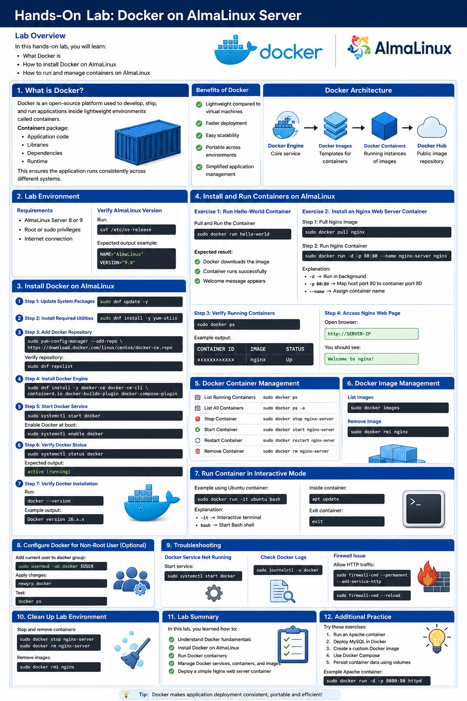
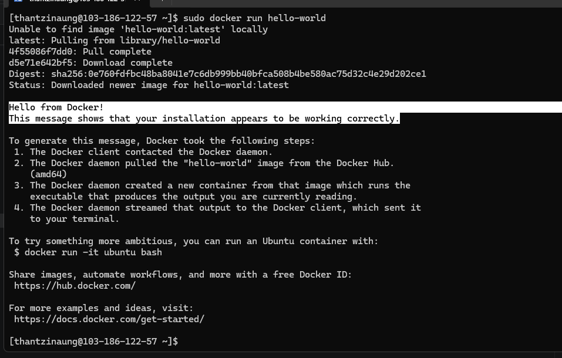
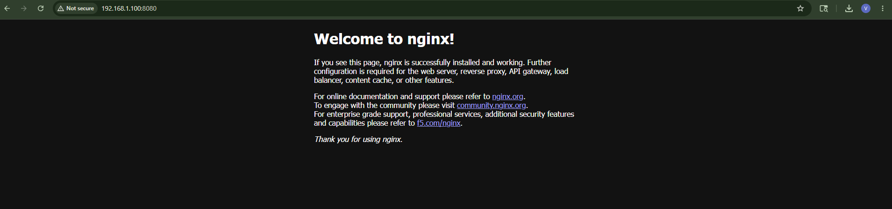

# Hands-On Lab: Docker on AlmaLinux Server

## Lab Overview

In this hands-on lab:

- What Docker is
- How to install Docker on AlmaLinux
- How to run and manage containers on AlmaLinux

---

# 1. What is Docker?

Docker is an open-source platform used to develop, ship, and run applications inside lightweight environments called **containers**.

Containers package:

- Application code
- Libraries
- Dependencies
- Runtime

This ensures the application runs consistently across different systems.

## Benefits of Docker

- Lightweight compared to virtual machines
- Faster deployment
- Easy scalability
- Portable across environments
- Simplified application management

## Docker Architecture

Docker consists of:

- Docker Engine — Core service
- Docker Images — Templates for containers
- Docker Containers — Running instances of images
- Docker Hub — Public image repository

---

# 2. Lab Environment

## Requirements

- AlmaLinux Server 8 or 9
- Root or sudo privileges
- Internet connection

## Verify AlmaLinux Version

Run:

```bash
cat /etc/os-release
```

Expected output example:

```bash
NAME="AlmaLinux"
VERSION="9.7 (Moss Jungle Cat)"
ID="almalinux"
ID_LIKE="rhel centos fedora"
VERSION_ID="9.7"
PLATFORM_ID="platform:el9"
PRETTY_NAME="AlmaLinux 9.7 (Moss Jungle Cat)"
ANSI_COLOR="0;34"
LOGO="fedora-logo-icon"
CPE_NAME="cpe:/o:almalinux:almalinux:9::baseos"
HOME_URL="https://almalinux.org/"
DOCUMENTATION_URL="https://wiki.almalinux.org/"
BUG_REPORT_URL="https://bugs.almalinux.org/"

ALMALINUX_MANTISBT_PROJECT="AlmaLinux-9"
ALMALINUX_MANTISBT_PROJECT_VERSION="9.7"
REDHAT_SUPPORT_PRODUCT="AlmaLinux"
REDHAT_SUPPORT_PRODUCT_VERSION="9.7"

```

---

# 3. Install Docker on AlmaLinux

## Step 1: Update System Packages

```bash
sudo dnf update -y
```

## Step 2: Install Required Utilities

```bash
sudo dnf install yum-utils -y
```

## Step 3: Add Docker Repository

```bash
sudo yum-config-manager --add-repo https://download.docker.com/linux/centos/docker-ce.repo
```

Verify repository:

```bash
sudo dnf repolist
```

## Step 4: Install Docker Engine

```bash
sudo dnf install -y docker-ce docker-ce-cli containerd.io docker-buildx-plugin docker-compose-plugin
```

## Step 5: Start Docker Service

```bash
sudo systemctl start docker
```

Enable Docker at boot:

```bash
sudo systemctl enable docker
```

## Step 6: Verify Docker Status

```bash
sudo systemctl status docker
```

Expected output:

```bash
active (running)
```

## Step 7: Verify Docker Installation

Run:

```bash
docker --version
```

Example output:

```bash
Docker version 29.5.2, build 79eb04c
```

---

# 4. Install and Run Containers on AlmaLinux

## Exercise 1: Run Hello-World Container

### Pull and Run the Container

```bash
sudo docker run hello-world
```

Expected result:

- Docker downloads the image
- Container runs successfully
- Welcome message appears

---

## Exercise 2: Install an Nginx Web Server Container

### Step 1: Pull Nginx Image

```bash
sudo docker pull nginx
```

### Step 2: Run Nginx Container

```bash
sudo docker run -d -p 8080:80 --name nginx-server nginx
```

Explanation:

- `-d` → Run in background
- `-p 80:80` → Map host port 80 to container port 80
- `--name` → Assign container name

### Step 3: Verify Running Containers

```bash
sudo docker ps
```

Example output:

```bash
CONTAINER ID   IMAGE   STATUS
xxxxxxxxxxxx   nginx   Up
```

(or)

```bash
sudo docker ps -a
```

Example Output :
```test
CONTAINER ID   IMAGE         COMMAND                  CREATED          STATUS                      PORTS     NAMES
28ea05177df9   nginx         "/docker-entrypoint.…"   8 minutes ago    Created                               nginx-server
62b0cb59df5a   hello-world   "/hello"                 11 minutes ago   Exited (0) 11 minutes ago             strange_mcclintock
```


### Step 4: Access Nginx Web Page

Open browser:

```text
http://SERVER-IP
```
(or)
```text
http://SERVER-IP:8080
```

You should see:

```text
Welcome to nginx!
```

(or)

Output is `This site can’t be reached` :

fix this - 
```bash
sudo docker start 28ea05177df9
```

---

# 5. Docker Container Management

## List Running Containers

```bash
sudo docker ps
```

## List All Containers

```bash
sudo docker ps -a
```

## Stop Container

```bash
sudo docker stop nginx-server
```

## Start Container

```bash
sudo docker start nginx-server
```

## Restart Container

```bash
sudo docker restart nginx-server
```

## Remove Container

```bash
sudo docker rm nginx-server
```

---

# 6. Docker Image Management

## List Images

```bash
sudo docker images
```

## Remove Image

```bash
sudo docker rmi nginx
```

---

# 7. Run Container in Interactive Mode

Example using Ubuntu container:

```bash
sudo docker run -it ubuntu bash
```

Explanation:

- `-it` → Interactive terminal
- `bash` → Start Bash shell

Inside container:

```bash
apt update
```

Exit container:

```bash
exit
```

---

# 8. Configure Docker for Non-Root User (Optional)

Add current user to docker group:

```bash
sudo usermod -aG docker $USER
```

(or)

```bash
sudo usermod -aG docker thantzinaung
```

Apply changes:

```bash
sudo newgrp docker
```

Test:

```bash
sudo docker ps
```

---

# 9. Troubleshooting

## Docker Service Not Running

Start service:

```bash
sudo systemctl start docker
```

## Check Docker Logs

```bash
sudo journalctl -u docker
```

## Firewall Issue

Allow HTTP traffic:

```bash
sudo firewall-cmd --permanent --add-service=http
sudo firewall-cmd --reload
```

---

# 10. Clean Up Lab Environment

Stop and remove containers:

```bash
sudo docker stop nginx-server
sudo docker rm nginx-server
```

Remove images:

```bash
sudo docker rmi nginx
```

---

# 11. Lab Summary

In this lab, you learned how to:

- Understand Docker fundamentals
- Install Docker on AlmaLinux
- Run Docker containers
- Manage Docker services, containers, and images
- Deploy a simple Nginx web server container

---

# 12. Additional Practice

Try these exercises:

1. Run an Apache container
2. Deploy MySQL in Docker
3. Create a custom Docker image
4. Use Docker Compose
5. Persist container data using volumes

Example Apache container:

```bash
sudo docker run -d -p 8080:80 httpd
```



