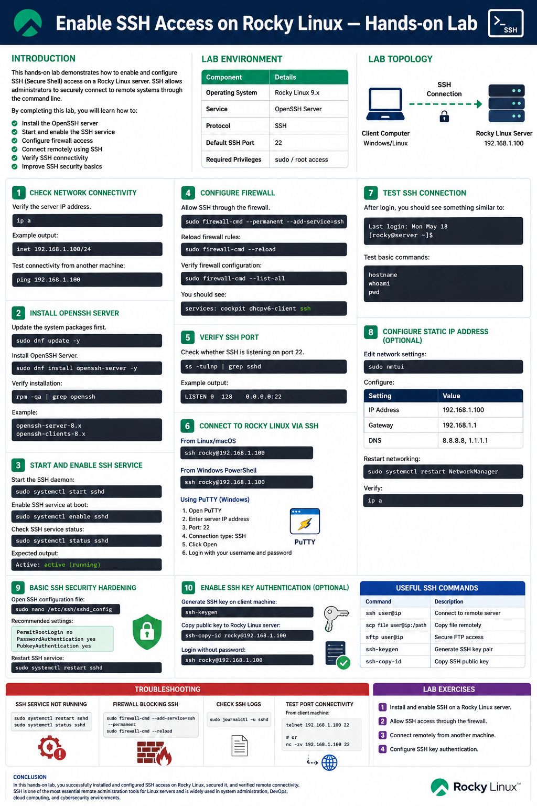
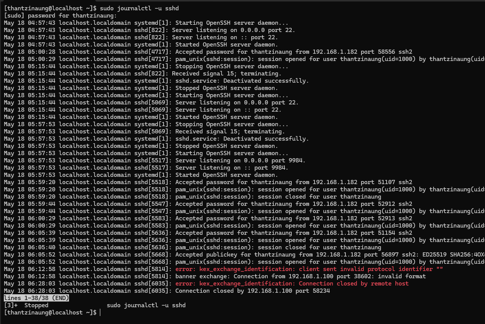
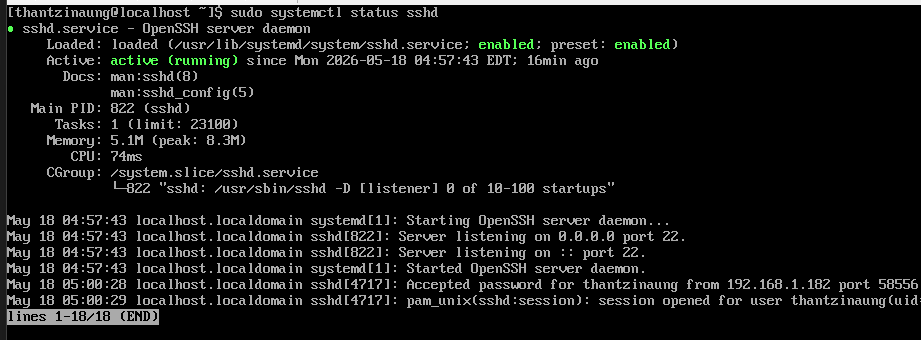
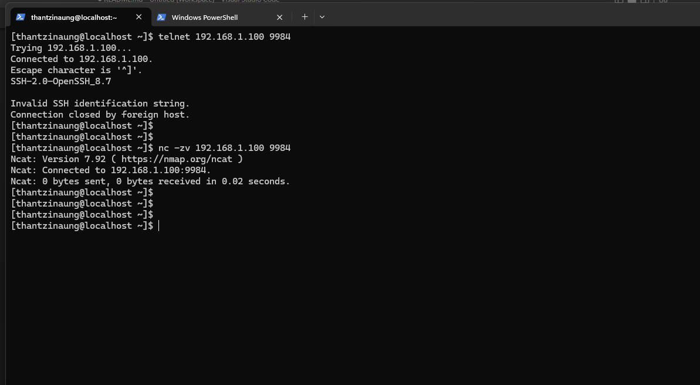

# Enable SSH Access on Rocky Linux — Hands-on Lab

## Introduction

This hands-on lab demonstrates how to enable and configure SSH (Secure Shell) access on a Rocky Linux server. SSH allows administrators to securely connect to remote systems through the command line.

By completing this lab, how to:

- Install the OpenSSH server
- Start and enable the SSH service
- Configure firewall access
- Connect remotely using SSH
- Verify SSH connectivity
- Improve SSH security basics

---

# Lab Environment

| Component | Details |
|---|---|
| Operating System | Rocky Linux 9.x |
| Service | OpenSSH Server |
| Protocol | SSH |
| Default SSH Port | 22 |
| Required Privileges | sudo / root access |

---

# Lab Topology

```text
+-------------------+        SSH Connection        +-------------------+
| Client Computer   |  ------------------------>  | Rocky Linux Server|
| Windows/Linux     |                              | 192.168.1.100     |
+-------------------+                              +-------------------+
```

---

# Step 1 — Check Network Connectivity

Verify the server IP address.

```bash
ip a
```

Example output:

```bash
inet 192.168.1.100/24
```

Test connectivity from another machine:

```bash
ping 192.168.1.100
```

---

# Step 2 — Install OpenSSH Server

Update the system packages first.

```bash
sudo dnf update -y
```

Install OpenSSH Server.

```bash
sudo dnf install openssh-server -y
```

Verify installation:

```bash
rpm -qa | grep openssh
```

Example:

```bash
openssh-server-8.x
openssh-clients-8.x
```

---

# Step 3 — Start and Enable SSH Service

Start the SSH daemon:

```bash
sudo systemctl start sshd
```

Enable SSH service at boot:

```bash
sudo systemctl enable sshd
```

Check SSH service status:

```bash
sudo systemctl status sshd
```

Expected output:

```bash
Active: active (running)
```

---

# Step 4 — Configure Firewall

Allow SSH through the firewall.

```bash
sudo firewall-cmd --permanent --add-service=ssh
```

Reload firewall rules:

```bash
sudo firewall-cmd --reload
```

Verify firewall configuration:

```bash
sudo firewall-cmd --list-all
```

You should see:

```bash
services: cockpit dhcpv6-client ssh
```

---

# Step 5 — Verify SSH Port

Check whether SSH is listening on port 22.

```bash
ss -tulnp | grep sshd
```

Example output:

```bash
LISTEN 0 128 0.0.0.0:22
```

---

# Step 6 — Connect to Rocky Linux via SSH

## From Linux/macOS

```bash
ssh username@192.168.1.100
```

Example:

```bash
ssh thantzinaung@192.168.1.100
```

---

## From Windows PowerShell

```powershell
ssh thantzinaung@192.168.1.100
```

---

## Using PuTTY (Windows)

1. Open PuTTY
2. Enter server IP address
3. Port: `22`
4. Connection type: `SSH`
5. Click **Open**
6. Login with your username and password

---

# Step 7 — Test SSH Connection

After login, you should see something similar to:

```bash
Last login: Mon May 18
[thantzinaung@server ~]$
```

Test basic commands:

```bash
hostname
whoami
pwd
```

---

# Step 8 — Configure Static IP Address (Optional)

Edit network settings:

```bash
sudo nmtui
```

Configure:

| Setting | Value |
|---|---|
| IP Address | 192.168.1.100 |
| Gateway | 192.168.1.1 |
| DNS | 8.8.8.8, 1.1.1.1 |

Restart networking:

```bash
sudo systemctl restart NetworkManager
```

Verify:

```bash
ip a
```

---

# Step 9 — Basic SSH Security Hardening

Open SSH configuration file:

```bash
sudo nano /etc/ssh/sshd_config
```

Recommended settings:

```bash
port 9984
PermitRootLogin no
PasswordAuthentication yes
PubkeyAuthentication yes
```
---
Restart SSH service:

```bash
sudo systemctl restart sshd
```

---

# Step 10 — Enable SSH Key Authentication (Optional)

Generate SSH key on client machine:

```bash
ssh-keygen
```

In SELinux to permit port 9984

```bash
sudo dnf install policycoreutils-python-utils -y

sudo semanage port -a -t ssh_port_t -p tcp 9984

sudo firewall-cmd --permanent --add-port=9984/tcp
sudo firewall-cmd --reload

```
---

Restart SSH service:

```bash
sudo systemctl restart sshd
```
---

Copy the Public Key to Your Rocky Server
Type your Client Computer (windows 11) -
```bash
type $env:USERPROFILE\.ssh\id_ed25519.pub | ssh -p 9984 thantzinaung@192.168.1.100 "mkdir -p ~/.ssh && chmod 700 ~/.ssh && cat >> ~/.ssh/authorized_keys && chmod 600 ~/.ssh/authorized_keys"
```
---

Login without password:

```bash
ssh -p 9984 thantzinaung@192.168.1.100
```

---

# Troubleshooting

## SSH Service Not Running

```bash
sudo systemctl restart sshd
sudo systemctl status sshd
```

---

## Firewall Blocking SSH

```bash
sudo firewall-cmd --add-service=ssh --permanent
sudo firewall-cmd --reload
```

---

## Check SSH Logs

```bash
sudo journalctl -u sshd
```

---

## Test Port Connectivity

From client machine:

```bash
telnet 192.168.1.100 9984
```

or

```bash
nc -zv 192.168.1.100 9984
```

---

# Useful SSH Commands

| Command | Description |
|---|---|
| `ssh user@ip` | Connect to remote server |
| `scp file user@ip:/path` | Copy file remotely |
| `sftp user@ip` | Secure FTP access |
| `ssh-keygen` | Generate SSH key pair |
| `ssh-copy-id` | Copy SSH public key |

---

# Lab Exercises

## Exercise 1

Install and enable SSH on a Rocky Linux server.

---

## Exercise 2

Allow SSH access through the firewall.

---

## Exercise 3

Connect remotely from another machine.

---

## Exercise 4

Configure SSH key authentication.

---

# Conclusion

In this hands-on lab, you successfully:

- Installed OpenSSH Server
- Enabled and started SSH service
- Configured firewall access
- Connected remotely using SSH
- Verified SSH functionality
- Applied basic SSH security practices

SSH is one of the most essential remote administration tools for Linux servers and is widely used in system administration, DevOps, cloud computing, and cybersecurity environments.




