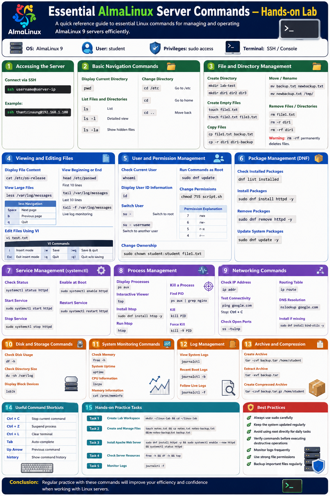

# Essential AlmaLinux Server Commands — Hands-on Lab

## Overview

This essential Linux commands required to manage and operate an AlmaLinux server. 

- Navigate the Linux filesystem
- Manage files and directories
- Work with users and permissions
- Monitor system resources
- Manage services and packages
- Work with networking commands
- Use process management tools
- Access system logs

---

# Lab Environment

| Component | Example |
|---|---|
| Operating System | AlmaLinux 9 |
| User Account | student |
| Privileges | sudo access |
| Terminal | SSH / Console |

---

# 1. Accessing the Server

## Connect via SSH

```bash
ssh username@server-ip
```

Example:

```bash
ssh thantzinaung@192.168.1.100
```

---

# 2. Basic Navigation Commands

## Display Current Directory

```bash
pwd
```

Example Output:

```bash
/home/thantzinaung
```

---

## List Files and Directories

```bash
ls
```

Detailed view:

```bash
ls -l
```

Show hidden files:

```bash
ls -la
```

---

## Change Directory

```bash
cd /etc
```

Return to home directory:

```bash
cd
```

Move one directory back:

```bash
cd ..
```

---

# 3. File and Directory Management

## Create a Directory

```bash
mkdir lab-test
```

Create multiple directories:

```bash
mkdir dir1 dir2 dir3
```

---

## Create Empty Files

```bash
touch file1.txt
```

Create multiple files:

```bash
touch file2.txt file3.txt
```

---

## Copy Files

```bash
cp file1.txt backup.txt
```

Copy directories recursively:

```bash
cp -r dir1 dir1-backup
```

---

## Move or Rename Files

```bash
mv backup.txt newbackup.txt
```

Move file to another directory:

```bash
mv newbackup.txt /tmp/
```

---

## Remove Files and Directories

Delete a file:

```bash
rm file1.txt
```

Delete directory recursively:

```bash
rm -r dir1
```

Force delete:

```bash
rm -rf dir1
```

> Warning: `rm -rf` permanently deletes files.

---

# 4. Viewing and Editing Files

## Display File Content

```bash
cat /etc/os-release
```

---

## View Large Files

```bash
less /var/log/messages
```

Navigation inside `less`:

| Key | Function |
|---|---|
| Space | Next page |
| b | Previous page |
| q | Quit |

---

## View Beginning or End of Files

View first 10 lines:

```bash
head /etc/passwd
```

View last 10 lines:

```bash
tail /var/log/messages
```

Live log monitoring:

```bash
tail -f /var/log/messages
```

---

## Edit Files Using VI

Open file:

```bash
vi test.txt
```

Basic VI Commands:

| Command | Function |
|---|---|
| i | Insert mode |
| Esc | Exit insert mode |
| :w | Save |
| :q | Quit |
| :wq | Save and quit |
| :q! | Quit without saving |

---

# 5. User and Permission Management

## Check Current User

```bash
whoami
```

---

## Display User ID Information

```bash
id
```

---

## Switch User

```bash
su -
```

Switch to another user:

```bash
su - username
```

---

## Run Commands as Root

```bash
sudo dnf update
```

---

## Change File Permissions

```bash
chmod 755 script.sh
```

Permission Explanation:

| Number | Permission |
|---|---|
| 7 | rwx |
| 6 | rw- |
| 5 | r-x |
| 4 | r-- |

---

## Change File Ownership

```bash
sudo chown student:student file1.txt
```

---

# 6. Package Management Using DNF

## Check Installed Packages

```bash
dnf list installed
```

---

## Install Packages

Install Apache web server:

```bash
sudo dnf install httpd -y
```

---

## Remove Packages

```bash
sudo dnf remove httpd -y
```

---

## Update System Packages

```bash
sudo dnf update -y
```

---

# 7. Service Management with systemctl

## Check Service Status

```bash
systemctl status httpd
```

---

## Start a Service

```bash
sudo systemctl start httpd
```

---

## Stop a Service

```bash
sudo systemctl stop httpd
```

---

## Enable Service at Boot

```bash
sudo systemctl enable httpd
```

---

## Restart Service

```bash
sudo systemctl restart httpd
```

---

# 8. Process Management

## Display Running Processes

```bash
ps aux
```

---

## Interactive Process Viewer

```bash
top
```

Install improved version:

```bash
sudo dnf makecache
sudo dnf install epel-release -y
sudo dnf install htop -y
```

Run:

```bash
htop
```

---

## Kill a Process

Find process ID:

```bash
ps aux | grep nginx
```

Kill process:

```bash
kill PID
```

Force kill:

```bash
kill -9 PID
```

---

# 9. Networking Commands

## Check IP Address

```bash
ip addr
```

---

## Test Network Connectivity

```bash
ping google.com
```

Stop with:

```bash
Ctrl + C
```

---

## Check Open Ports

```bash
ss -tulnp
```

---

## Display Routing Table

```bash
ip route
```

---

## Check DNS Resolution

```bash
nslookup google.com
```

Install if missing:

```bash
sudo dnf install bind-utils -y
```

---

# 10. Disk and Storage Commands

## Check Disk Usage

```bash
df -h
```
---
## Check SSD Health
```bash
sudo dnf install smartmontools -y

lsblk

sudo smartctl -H /dev/nvme0n1 (your device name | -H = health)

sudo smartctl -a /dev/nvme0n1 (-a = all)
```
---

## Check Directory Size

```bash
du -sh /var/log
```

---

## Display Block Devices

```bash
lsblk
```

---

# 11. System Monitoring Commands

## Check Memory Usage

```bash
free -h
```

---

## Check System Uptime

```bash
uptime
```

---

## Display CPU Information

```bash
lscpu
```

---

## Display Memory Information

```bash
cat /proc/meminfo
```

---

# 12. Log Management

## View System Logs

```bash
journalctl
```

---

## View Recent Boot Logs

```bash
journalctl -b
```

## View Specific log
```bash
sudo journalctl -u httpd
```

## view Error Logs
```bash
sudo journalctl -p err..crit
```

## View by period
```bash
sudo journalctl --since today
```

## View by hour
```bash
sudo journalctl --since "1 hour ago"
```

---

## Follow Live Logs

```bash
journalctl -f
```

---

# 13. Archive and Compression Commands

## Create Archive

```bash
tar -cvf backup.tar /home/student
```

---

## Extract Archive

```bash
tar -xvf backup.tar
```

---

## Create Compressed Archive

```bash
tar -czvf backup.tar.gz /home/student
```

---

# 14. Useful Command Shortcuts

| Shortcut | Function |
|---|---|
| Ctrl + C | Stop current command |
| Ctrl + Z | Suspend process |
| Ctrl + L | Clear terminal |
| Tab | Auto-complete |
| Up Arrow | Previous command |
| history | Show command history |

---

# Best Practices

- Always use `sudo` carefully
- Keep the system updated regularly
- Avoid using `root` directly for daily tasks
- Verify commands before executing destructive operations
- Monitor logs frequently
- Use strong file permissions
- Backup important files regularly

---

# Conclusion

This hands-on lab introduced the essential commands required for managing an AlmaLinux server environment. These commands form the foundation for Linux system administration and are commonly used in server management, troubleshooting, networking, monitoring, and automation tasks.


