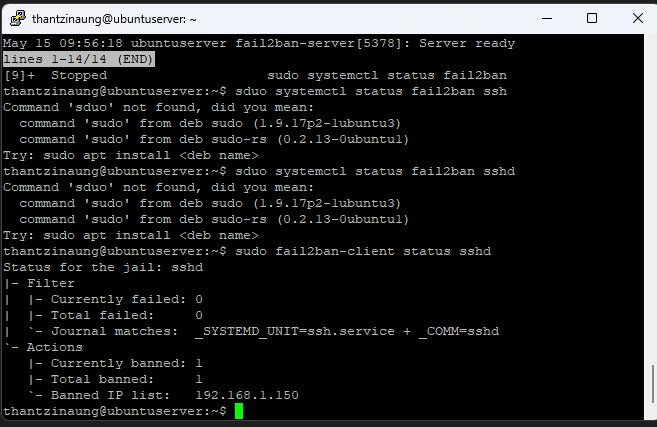
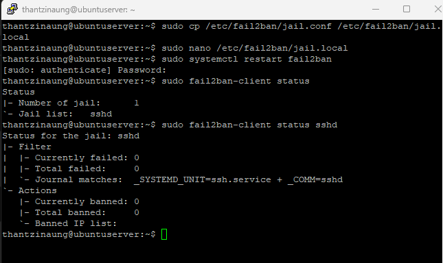
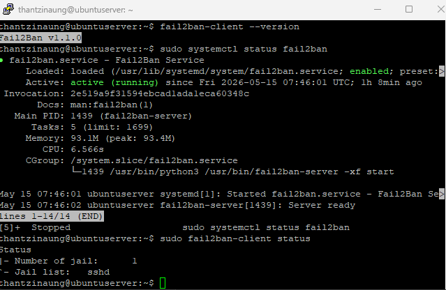
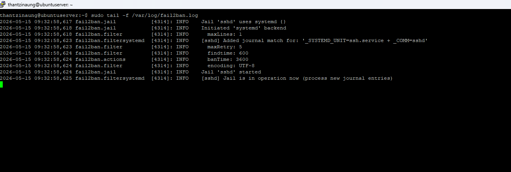

# Fail2Ban Documentation for Ubuntu Server 26.04

## What Is Fail2Ban?

Fail2Ban is a security tool that helps protect your Ubuntu server from brute-force attacks and unauthorized login attempts.

It works by:

- Monitoring log files
- Detecting repeated failed login attempts
- Automatically banning suspicious IP addresses using firewall rules

Fail2Ban is commonly used to protect:

- SSH
- Apache
- Nginx
- FTP
- Mail servers
- Other network services

---

# Why Use Fail2Ban?

Without Fail2Ban, attackers can repeatedly try passwords against your server.

Fail2Ban helps by:

- Blocking brute-force attacks
- Reducing malicious traffic
- Improving server security
- Automatically managing temporary bans

---

# Install Fail2Ban on Ubuntu Server 26.04

Update package lists first:

```bash
sudo apt update
```

Install Fail2Ban:

```bash
sudo apt install fail2ban -y
```

---

# Verify Installation

Check the Fail2Ban service status:

```bash
sudo systemctl status fail2ban
```

You should see:

```text
active (running)
```

---

# Enable Fail2Ban at Boot

Enable automatic startup:

```bash
sudo systemctl enable fail2ban
```

Start the service manually if needed:

```bash
sudo systemctl start fail2ban
```

Restart the service:

```bash
sudo systemctl restart fail2ban
```

Stop the service:

```bash
sudo systemctl stop fail2ban
```

---

# Check Fail2Ban Version

```bash
fail2ban-client --version
```

---

# Understanding Fail2Ban Configuration Files

Main configuration directory:

```bash
/etc/fail2ban/
```

Important files:

| File | Purpose |
|---|---|
| `/etc/fail2ban/jail.conf` | Default configuration |
| `/etc/fail2ban/jail.local` | Custom configuration |
| `/etc/fail2ban/filter.d/` | Filter definitions |
| `/var/log/fail2ban.log` | Fail2Ban logs |

---

# Important Recommendation

Do NOT edit:

```bash
/etc/fail2ban/jail.conf
```

Instead, create:
copy - 
```bash
sudo cp /etc/fail2ban/jail.conf /etc/fail2ban/jail.local
```
This prevents your settings from being overwritten during updates.

---

# Create a Basic Configuration

Create the local configuration file:

```bash
sudo nano /etc/fail2ban/jail.local
```

Example configuration:

```ini
[sshd]
enable = ture
port = ssh
logpath = %(sshd_log)s
backend = %(sshd_backend)s

maxretry = 5
findtime = 10m
bantime = 1h
```

---

# Configuration Explanation

| Option | Description |
|---|---|
| `bantime` | How long an IP is banned |
| `findtime` | Time window for failed attempts |
| `maxretry` | Allowed failed attempts before ban |
| `backend` | Log monitoring method |
| `enabled` | Enables protection |
| `port` | Protected port |
| `logpath` | Log file location |

---

# Restart Fail2Ban After Changes

```bash
sudo systemctl restart fail2ban
```

---

# Check Active Jails

List all active jails:

```bash
sudo fail2ban-client status
```

Example output:

```text
Status
|- Number of jail:  1
`- Jail list:   sshd
```

---

# Check SSH Jail Status

```bash
sudo fail2ban-client status sshd
```

Example output:

```text
Status for the jail: sshd
|- Currently failed: 2
|- Total failed: 10
`- Banned IP list: 192.168.1.50
```

---

# Unban an IP Address

```bash
sudo fail2ban-client set sshd unbanip 192.168.1.50
```

---

# Ban an IP Address Manually

```bash
sudo fail2ban-client set sshd banip 192.168.1.50
```

---

# View Fail2Ban Logs

Monitor logs in real time:

```bash
sudo tail -f /var/log/fail2ban.log
```

View the last 50 lines:

```bash
sudo tail -50 /var/log/fail2ban.log
```

Search logs for banned IPs:

```bash
grep "Ban" /var/log/fail2ban.log
```

---

# Protecting SSH

Fail2Ban commonly protects SSH against brute-force attacks.

Example secure SSH jail:

```ini
[sshd]

enabled = true
port = ssh
maxretry = 3
findtime = 10m
bantime = 24h
```

This means:

- 3 failed attempts
- Within 10 minutes
- Results in a 24-hour ban

---

# Ignore Trusted IP Addresses

You can whitelist your IP:

```ini
ignoreip = 127.0.0.1/8 192.168.1.100
```

Example:

```ini
[DEFAULT]

ignoreip = 127.0.0.1/8 YOUR_HOME_IP
```

Be careful when using this feature.

---

# Enable Email Notifications (Optional)

Install mail utilities:

```bash
sudo apt install mailutils -y
```
choose - ok > Internet Site > Set name you want and ok 

Example configuration:

```ini
destemail = admin@example.com
sender = fail2ban@example.com
mta = sendmail
action = %(action_mwl)s
```

This can send email alerts when bans occur.

---

# Common Fail2Ban Commands

| Command | Description |
|---|---|
| `sudo systemctl status fail2ban` | Check service status |
| `sudo systemctl restart fail2ban` | Restart service |
| `sudo fail2ban-client status` | Show jails |
| `sudo fail2ban-client status sshd` | Show SSH jail |
| `sudo fail2ban-client reload` | Reload configuration |
| `sudo fail2ban-client set sshd banip IP` | Ban IP |
| `sudo fail2ban-client set sshd unbanip IP` | Unban IP |
| `sudo tail -f /var/log/fail2ban.log` | View logs |

---

# Using UFW with Fail2Ban

Fail2Ban works well with UFW firewall.

Install UFW:

```bash
sudo apt install ufw -y
```

Allow SSH:

```bash
sudo ufw allow OpenSSH
```

Enable firewall:

```bash
sudo ufw enable
```

Fail2Ban can automatically add firewall rules to UFW.

---

# Testing Fail2Ban

You can test Fail2Ban by intentionally failing SSH login attempts from another machine.

After several failed attempts:

- Your IP should be banned
- SSH access will be blocked temporarily

Check:

```bash
sudo fail2ban-client status sshd
```

---

# Troubleshooting

## Fail2Ban Won’t Start

Check logs:

```bash
sudo journalctl -u fail2ban
```

Test configuration:

```bash
sudo fail2ban-client -t
```
To check which line occur error 
```bash
sudo fail2ban-server -t
```
---

Go to error by line

```bash
ctl + _ type-line-number-you-want-to-go
```

For Example 
```bash
ctrl + _ 123
```

---

## SSH Jail Not Working

Verify SSH logs exist:

```bash
sudo ls /var/log/auth.log
```

Check jail status:

```bash
sudo fail2ban-client status sshd
```

---

## Firewall Conflicts

Ensure UFW or iptables is active:

```bash
sudo ufw status
```

---

# Best Practices

## Use SSH Keys

Disable password authentication when possible.

---

## Reduce Max Retry

Recommended:

```ini
maxretry = 3
```

---

## Increase Ban Time

Example:

```ini
bantime = 24h
```

---

## Keep Fail2Ban Updated

```bash
sudo apt update
sudo apt upgrade
```

---

# Example Advanced Configuration

```ini
[DEFAULT]

ignoreip = 127.0.0.1/8
bantime = 24h
findtime = 15m
maxretry = 3
backend = systemd

[sshd]

enabled = true
port = ssh
logpath = %(sshd_log)s
```

---

# Remove Fail2Ban

Remove package:

```bash
sudo apt remove fail2ban -y
```

Remove configuration files:

```bash
sudo apt purge fail2ban -y
```

---

# Conclusion

Fail2Ban is an essential security tool for Ubuntu servers. It helps defend against brute-force attacks by automatically banning malicious IP addresses after repeated failed login attempts.

Combining Fail2Ban with:

- SSH key authentication
- UFW firewall
- Strong passwords
- Regular updates

creates a much more secure Ubuntu server environment.




