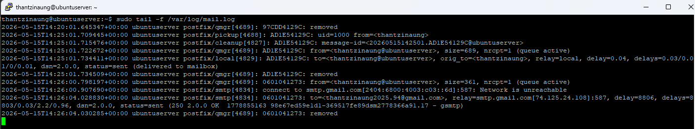
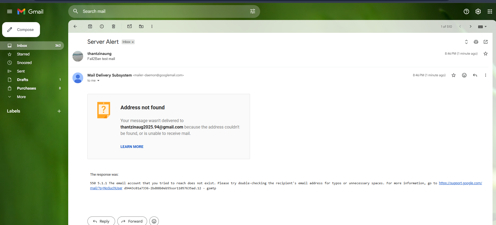

# Fail2Ban Email Notification on Ubuntu Server 26.04

## Introduction

Fail2Ban is a security tool that monitors log files and automatically bans IP addresses that show malicious behavior, such as repeated failed login attempts.

One useful feature of Fail2Ban is **email notifications**. When an IP address is banned, Fail2Ban can send an alert email to the server administrator with details about the attack.

This guide explains how to configure Fail2Ban email notifications on **Ubuntu Server 26.04**.

---

# Header

- Install Fail2Ban
- Install a mail server utility
- Configure email notifications
- Enable alerts for SSH attacks
- Customize email actions
- Test email notifications
- Troubleshoot common problems

---

# Prerequisites

Before starting, ensure you have:

- Ubuntu Server 26.04
- A sudo-enabled user account
- Internet connectivity
- A valid email address

---

# Step 1 — Install Fail2Ban

Update package lists:

```bash
sudo apt update
```

Install Fail2Ban:

```bash
sudo apt install fail2ban -y
```

Verify installation:

```bash
sudo systemctl status fail2ban
```

Expected output:

```text
active (running)
```

Enable Fail2Ban at boot:

```bash
sudo systemctl enable fail2ban
```

---

# Step 2 — Install Mail Utilities

Fail2Ban requires a mail transfer agent to send emails.

Install Postfix and mail utilities:

```bash
sudo apt install postfix mailutils -y
```

During installation:

Choose:

```text
Internet Site
```

Set your mail name:

```text
yourdomain.com
```

Example:

```text
server.example.com
```

---

# Step 3 — Verify Email Sending

Test mail delivery:

```bash
echo "Test Email" | mail -s "Mail Test" your_email@example.com
```

Replace:

```text
your_email@example.com
```

with your real email address.

Check your inbox.

---

# Step 4 — Create Fail2Ban Local Configuration

Never edit:

```bash
/etc/fail2ban/jail.conf
```

Instead, create a local override file:

```bash
sudo cp /etc/fail2ban/jail.conf /etc/fail2ban/jail.local
```

---

# Step 5 — Configure Email Notifications

Open the configuration file:

```bash
sudo nano /etc/fail2ban/jail.local
```

Find the `[DEFAULT]` section.

Add or modify the following settings:

```ini
[DEFAULT]

destemail = your_email@example.com
sender = fail2ban@yourserver.com
mta = sendmail

action = %(action_mwl)s
```

---

# Understanding These Settings

## `destemail`

The recipient email address.

Example:

```ini
destemail = admin@example.com
```

---

## `sender`

The sender address used in notification emails.

Example:

```ini
sender = fail2ban@example.com
```

---

## `mta`

Defines the mail transfer agent.

Example:

```ini
mta = sendmail
```

---

## `action`

Determines what happens when a ban occurs.

### Common Actions

| Action | Description |
|---|---|
| `%(action_)s` | Ban only |
| `%(action_mw)s` | Ban + whois report |
| `%(action_mwl)s` | Ban + whois + log lines |

Recommended:

```ini
action = %(action_mwl)s
```

This provides the most useful information.

---

# Step 6 — Configure SSH Jail

Locate the SSH jail section:

```ini
[sshd]
```

Example configuration:

```ini
[sshd]
enabled = true
port = ssh
logpath = %(sshd_log)s
backend = systemd
maxretry = 5
bantime = 1h
findtime = 10m
```

---

# Step 7 — Restart Fail2Ban

Restart the service:

```bash
sudo systemctl restart fail2ban
```

Verify status:

```bash
sudo fail2ban-client status
```

Expected example:

```text
Status
|- Number of jail: 1
`- Jail list: sshd
```

---

# Step 8 — Test Email Notifications

Trigger failed SSH attempts from another machine.

Example:

```bash
ssh fakeuser@your-server-ip
```

Enter incorrect passwords multiple times.

Once the IP is banned, Fail2Ban should send an email notification.

---

# View Banned IP Addresses

Check jail status:

```bash
sudo fail2ban-client status sshd
```

Example output:

```text
Banned IP list:
192.168.1.50
```

---

# Unban an IP Address

Remove a banned IP:

```bash
sudo fail2ban-client set sshd unbanip 192.168.1.50
```

---

# Advanced Email Configuration

## Change Email Subject

Edit:

```bash
sudo nano /etc/fail2ban/action.d/sendmail-common.local
```

Customize the subject line.

Example:

```ini
[Definition]

actionstart = printf %%b "Subject: [Fail2Ban] <name> started on <fq-hostname>\nFrom: <sender>\nTo: <dest>\n\nHi,\nThe jail <name> has been started successfully.\n" | /usr/sbin/sendmail -f "<sender>" "<dest>"
```

---

# Configure Gmail SMTP Relay (Optional)

Instead of local mail delivery, you can use Gmail SMTP.

Install required packages:

```bash
sudo apt install libsasl2-modules ca-certificates -y
```

Edit Postfix configuration:

```bash
sudo nano /etc/postfix/main.cf
```

Add:

```ini
relayhost = [smtp.gmail.com]:587
smtp_sasl_auth_enable = yes
smtp_sasl_password_maps = hash:/etc/postfix/sasl_passwd
smtp_sasl_security_options = noanonymous
smtp_tls_CAfile = /etc/ssl/certs/ca-certificates.crt
smtp_use_tls = yes
```

Create password file:

```bash
sudo nano /etc/postfix/sasl_passwd
```

Add:

```text
[smtp.gmail.com]:587 your_email@gmail.com:your_app_password
```

Secure the file:

```bash
sudo chmod 600 /etc/postfix/sasl_passwd
```

Generate database:

```bash
sudo postmap /etc/postfix/sasl_passwd
```

Restart Postfix:

```bash
sudo systemctl restart postfix
```

---

# Common Fail2Ban Commands

| Command | Description |
|---|---|
| `sudo systemctl status fail2ban` | Check service status |
| `sudo fail2ban-client status` | View active jails |
| `sudo fail2ban-client status sshd` | View SSH jail details |
| `sudo systemctl restart fail2ban` | Restart service |
| `sudo fail2ban-client reload` | Reload configuration |
| `sudo fail2ban-client set sshd unbanip IP` | Unban IP address |

---

# Troubleshooting

## Emails Are Not Being Sent

Check mail logs:

```bash
sudo journalctl -u postfix
```

Or:

```bash
sudo tail -f /var/log/mail.log
```

---

## Fail2Ban Configuration Errors

Test configuration:

```bash
sudo fail2ban-server -t
```

Go to error by line

```bash
ctl + _ type-line-number-you-want-to-go
```

For Example 
```bash
ctrl + _ 123
```
---

## Verify Jail Status

```bash
sudo fail2ban-client status sshd
```

---

# Security Best Practices

- Use SSH key authentication
- Disable root SSH login
- Change default SSH port
- Use long ban times for repeated offenders
- Regularly monitor logs
- Keep Ubuntu updated

---

# Example Complete Configuration

```ini
[DEFAULT]

ignoreip = 127.0.0.1/8
bantime = 1h
findtime = 10m
maxretry = 5

destemail = admin@example.com
sender = fail2ban@example.com
mta = sendmail

action = %(action_mwl)s

[sshd]

enabled = true
port = ssh
logpath = %(sshd_log)s
backend = systemd
```

---

# Conclusion

You have successfully configured:

- Fail2Ban installation
- Email notifications
- SSH protection
- Ban alerts
- Optional Gmail SMTP relay

With email notifications enabled, you can quickly detect and respond to unauthorized access attempts on your Ubuntu Server 26.04 system.


