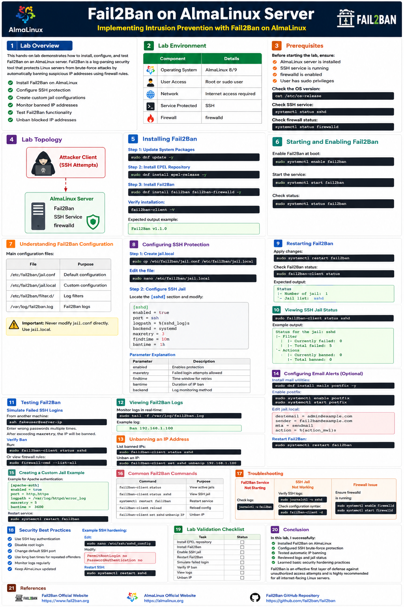
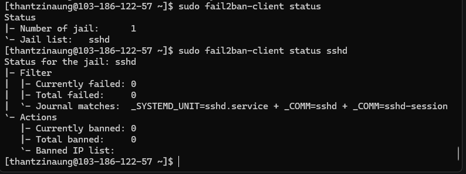

# Fail2Ban on AlmaLinux Server : Hands-On Lab

## Lab Title

Implementing Intrusion Prevention with Fail2Ban on AlmaLinux

---

# 1. Lab Overview

This hands-on lab demonstrates how to install, configure, and test Fail2Ban on an AlmaLinux server. Fail2Ban is a log-parsing security tool that protects Linux servers from brute-force attacks by automatically banning suspicious IP addresses using firewall rules.

- Install Fail2Ban on AlmaLinux
- Configure SSH protection
- Create custom jail configurations
- Monitor banned IP addresses
- Test Fail2Ban functionality
- Unban blocked IP addresses

---

# 2. Lab Environment

| Component | Details |
|---|---|
| Operating System | AlmaLinux 8/9 |
| User Access | Root or sudo user |
| Network | Internet access required |
| Service Protected | SSH |
| Firewall | firewalld |

---

# 3. Prerequisites

Before starting the lab, ensure:

- AlmaLinux server is installed
- SSH service is running
- firewalld is enabled
- User has sudo privileges

Check the OS version:

```bash
cat /etc/os-release
```

Check SSH service:

```bash
systemctl status sshd
```

Check firewall status:

```bash
systemctl status firewalld
```

---

# 4. Lab Topology

```text
+-------------------+
|   Attacker Client |
|  (SSH Attempts)   |
+---------+---------+
          |
          v
+-------------------+
| AlmaLinux Server  |
|   Fail2Ban        |
|   SSH Service     |
|   firewalld       |
+-------------------+
```

---

# 5. Installing Fail2Ban

## Step 1: Update System Packages

```bash
sudo dnf update -y
```

## Step 2: Install EPEL (Extra Packages for Enterprise Linux) Repository

Fail2Ban is available in the EPEL repository.

```bash
sudo dnf install epel-release -y
```

## Step 3: Install Fail2Ban

```bash
sudo dnf install fail2ban fail2ban-firewalld -y
```

Verify installation:

```bash
fail2ban-client -V
```

Expected output example:

```text
Fail2Ban v1.1.0
```

---

# 6. Starting and Enabling Fail2Ban

Enable Fail2Ban at boot:

```bash
sudo systemctl enable fail2ban
```

Start the service:

```bash
sudo systemctl start fail2ban
```

Check status:

```bash
sudo systemctl status fail2ban
```

---

# 7. Understanding Fail2Ban Configuration

Main configuration files:

| File | Purpose |
|---|---|
| `/etc/fail2ban/jail.conf` | Default configuration |
| `/etc/fail2ban/jail.local` | Custom configuration |
| `/etc/fail2ban/filter.d/` | Log filters |
| `/var/log/fail2ban.log` | Fail2Ban logs |

> Important: Never modify `jail.conf` directly. Use `jail.local`.

---

# 8. Configuring SSH Protection

## Step 1: Create jail.local

```bash
sudo cp /etc/fail2ban/jail.conf /etc/fail2ban/jail.local
```

Edit the file:

```bash
sudo nano /etc/fail2ban/jail.local
```

## Step 2: Configure SSH Jail

Locate the `[sshd]` section and modify:

```ini
[sshd]
enabled = true
port = ssh
logpath = %(sshd_log)s
backend = systemd
maxretry = 3
findtime = 10m
bantime = 1h
```

### Parameter Explanation

| Parameter | Description |
|---|---|
| enabled | Enables protection |
| maxretry | Failed login attempts allowed |
| findtime | Time window for retries |
| bantime | Duration of IP ban |
| backend | Log monitoring method |

---

# 9. Restarting Fail2Ban

Apply changes:

```bash
sudo systemctl restart fail2ban
```

Check Fail2Ban status:

```bash
sudo fail2ban-client status
```

Expected output:

```text
Status
|- Number of jail: 1
`- Jail list: sshd
```

---

# 10. Viewing SSH Jail Status

```bash
sudo fail2ban-client status sshd
```

Example output:

```text
Status for the jail: sshd
|- Filter
|  |- Currently failed: 0
|  |- Total failed: 5
`- Actions
   |- Currently banned: 0
   |- Total banned: 0
```

---

# 11. Testing Fail2Ban

## Simulate Failed SSH Logins

From another machine:

```bash
ssh fakeuser@server-ip
```

Enter wrong passwords multiple times.

After exceeding `maxretry`, the IP will be banned.

## Verify Ban

Run:

```bash
sudo fail2ban-client status sshd
```

Or view firewall rules:

```bash
sudo firewall-cmd --list-all
```

---

# 12. Viewing Fail2Ban Logs

Monitor logs in real-time:

```bash
sudo tail -f /var/log/fail2ban.log
```

Example log:

```text
Ban 192.168.1.100
```

---

# 13. Unbanning an IP Address

List banned IPs:

```bash
sudo fail2ban-client status sshd
```

Unban an IP:

```bash
sudo fail2ban-client set sshd unbanip 192.168.1.100
```

---

# 14. Configuring Email Alerts (Optional)

Install mail utilities:

```bash
sudo dnf install mailx postfix -y
```

Enable postfix:

```bash
sudo systemctl enable postfix
sudo systemctl start postfix
```

Edit `jail.local`:

```ini
destemail = admin@example.com
sender = fail2ban@example.com
mta = sendmail
action = %(action_mwl)s
```

Restart Fail2Ban:

```bash
sudo systemctl restart fail2ban
```

---

# 15. Creating a Custom Jail Example

Example for Apache authentication:

```ini
[apache-auth]
enabled = true
port = http,https
logpath = /var/log/httpd/error_log
maxretry = 5
bantime = 3600
```

Restart service:

```bash
sudo systemctl restart fail2ban
```

---

# 16. Common Fail2Ban Commands

| Command | Purpose |
|---|---|
| `fail2ban-client status` | View active jails |
| `fail2ban-client status sshd` | View SSH jail |
| `systemctl restart fail2ban` | Restart service |
| `fail2ban-client reload` | Reload config |
| `fail2ban-client set sshd unbanip IP` | Unban IP |

---

# 17. Troubleshooting

## Fail2Ban Service Not Starting

Check logs:

```bash
journalctl -u fail2ban
```

## SSH Jail Not Working

Verify SSH logs:

```bash
sudo journalctl -u sshd
```

Check configuration syntax:

```bash
sudo fail2ban-client -d
```

## Firewall Issue

Ensure firewalld is running:

```bash
sudo systemctl enable firewalld
sudo systemctl start firewalld
```

---

# 18. Security Best Practices

- Use SSH key authentication
- Disable root login
- Change default SSH port
- Use long ban times for repeated offenders
- Monitor logs regularly
- Keep AlmaLinux updated

Example SSH hardening:

Edit:

```bash
sudo nano /etc/ssh/sshd_config
```

Modify:

```ini
PermitRootLogin no
PasswordAuthentication no
```

Restart SSH:

```bash
sudo systemctl restart sshd
```

---

# 19. Lab Validation Checklist

| Task | Status |
|---|---|
| Install EPEL repository | ☐ |
| Install Fail2Ban | ☐ |
| Enable SSH jail | ☐ |
| Restart Fail2Ban | ☐ |
| Simulate failed login | ☐ |
| Verify IP ban | ☐ |
| View logs | ☐ |
| Unban IP | ☐ |

---

# 20. Conclusion

In this lab, I successfully:

- Installed Fail2Ban on AlmaLinux
- Configured SSH brute-force protection
- Tested automatic IP banning
- Reviewed logs and jail status
- Learned basic security hardening practices

Fail2Ban is an effective first layer of defense against unauthorized access attempts and is highly recommended for all internet-facing Linux servers.

---


