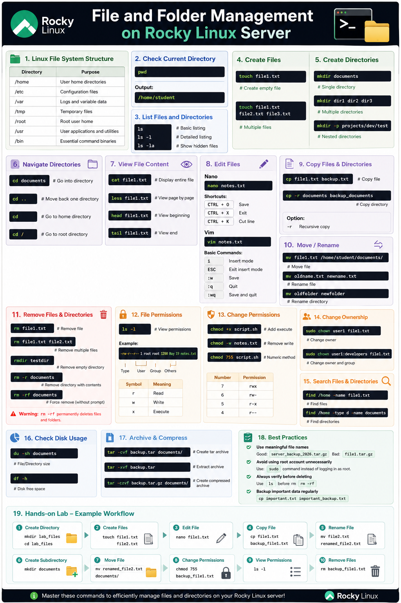

# File and Folder Management on Rocky Linux Server

## Introduction

File and folder management is one of the most important skills for Linux system administration. In Rocky Linux, administrators use command-line tools to create, edit, organize, secure, copy, move, and remove files and directories efficiently.

This documentation covers the essential file and folder management commands used in Rocky Linux servers.

---

# 1. Understanding Linux File System Structure

Linux organizes everything as files and directories.

| Directory | Purpose |
|---|---|
| `/home` | User home directories |
| `/etc` | Configuration files |
| `/var` | Logs and variable data |
| `/tmp` | Temporary files |
| `/root` | Root user home |
| `/usr` | User applications and utilities |
| `/bin` | Essential command binaries |

---

# 2. Check Current Directory

Use `pwd` to display the current working directory.

```bash
pwd
```

Example output:

```bash
/home/thantzinaung
```

---

# 3. List Files and Directories

## Basic Listing

```bash
ls
```

## Detailed Listing

```bash
ls -l
```

## Show Hidden Files

```bash
ls -la
```

Explanation:

| Option | Description |
|---|---|
| `-l` | Long format listing |
| `-a` | Show hidden files |
| `-h` | Human-readable sizes |

---

# 4. Create Files

## Create Empty File

```bash
touch file1.txt
```

## Create Multiple Files

```bash
touch file1.txt file2.txt file3.txt
```

## Verify Creation

```bash
ls
```

---

# 5. Create Directories (Folders)

## Create Single Directory

```bash
mkdir developers
```

## Create Multiple Directories

```bash
mkdir dir1 dir2 dir3
```

## Create Nested Directories

```bash
mkdir -p projects/dev/test
```

Explanation:

| Option | Description |
|---|---|
| `-p` | Create parent directories automatically |

---

# 6. Navigate Between Directories

## Move into Directory

```bash
cd developers
```

## Move Back One Directory

```bash
cd ..
```

## Move to Home Directory

```bash
cd
```

## Move to Root Directory

```bash
cd /
```

---

# 7. View File Content

## Display Entire File

```bash
cat file1.txt
```

## View File Page by Page

```bash
less file1.txt
```

## View Beginning of File

```bash
head file1.txt
```

## View End of File

```bash
tail file1.txt
```

---

# 8. Edit Files

## Edit with Nano

```bash
nano notes.txt
```

### Nano Shortcuts

| Shortcut | Action |
|---|---|
| `CTRL + O` | Save |
| `CTRL + X` | Exit |
| `CTRL + K` | Cut line |

---

## Edit with Vim

```bash
vim notes.txt
```

### Basic Vim Commands

| Command | Action |
|---|---|
| `i` | Insert mode |
| `ESC` | Exit insert mode |
| `:w` | Save |
| `:q` | Quit |
| `:wq` | Save and quit |

---

# 9. Copy Files and Directories

## Copy File

```bash
cp file1.txt backup.txt
```

## Copy Directory

```bash
cp -r documents backup_documents
```

Explanation:

| Option | Description |
|---|---|
| `-r` | Recursive copy |

---

# 10. Move and Rename Files

## Move File

```bash
mv file1.txt /home/student/documents/
```

## Rename File

```bash
mv oldname.txt newname.txt
```

## Rename Directory

```bash
mv oldfolder newfolder
```

---

# 11. Remove Files and Directories

## Remove File

```bash
rm file1.txt
```

## Remove Multiple Files

```bash
rm file1.txt file2.txt
```

## Remove Empty Directory

```bash
rmdir testdir
```

## Remove Directory with Contents

```bash
rm -r documents
```

## Force Remove

```bash
rm -rf documents
```

> ⚠ Warning:
>
> `rm -rf` permanently deletes files and folders without confirmation.

---

# 12. File Permissions

Linux uses permissions to control access.

## View Permissions

```bash
ls -l
```

Example:

```bash
-rw-r--r-- 1 root root 1200 May 19 notes.txt
```

Permission breakdown:

```text
-rw-r--r--
```

| Symbol | Meaning |
|---|---|
| `r` | Read |
| `w` | Write |
| `x` | Execute |

---

# 13. Change Permissions

## Using chmod

### Add Execute Permission

```bash
chmod +x script.sh
```

### Remove Write Permission

```bash
chmod -w notes.txt
```

### Numeric Permission Method

```bash
chmod 755 script.sh
```

Permission values:

| Number | Permission |
|---|---|
| 7 | rwx |
| 6 | rw- |
| 5 | r-x |
| 4 | r-- |

---
Create user using `sudo useradd username` if these is not in the grouplist - 

# 14. Change File Ownership

## Change Owner


```bash
sudo chown hantun file1.txt
```

## Change Owner and Group

```bash
sudo chown hantun:developers file3.txt
```

---

# 15. Search Files and Directories

## Find Files

```bash
find /home -name file1.txt
```

## Find Directories

```bash
find /home -type d -name documents
```

---

# 16. Check Disk Usage

## File Size

```bash
du -sh documents
```

## Disk Free Space

```bash
df -h
```

---

# 17. Archive and Compress Files

## Create Tar Archive

```bash
tar -cvf backup.tar documents/
```

## Extract Archive

```bash
tar -xvf backup.tar
```

## Create Compressed Archive

```bash
tar -czvf backup.tar.gz documents/
```

## Extact
```bash
tar -xzvf backup.tar.gz
```

---
## Create Zip
```bash
zip zip_name.zip original_name
```
```bash
unzip zip_name.zip
```

---

# 18. File Management Best Practices

## Use Meaningful File Names

Good example:

```text
server_backup_2026.tar.gz
```

Bad example:

```text
file1.tar.gz
```

---

## Avoid Using Root Account Unnecessarily

Use:

```bash
sudo command
```

instead of logging in directly as root.

---

## Always Verify Before Deleting

Use:

```bash
ls
```

before:

```bash
rm -rf
```

---

## Backup Important Data Regularly

Example:

```bash
cp important.txt important_backup.txt
```

---

# 19. Hands-on Lab

## Step 1 — Create Directory

```bash
mkdir lab_files
cd lab_files
```

---

## Step 2 — Create Files

```bash
touch file1.txt file2.txt
```

---

## Step 3 — Edit File

```bash
nano file1.txt
```

Add some text and save.

---

## Step 4 — Copy File

```bash
cp file1.txt backup_file1.txt
```

---

## Step 5 — Rename File

```bash
mv file2.txt renamed_file2.txt
```

---

## Step 6 — Create Subdirectory

```bash
mkdir documents
```

---

## Step 7 — Move File

```bash
mv renamed_file2.txt documents/
```

---

## Step 8 — Change Permissions

```bash
chmod 755 backup_file1.txt
```

---

## Step 9 — View Permissions

```bash
ls -l
```

---

## Step 10 — Remove Files

```bash
rm backup_file1.txt
```

---

# Conclusion

File and folder management is a fundamental skill for working with Rocky Linux servers. Understanding how to create, edit, organize, secure, and remove files helps administrators manage systems safely and efficiently.

By mastering these commands, you can confidently handle daily Linux server administration tasks in real-world environments.

