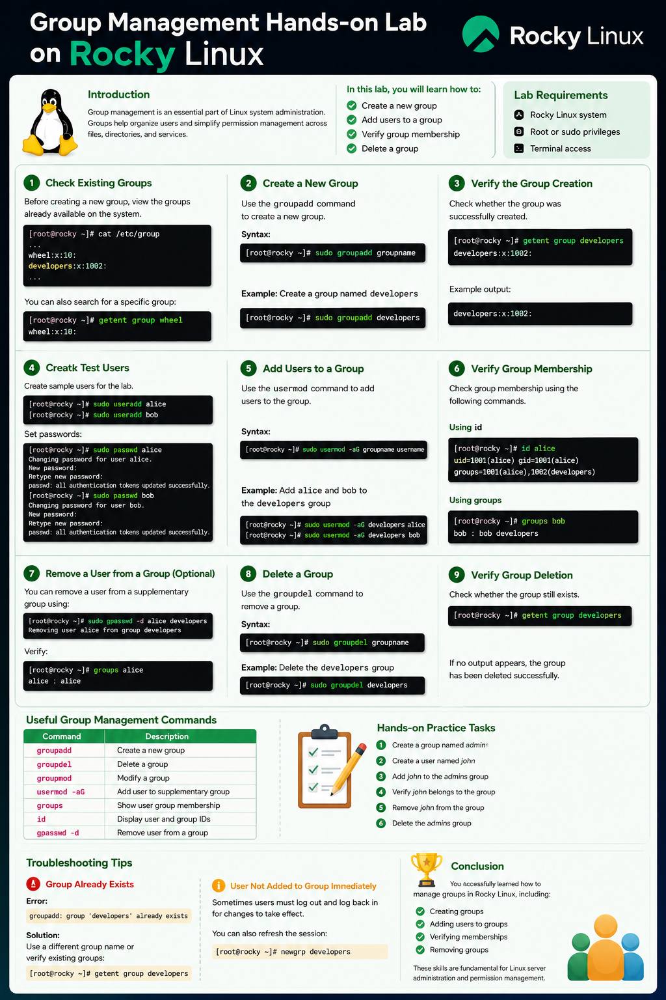
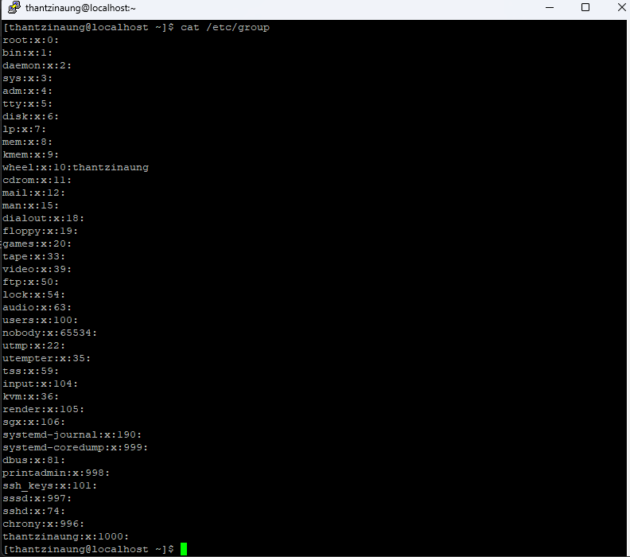
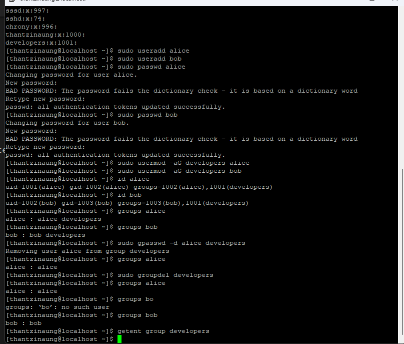

# Group Management Hands-on Lab on Rocky Linux

## Introduction

Group management is an essential part of Linux system administration. Groups help organize users and simplify permission management across files, directories, and services.

In this hands-on lab, 

- Create a new group
- Add users to a group
- Verify group membership
- Delete a group

This lab is designed for systems running Rocky Linux.

---

# Lab Requirements

- Rocky Linux system
- Root or sudo privileges
- Terminal access

---

# Step 1 — Check Existing Groups

Before creating a new group, view the groups already available on the system.

```bash
cat /etc/group
```

You can also search for a specific group:

```bash
getent group
```

Example:

```bash
getent group wheel
```

---

# Step 2 — Create a New Group

Use the `groupadd` command to create a new group.

## Syntax

```bash
sudo groupadd groupname
```

## Example

Create a group named `developers`:

```bash
sudo groupadd developers
```

Assingn a specific Group ID (GID) : use the `-g` flag to assgin a specific numeric ID to the group

## Syntax
```bash
sudo groupadd -g groupid groupname
```

## Example
```bash
sudo groupadd -g 1050 students
```
---

# Step 3 — Verify the Group Creation

Check whether the group was successfully created.

```bash
getent group developers
```

Example output:

```text
developers:x:1001:
```

---

# Step 4 — Create Test Users

Create sample users for the lab.

```bash
sudo useradd alice
sudo useradd bob
```

Set passwords:

```bash
sudo passwd alice
sudo passwd bob
```

---

# Step 5 — Add Users to a Group

Use the `usermod` command to add users to the group.

## Syntax

```bash
sudo usermod -aG groupname username
```

## Example

Add `alice` and `bob` to the `developers` group:

```bash
sudo usermod -aG developers alice
sudo usermod -aG developers bob
```

---

# Step 6 — Verify Group Membership

Check group membership using the following commands.

## Using `id`

```bash
id alice
```

Example output:

```text
uid=1001(alice) gid=1001(alice) groups=1001(alice),1002(developers)
```

## Using `groups`

```bash
groups bob
```

Example output:

```text
bob : bob developers
```

---

# Step 7 — Remove a User from a Group (Optional)

You can remove a user from a supplementary group using:

```bash
sudo gpasswd -d alice developers
```

Verify:

```bash
groups alice
```

---

# Step 8 — Delete a Group

Use the `groupdel` command to remove a group.

## Syntax

```bash
sudo groupdel groupname
```

## Example

Delete the `developers` group:

```bash
sudo groupdel developers
```

---

# Step 9 — Verify Group Deletion

Check whether the group still exists.

```bash
getent group developers
```

If no output appears, the group has been deleted successfully.

---

# Useful Group Management Commands

| Command | Description |
|---|---|
| `groupadd` | Create a new group |
| `groupdel` | Delete a group |
| `groupmod` | Modify a group |
| `usermod -aG` | Add user to supplementary group |
| `groups` | Show user group membership |
| `id` | Display user and group IDs |
| `gpasswd -d` | Remove user from a group |

---

# Hands-on Practice Tasks

completed the following exercises:

1. Create a group named `admins`
2. Create a user named `john`
3. Add `john` to the `admins` group
4. Verify `john` belongs to the group
5. Remove `john` from the group
6. Delete the `admins` group

---

# Troubleshooting Tips

## Group Already Exists

Error:

```text
groupadd: group 'developers' already exists
```

Solution:

Use a different group name or verify existing groups:

```bash
getent group developers
```

---

## User Not Added to Group Immediately

Sometimes users must log out and log back in for changes to take effect.

You can also refresh the session:

```bash
newgrp developers
```

---

# Conclusion

I have successfully learned how to manage groups in Rocky Linux, including:

- Creating groups
- Adding users to groups
- Verifying memberships
- Removing groups

These skills are fundamental for Linux server administration and permission management.



