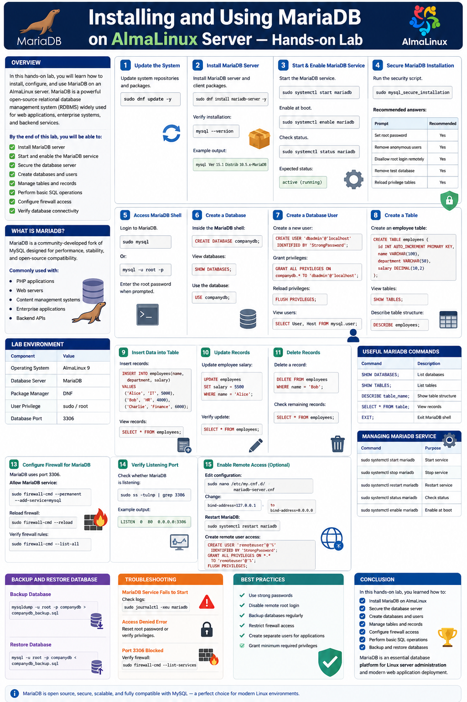
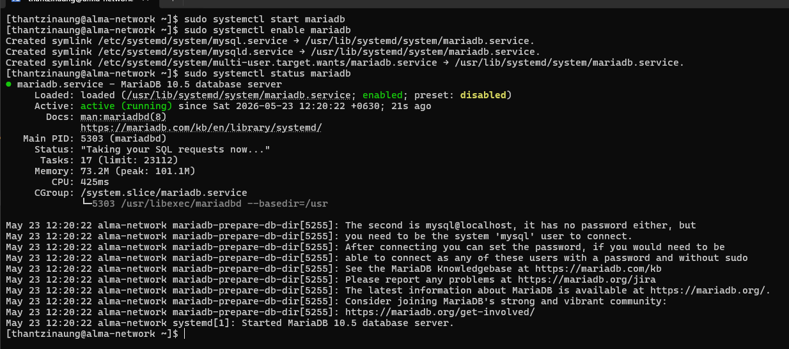
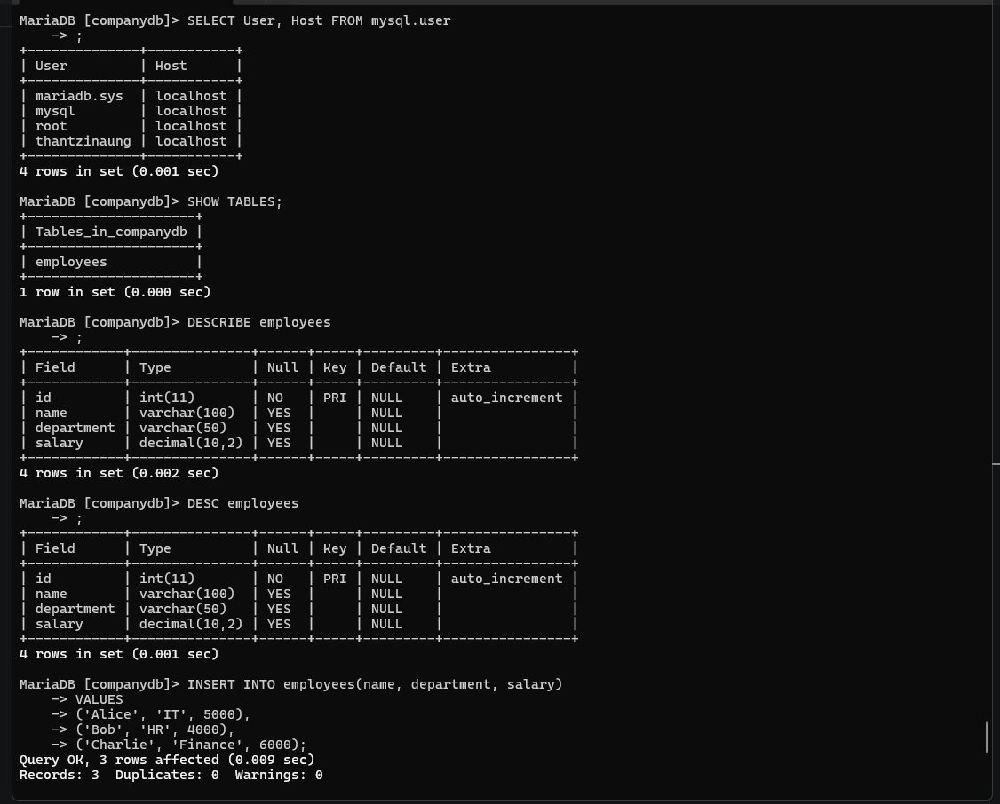
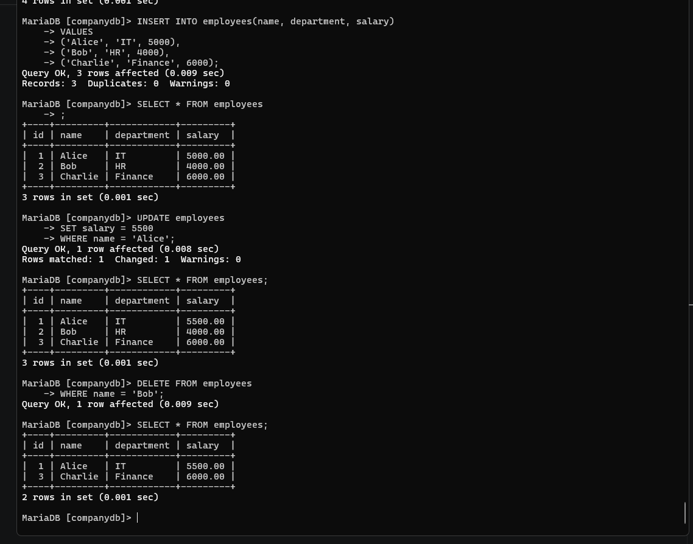

# Installing and Using MariaDB on AlmaLinux Server — Hands-on Lab

## Overview

In this hands-on lab, install, configure, and use MariaDB on an AlmaLinux server. MariaDB is a powerful open-source relational database management system (RDBMS) widely used for web applications, enterprise systems, and backend services.


- Install MariaDB server
- Start and enable the MariaDB service
- Secure the database server
- Create databases and users
- Manage tables and records
- Perform basic SQL operations
- Configure firewall access
- Verify database connectivity

---

# What is MariaDB?

MariaDB is a community-developed fork of MySQL designed for performance, stability, and open-source compatibility.

MariaDB is commonly used with:

- PHP applications
- Web servers
- Content management systems
- Enterprise applications
- Backend APIs

---

# Lab Environment

| Component | Value |
|---|---|
| Operating System | AlmaLinux 9 |
| Database Server | MariaDB |
| Package Manager | DNF |
| User Privilege | sudo/root |

---

# Step 1 — Update the System

Before installing packages, update the system repositories and packages.

```bash
sudo dnf update -y
```

---

# Step 2 — Install MariaDB Server

Install MariaDB server and client packages.

```bash
sudo dnf install mariadb-server -y
```

Verify installation:

```bash
mysql --version
```

Example output:

```bash
mysql  Ver 15.1 Distrib 10.5.29-MariaDB, for Linux (x86_64) using  EditLine wrapper
```

---

# Step 3 — Start and Enable MariaDB Service

Start the MariaDB service:

```bash
sudo systemctl start mariadb
```

Enable the service to start automatically during boot:

```bash
sudo systemctl enable mariadb
```

Check service status:

```bash
sudo systemctl status mariadb
```

Expected status:

```text
active (running)
```

---

# Step 4 — Secure MariaDB Installation

Run the security script:

```bash
sudo mysql_secure_installation
```

This script helps:

- Set root password
- Remove anonymous users
- Disable remote root login
- Remove test database
- Reload privilege tables

Recommended answers:

| Prompt | Recommended |
|---|---|
| Set root password | Yes |
| Remove anonymous users | Yes |
| Disallow root login remotely | Yes |
| Remove test database | Yes |
| Reload privilege tables | Yes |

---

# Step 5 — Access MariaDB Shell

Login to MariaDB:

```bash
sudo mysql
```

Or:

```bash
mysql -u root -p
```

Enter the root password when prompted.

---

# Step 6 — Create a Database

Inside the MariaDB shell:

```sql
CREATE DATABASE companydb;
```

View databases:

```sql
SHOW DATABASES;
```

Use the database:

```sql
USE companydb;
```

---

# Step 7 — Create a Database User

Create a new user:

```sql
CREATE USER 'thantzinaung'@'localhost' IDENTIFIED BY 'StrongPassword';
```

Grant privileges:

```sql
GRANT ALL PRIVILEGES ON companydb.* TO 'thantzinaung'@'localhost';
```

Reload privileges:

```sql
FLUSH PRIVILEGES;
```

View users:

```sql
SELECT User, Host FROM mysql.user;
```

---

# Step 8 — Create a Table

Create an employee table:

```sql
CREATE TABLE employees (
    id INT AUTO_INCREMENT PRIMARY KEY,
    name VARCHAR(100),
    department VARCHAR(50),
    salary DECIMAL(10,2)
);
```

View tables:

```sql
SHOW TABLES;
```

Describe table structure:

```sql
DESCRIBE employees;
```

---

# Step 9 — Insert Data into Table

Insert records:

```sql
INSERT INTO employees(name, department, salary)
VALUES
('Alice', 'IT', 5000),
('Bob', 'HR', 4000),
('Charlie', 'Finance', 6000);
```

View records:

```sql
SELECT * FROM employees;
```

---

# Step 10 — Update Records

Update employee salary:

```sql
UPDATE employees
SET salary = 5500
WHERE name = 'Alice';
```

Verify update:

```sql
SELECT * FROM employees;
```

---

# Step 11 — Delete Records

Delete a record:

```sql
DELETE FROM employees
WHERE name = 'Bob';
```

Check remaining records:

```sql
SELECT * FROM employees;
```

---

# Step 12 — Drop Table and Database

Delete a table:

```sql
DROP TABLE employees;
```

Delete database:

```sql
DROP DATABASE companydb;
```

---

# Step 13 — Configure Firewall for MariaDB

MariaDB uses port `3306`.

Allow MariaDB service through firewall:

```bash
sudo firewall-cmd --permanent --add-service=mysql
```

Reload firewall:

```bash
sudo firewall-cmd --reload
```

Verify firewall rules:

```bash
sudo firewall-cmd --list-all
```

---

# Step 14 — Verify Listening Port

Check whether MariaDB is listening:

```bash
sudo ss -tulnp | grep 3306
```

Example output:

```text
tcp   LISTEN 0      80                 *:3306            *:*    users:(("mariadbd",pid=5303,fd=19))
```

---

# Step 15 — Enable Remote Access (Optional)

Edit MariaDB configuration:

```bash
sudo nano /etc/my.cnf.d/mariadb-server.cnf
```

Find:

```ini
bind-address=127.0.0.1
```

Change to:

```ini
bind-address=0.0.0.0
```

Restart MariaDB:

```bash
sudo systemctl restart mariadb
```

Create remote user access:

```sql
CREATE USER 'thantzinaung'@'%' IDENTIFIED BY 'StrongPassword';
GRANT ALL PRIVILEGES ON *.* TO 'thantzinaung'@'%';
FLUSH PRIVILEGES;
```

---

# Useful MariaDB Commands

| Command | Description |
|---|---|
| `SHOW DATABASES;` | List databases |
| `SHOW TABLES;` | List tables |
| `DESCRIBE table_name;` | Show table structure |
| `SELECT * FROM table;` | View records |
| `EXIT;` | Exit MariaDB shell |

---

# Managing MariaDB Service

| Command | Purpose |
|---|---|
| `sudo systemctl start mariadb` | Start service |
| `sudo systemctl stop mariadb` | Stop service |
| `sudo systemctl restart mariadb` | Restart service |
| `sudo systemctl status mariadb` | Check status |
| `sudo systemctl enable mariadb` | Enable at boot |

---

# Backup and Restore Database

## Backup Database

```bash
mysqldump -u root -p companydb > companydb_backup.sql
```

## Restore Database

```bash
mysql -u root -p companydb < companydb_backup.sql
```

---

# Troubleshooting

## MariaDB Service Fails to Start

Check logs:

```bash
sudo journalctl -xeu mariadb
```

## Access Denied Error

Reset root password or verify privileges.

## Port 3306 Blocked

Verify firewall:

```bash
sudo firewall-cmd --list-services
```

---

# Best Practices

- Use strong passwords
- Disable remote root login
- Backup databases regularly
- Restrict firewall access
- Create separate users for applications
- Grant minimum required privileges

---

# Conclusion

In this hands-on lab, you learned how to:

- Install MariaDB on AlmaLinux
- Secure the database server
- Create databases and users
- Manage tables and records
- Configure firewall access
- Perform basic SQL operations
- Backup and restore databases

MariaDB is an essential database platform for Linux server administration and modern web application deployment.




