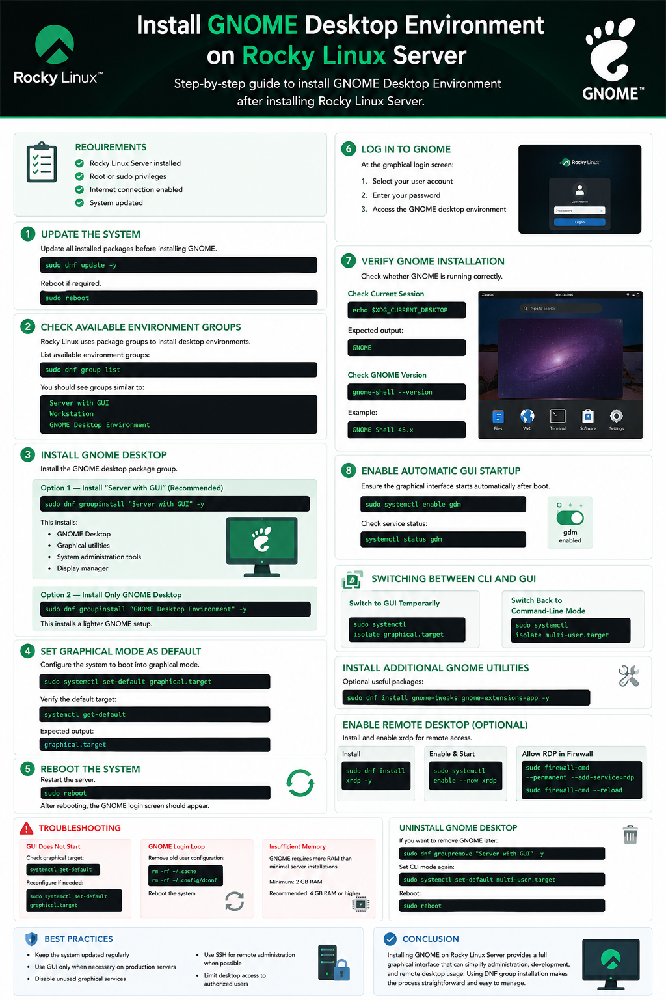

# Install GNOME Desktop Environment on Rocky Linux Server

## Introduction

By default, a Rocky Linux Server installation uses a minimal command-line environment without a graphical user interface (GUI). In some situations, administrators may want to install a desktop environment such as GNOME for easier system management, development work, or remote desktop access.

---

# Requirements

Before starting:

- Rocky Linux Server installed
- Root or sudo privileges
- Internet connection enabled
- System updated

---

# Step 1 — Update the System

Update all installed packages before installing GNOME.

```bash
sudo dnf update -y
```

After the update completes, reboot if required.

```bash
sudo reboot
```

---

# Step 2 — Check Available Environment Groups

Rocky Linux uses package groups to install desktop environments.

List available environment groups:

```bash
sudo dnf group list
```

see groups similar to:

```text
Server with GUI
Workstation
GNOME Desktop Environment
```

---

# Step 3 — Install GNOME Desktop

Install the GNOME desktop package group.

## Option 1 — Install “Server with GUI” (Recommended)

```bash
sudo dnf groupinstall "Server with GUI" -y
```

This installs:

- GNOME Desktop
- Graphical utilities
- System administration tools
- Display manager

---

## Option 2 — Install Only GNOME Desktop

```bash
sudo dnf groupinstall "GNOME Desktop Environment" -y
```

This installs a lighter GNOME setup.

---

# Step 4 — Set Graphical Mode as Default

After installation, configure the system to boot into graphical mode.

```bash
sudo systemctl set-default graphical.target
```

Verify the default target:

```bash
systemctl get-default
```

Expected output:

```text
graphical.target
```

---

# Step 5 — Reboot the System

Restart the server.

```bash
sudo reboot
```

After rebooting, the GNOME login screen should appear.

---

# Step 6 — Log In to GNOME

At the graphical login screen:

1. Select your user account
2. Enter your password
3. Access the GNOME desktop environment

---

# Step 7 — Verify GNOME Installation

Check whether GNOME is running correctly.

## Check Current Session

```bash
echo $XDG_CURRENT_DESKTOP
```

Expected output:

```text
GNOME
```

---

## Check GNOME Version

```bash
gnome-shell --version
```

Example:

```text
GNOME Shell 45.x
```

---

# Step 8 — Enable Automatic GUI Startup

Ensure the graphical interface starts automatically after boot.

```bash
sudo systemctl enable gdm
```

Check service status:

```bash
systemctl status gdm
```

---

# Switching Between CLI and GUI

## Switch to GUI Temporarily

```bash
sudo systemctl isolate graphical.target
```

## Switch Back to Command-Line Mode

```bash
sudo systemctl isolate multi-user.target
```

---

# Install Additional GNOME Utilities

Optional useful packages:

```bash
sudo dnf install gnome-tweaks gnome-extensions-app -y
```

These tools help customize the GNOME desktop.

---

# Enable Remote Desktop (Optional)

Install remote desktop support:

```bash
sudo dnf install xrdp -y
```

Enable and start the service:

```bash
sudo systemctl enable --now xrdp
```

Allow RDP through the firewall:

```bash
sudo firewall-cmd --permanent --add-service=rdp
sudo firewall-cmd --reload
```

---

# Troubleshooting

## GUI Does Not Start

Check graphical target:

```bash
systemctl get-default
```

Reconfigure if needed:

```bash
sudo systemctl set-default graphical.target
```

---

## GNOME Login Loop

Remove old user configuration:

```bash
rm -rf ~/.cache
rm -rf ~/.config/dconf
```

Reboot the system.

---

## Insufficient Memory

GNOME requires more RAM than minimal server installations.

Recommended:

- Minimum: 2 GB RAM
- Recommended: 4 GB RAM or higher

---

# Uninstall GNOME Desktop

If you want to remove GNOME later:

```bash
sudo dnf groupremove "Server with GUI" -y
```

Set CLI mode again:

```bash
sudo systemctl set-default multi-user.target
```

Reboot:

```bash
sudo reboot
```

---

# Best Practices

- Keep the system updated regularly
- Use GUI only when necessary on production servers
- Disable unused graphical services
- Use SSH for remote administration when possible
- Limit desktop access to authorized users

---

# Conclusion

Installing GNOME on Rocky Linux Server provides a full graphical interface that can simplify administration, development, and remote desktop usage. Using DNF group installation makes the process straightforward and easy to manage.

