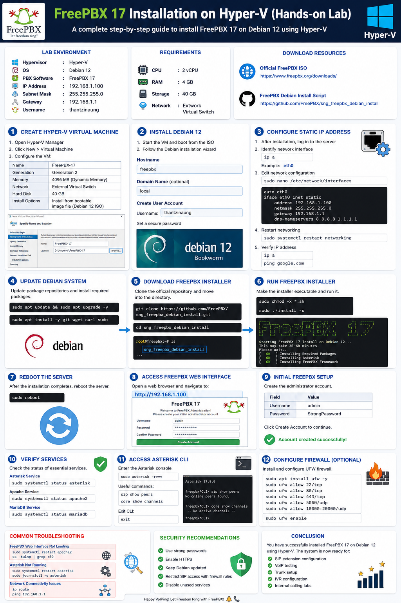
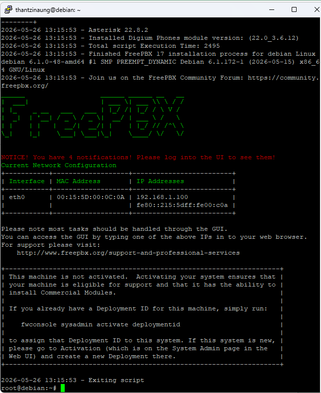
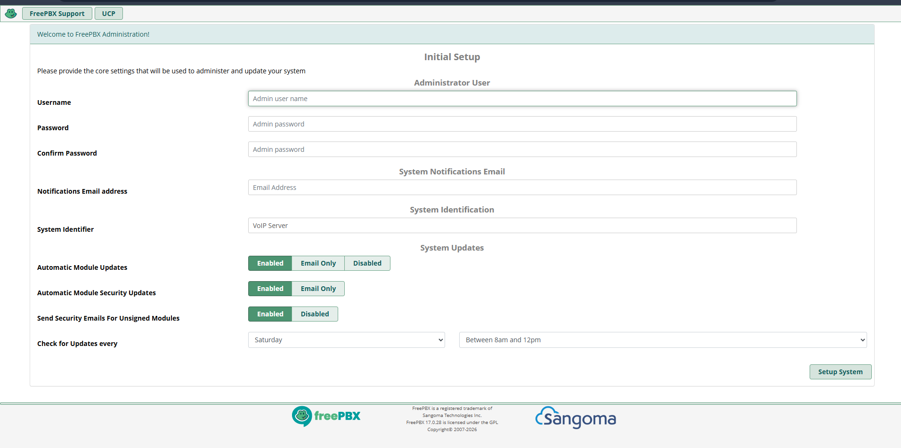
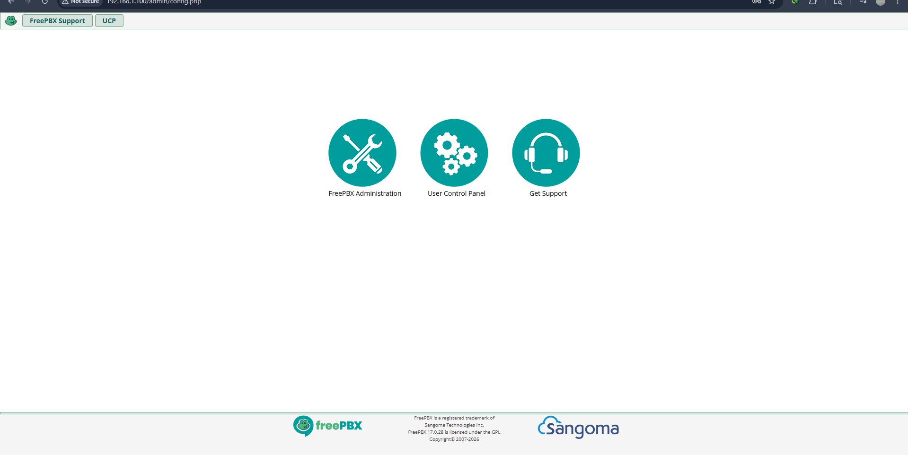

# FreePBX 17 Installation on Hyper-V (Hands-on Lab)

## Overview

This hands-on lab demonstrates how to install FreePBX 17 on Hyper-V using the official Debian 12 installation method.

The lab includes:

- Creating a Hyper-V virtual machine
- Installing Debian 12
- Configuring static networking
- Installing FreePBX 17
- Accessing the FreePBX web interface
- Basic post-installation verification

---

# Lab Environment

| Component | Details |
|---|---|
| Hypervisor | Hyper-V |
| Operating System | Debian 12 |
| PBX Software | FreePBX 17 |
| IP Address | 192.168.1.100 |
| Subnet Mask | 255.255.255.0 |
| Gateway | 192.168.1.1 |
| Username | thantzinaung |

---

# Requirements

## Hardware Requirements

| Resource | Recommended |
|---|---|
| CPU | 2 vCPU |
| RAM | 4 GB |
| Storage | 60 GB |
| Network | External Virtual Switch |

---

# Download Resources

## Official FreePBX ISO

FreePBX Downloads  
https://www.freepbx.org/downloads/

## FreePBX Debian Installation Script

FreePBX Debian Install GitHub Repository  
https://github.com/FreePBX/sng_freepbx_debian_install

---

# Step 1 — Create Hyper-V Virtual Machine

## Open Hyper-V Manager

On the Windows host:

1. Open **Hyper-V Manager**
2. Click **New → Virtual Machine**

---

## Configure VM

### Specify Name and Location

Example:

```bash
FreePBX-17
```

---

### Generation

Select:

```bash
Generation 2
```

---

### Assign Memory

Recommended:

```bash
4096 MB
```

Enable:

```bash
Use Dynamic Memory
```

---

### Configure Networking

Select:

```bash
External Virtual Switch
```

This allows the VM to communicate with the local network.

---

### Create Virtual Hard Disk

```bash
60 GB
```

---

### Installation Options

Choose:

```bash
Install an operating system from a bootable image file
```

Attach the downloaded Debian 12 / FreePBX ISO.

---

# Step 2 — Install Debian 12

Start the VM and boot from the ISO.

Follow the Debian installation wizard.

---

## Configure Hostname

Example:

```bash
freepbx
```

---

## Configure Domain Name

Optional:

```bash
local
```

---

## Create User Account

Username:

```bash
thantzinaung
```

Set a secure password.

---

# Step 3 — Configure Static IP Address

After Debian installation completes, log in to the server.

---

## Identify Network Interface

Run:

```bash
ip a
```

Example interface:

```bash
eth0
```

---

## Edit Network Configuration

Open the network configuration file:

```bash
sudo nano /etc/network/interfaces
```

Example configuration:

```bash
auto eth0

iface eth0 inet static
address 192.168.1.100
netmask 255.255.255.0
gateway 192.168.1.1
dns-nameservers 8.8.8.8 1.1.1.1
```

Save and exit.

---

## Restart Networking

```bash
sudo systemctl restart networking
```

---

## Verify IP Address

```bash
ip a
```

Test internet connectivity:

```bash
ping google.com
```

---

# Step 4 — Update Debian System

Update package repositories:

```bash
sudo apt update && sudo apt upgrade -y
```

Install required packages:

```bash
sudo apt install -y git wget curl sudo
```

---

# Step 5 — Download FreePBX Installation Script

Clone the official repository:

```bash
git clone https://github.com/FreePBX/sng_freepbx_debian_install.git
```

Move into the directory:

```bash
cd sng_freepbx_debian_install
```

---

# Step 6 — Run FreePBX Installer

Make the installer executable:

```bash
sudo chmod +x *.sh
```

Run the installation script:

```bash
sudo ./install -s
```

---

## Installation Notes

The installer automatically installs:

- Apache
- MariaDB
- PHP
- Asterisk
- NodeJS
- FreePBX Framework

The installation may take:

```bash
30–60 minutes
```

depending on internet speed and system performance.

---

# Step 7 — Reboot the Server

After installation completes:

```bash
sudo reboot
```

---

# Step 8 — Access FreePBX Web Interface

Open a web browser on another machine.

Navigate to:

```bash
http://192.168.1.100
```

---

# Step 9 — Initial FreePBX Setup

Create the administrator account.

Example:

| Field | Value |
|---|---|
| Username | admin |
| Password | StrongPassword |

Click:

```bash
Create Account
```

---

# Step 10 — Verify Services

## Check Asterisk Service

```bash
sudo systemctl status asterisk
```

---

## Check Apache Service

```bash
sudo systemctl status apache2
```

---

## Check MariaDB Service

```bash
sudo systemctl status mariadb
```

---

# Step 11 — Access Asterisk CLI

Enter the Asterisk console:

```bash
sudo asterisk -rvvv
```

Useful commands:

```bash
sip show peers
```

```bash
core show channels
```

Exit CLI:

```bash
exit
```

---

# Step 12 — Configure Firewall (Optional)

Install UFW:

```bash
sudo apt install ufw -y
```

Allow required ports:

```bash
sudo ufw allow 22/tcp
sudo ufw allow 80/tcp
sudo ufw allow 443/tcp
sudo ufw allow 5060/udp
sudo ufw allow 10000:20000/udp
```

Enable firewall:

```bash
sudo ufw enable
```

---

# Common Troubleshooting

## FreePBX Web Interface Not Loading

Check Apache:

```bash
sudo systemctl restart apache2
```

Verify port 80:

```bash
ss -tulnp | grep :80
```

---

## Asterisk Not Running

Restart service:

```bash
sudo systemctl restart asterisk
```

Check logs:

```bash
sudo journalctl -u asterisk
```

---

## Network Connectivity Issues

Verify IP configuration:

```bash
ip route
```

Test gateway connectivity:

```bash
ping 192.168.1.1
```

---

# Security Recommendations

- Use strong passwords
- Enable HTTPS
- Keep Debian updated
- Restrict SIP access with firewall rules
- Disable unused services

---

# Conclusion

In this lab, you successfully installed:

- Debian 12
- FreePBX 17
- Asterisk PBX
- Required web and database services

You also configured:

- Static networking
- Hyper-V virtual machine settings
- Firewall rules
- Service verification

The FreePBX server is now ready for:

- SIP extension configuration
- VoIP testing
- Trunk setup
- IVR configuration
- Internal calling labs






