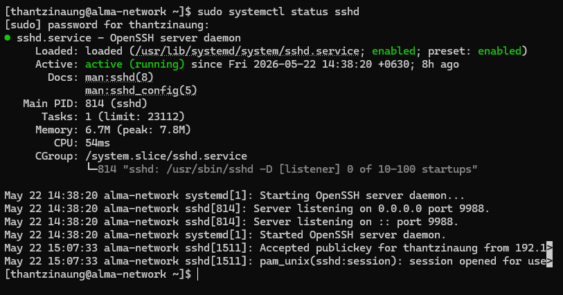
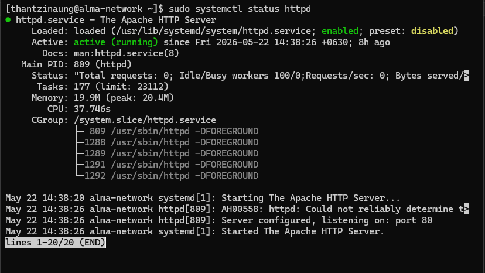
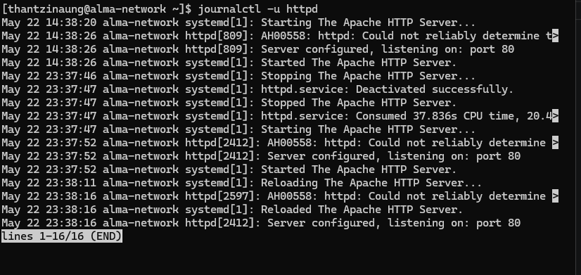
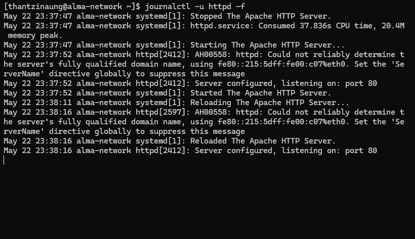

# Managing Services with `systemctl` in AlmaLinux Server

## Overview

In AlmaLinux, system services are managed using **systemd**, the modern initialization and service management system for Linux distributions. The `systemctl` command is the primary tool used to control services, check their status, enable automatic startup, and troubleshoot server processes.

This hands-on guide introduces essential service management tasks using `systemctl` on an AlmaLinux server.

---

- Understand the role of `systemd` and services
- Start and stop services
- Enable and disable services at boot
- Restart and reload services
- Check service status
- View logs and troubleshoot services
- List active and failed services
- Manage targets (runlevels)

---

# What is systemd?

`systemd` is the default system and service manager in AlmaLinux.

It is responsible for:

- Booting the system
- Starting system services
- Managing background processes (daemons)
- Handling system states and targets
- Logging and monitoring services

The command-line tool used to interact with `systemd` is:

```bash
systemctl
```

---

# Understanding Services

A **service** is a background process that performs specific tasks such as:

| Service | Purpose |
|---|---|
| `sshd` | Secure remote login |
| `httpd` | Apache web server |
| `firewalld` | Firewall management |
| `NetworkManager` | Network management |
| `chronyd` | Time synchronization |

---

# Basic `systemctl` Syntax

```bash
systemctl [COMMAND] [SERVICE_NAME]
```

Example:

```bash
sudo systemctl status sshd
```

---

# Checking Service Status

To verify whether a service is running:

```bash
systemctl status sshd
```

Example output:

```text
● sshd.service - OpenSSH server daemon
   Loaded: loaded (/usr/lib/systemd/system/sshd.service)
   Active: active (running)
```

## Common Service States

| State | Meaning |
|---|---|
| `active (running)` | Service is running |
| `inactive` | Service is stopped |
| `failed` | Service encountered an error |

---

# Starting a Service

Start a service immediately:

```bash
sudo systemctl start httpd
```

Verify:

```bash
systemctl status httpd
```

---

# Stopping a Service

Stop a running service:

```bash
sudo systemctl stop httpd
```

---

# Restarting a Service

Restart a service after configuration changes:

```bash
sudo systemctl restart httpd
```

---

# Reloading a Service

Reload configuration without fully restarting:

```bash
sudo systemctl reload httpd
```

> Note: Not all services support reload.

---

# Enabling Services at Boot

Enable a service to automatically start during boot:

```bash
sudo systemctl enable httpd
```

Output example:

```text
Created symlink /etc/systemd/system/multi-user.target.wants/httpd.service
```

---

# Disabling Services at Boot

Prevent a service from starting automatically:

```bash
sudo systemctl disable httpd
```

---

# Checking if a Service is Enabled

```bash
systemctl is-enabled httpd
```

Possible outputs:

```text
enabled
disabled
static
```

---

# Checking if a Service is Active

```bash
systemctl is-active httpd
```

Example output:

```text
active
```

---

# Listing All Running Services

```bash
systemctl list-units --type=service
```

---

# Listing Failed Services

```bash
systemctl --failed
```

This is useful for troubleshooting service problems.

---

# Viewing Service Logs with `journalctl`

Systemd uses the journal logging system.

## View logs for a service

```bash
journalctl -u httpd
```

## View recent logs

```bash
journalctl -u httpd -n 20
```

## Follow logs in real time

```bash
journalctl -u httpd -f
```

---

# Reloading systemd Configuration

After editing service unit files:

```bash
sudo systemctl daemon-reload
```

---

# Understanding Service Unit Files

Service definitions are stored in:

```bash
/ usr/lib/systemd/system/
```

Custom services may be placed in:

```bash
/etc/systemd/system/
```

Example:

```bash
ls /usr/lib/systemd/system/httpd.service
```

---

# Managing Targets (Runlevels)

Targets define system operating modes.

| Target | Purpose |
|---|---|
| `multi-user.target` | Command-line mode |
| `graphical.target` | GUI mode |
| `rescue.target` | Rescue mode |

## Check current target

```bash
systemctl get-default
```

## Set graphical mode as default

```bash
sudo systemctl set-default graphical.target
```

## Set command-line mode

```bash
sudo systemctl set-default multi-user.target
```

---

# Rebooting and Shutting Down

## Reboot System

```bash
sudo systemctl reboot
```

## Shutdown System

```bash
sudo systemctl poweroff
```

---

# Troubleshooting Services

## Check Detailed Status

```bash
systemctl status SERVICE_NAME
```

## View Failure Logs

```bash
journalctl -xe
```

## Verify Service File Syntax

```bash
systemd-analyze verify /etc/systemd/system/custom.service
```

---

# Useful `systemctl` Commands Summary

| Command | Description |
|---|---|
| `systemctl start SERVICE` | Start service |
| `systemctl stop SERVICE` | Stop service |
| `systemctl restart SERVICE` | Restart service |
| `systemctl reload SERVICE` | Reload configuration |
| `systemctl enable SERVICE` | Enable at boot |
| `systemctl disable SERVICE` | Disable at boot |
| `systemctl status SERVICE` | Check service status |
| `systemctl is-active SERVICE` | Check if running |
| `systemctl is-enabled SERVICE` | Check boot status |
| `systemctl list-units --type=service` | List services |
| `systemctl --failed` | List failed services |
| `journalctl -u SERVICE` | View logs |

---

# Best Practices

- Always verify service status after configuration changes
- Use `reload` instead of `restart` when supported
- Enable only required services
- Regularly check failed services
- Use logs for troubleshooting
- Keep services updated with security patches

---

# Conclusion

Managing services with `systemctl` is one of the most important skills for AlmaLinux server administration. With `systemd`, administrators can efficiently control system services, automate startup processes, monitor logs, and troubleshoot server operations.

Mastering `systemctl` helps ensure stable, secure, and reliable Linux server management.





