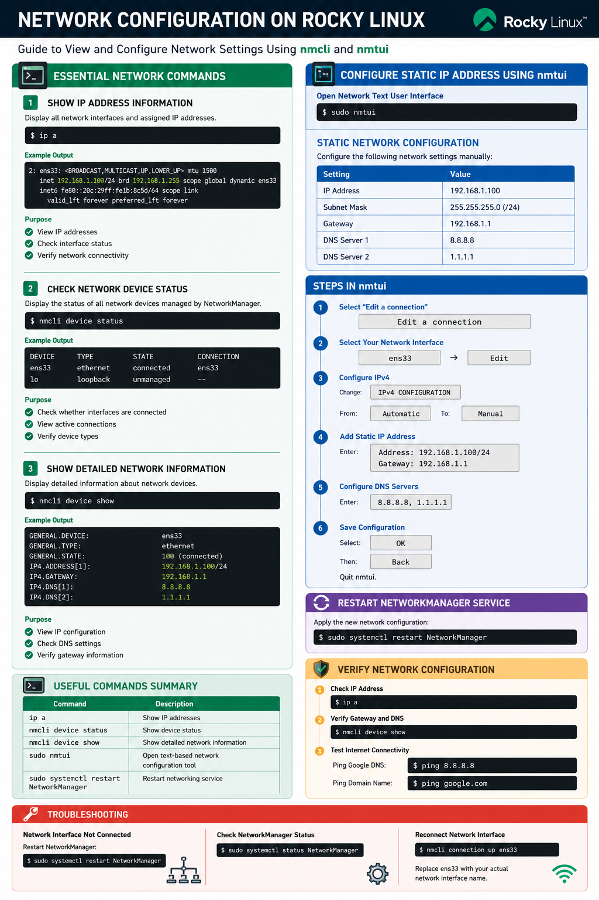
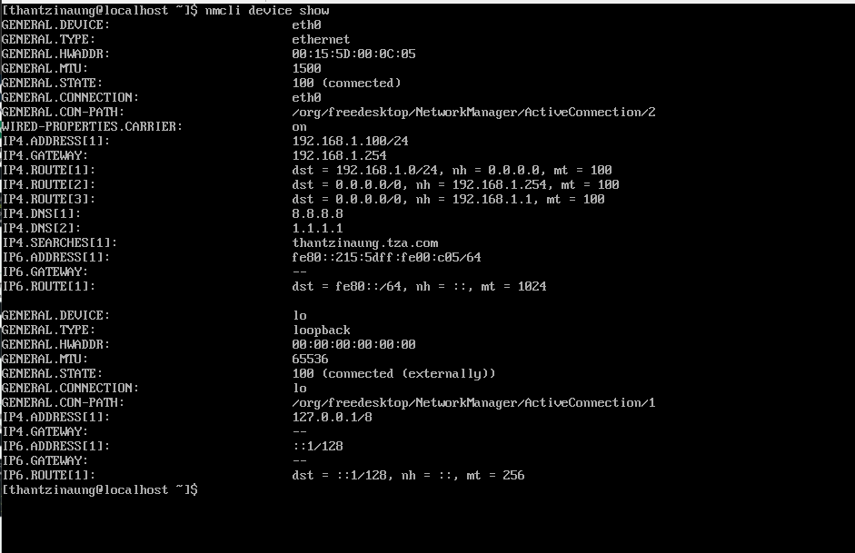

# Network Configuration on Rocky Linux

This documentation explains essential network configuration commands and how to configure a static IP address on a Rocky Linux server using `nmcli` and `nmtui`.

---

# Essential Network Commands

## 1. Show IP Address Information

Use the following command to display all network interfaces and assigned IP addresses:

```bash
ip a
```

### Example Output

```bash
2: ens33: <BROADCAST,MULTICAST,UP,LOWER_UP> mtu 1500
    inet 192.168.1.100/24 brd 192.168.1.255 scope global dynamic ens33
```

### Purpose
- View IP addresses
- Check interface status
- Verify network connectivity

---

## 2. Check Network Device Status

Display the status of all network devices managed by NetworkManager:

```bash
nmcli device status
```

### Example Output

```bash
DEVICE  TYPE      STATE      CONNECTION
ens33   ethernet  connected  ens33
lo      loopback  unmanaged  --
```

### Purpose
- Check whether interfaces are connected
- View active connections
- Verify device types

---

## 3. Show Detailed Network Information

Display detailed information about network devices:

```bash
nmcli device show
```

### Example Output

```bash
GENERAL.DEVICE:                         ens33
GENERAL.TYPE:                           ethernet
IP4.ADDRESS[1]:                         192.168.1.100/24
IP4.GATEWAY:                            192.168.1.1
IP4.DNS[1]:                             8.8.8.8
```

### Purpose
- View IP configuration
- Check DNS settings
- Verify gateway information

---

# Configure Static IP Address Using `nmtui`

## Open Network Text User Interface

Run:

```bash
sudo nmtui
```

---

# Static Network Configuration

Configure the following network settings manually:

| Setting | Value |
|---|---|
| IP Address | 192.168.1.100 |
| Subnet Mask | 255.255.255.0 (/24) |
| Gateway | 192.168.1.1 |
| DNS Server 1 | 8.8.8.8 |
| DNS Server 2 | 1.1.1.1 |

---

# Steps in `nmtui`

## Step 1 — Select “Edit a connection”

Choose:

```text
Edit a connection
```

---

## Step 2 — Select Your Network Interface

Example:

```text
ens33
```

Select the interface and choose:

```text
Edit
```

---

## Step 3 — Configure IPv4

Change:

```text
IPv4 CONFIGURATION
```

From:

```text
Automatic
```

To:

```text
Manual
```

---

## Step 4 — Add Static IP Address

Enter:

```text
Address: 192.168.1.100/24
Gateway: 192.168.1.1
```

---

## Step 5 — Configure DNS Servers

Enter:

```text
8.8.8.8, 1.1.1.1
```

---

## Step 6 — Save Configuration

Select:

```text
OK
```

Then:

```text
Back
```

Quit `nmtui`.

---

# Restart NetworkManager Service

Apply the new network configuration:

```bash
sudo systemctl restart NetworkManager
```

---

# Verify Network Configuration

## Check IP Address

```bash
ip a
```

---

## Verify Gateway and DNS

```bash
nmcli device show
```

---

## Test Internet Connectivity

Ping Google DNS:

```bash
ping 8.8.8.8
```

Ping Domain Name:

```bash
ping google.com
```

---

# Troubleshooting

## Network Interface Not Connected

Restart NetworkManager:

```bash
sudo systemctl restart NetworkManager
```

---

## Check NetworkManager Status

```bash
sudo systemctl status NetworkManager
```

---

## Reconnect Network Interface

```bash
nmcli connection up ens33
```

Replace `ens33` with your actual network interface name.

---

# Useful Commands Summary

| Command | Description |
|---|---|
| `ip a` | Show IP addresses |
| `nmcli device status` | Show device status |
| `nmcli device show` | Show detailed network information |
| `sudo nmtui` | Open text-based network configuration tool |
| `sudo systemctl restart NetworkManager` | Restart networking service |

---

# Conclusion

Rocky Linux provides powerful networking tools such as `ip`, `nmcli`, and `nmtui` for managing network configurations. Using these tools, administrators can easily configure static IP addresses, DNS servers, and gateways for server environments.


