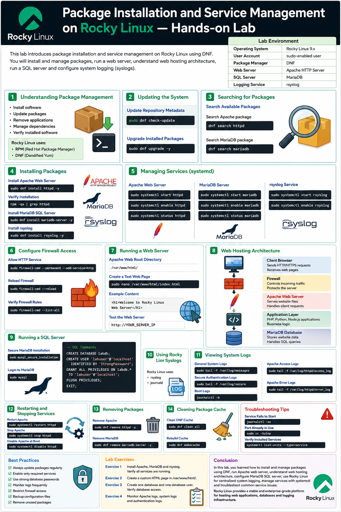
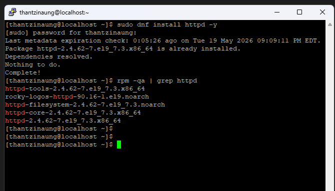
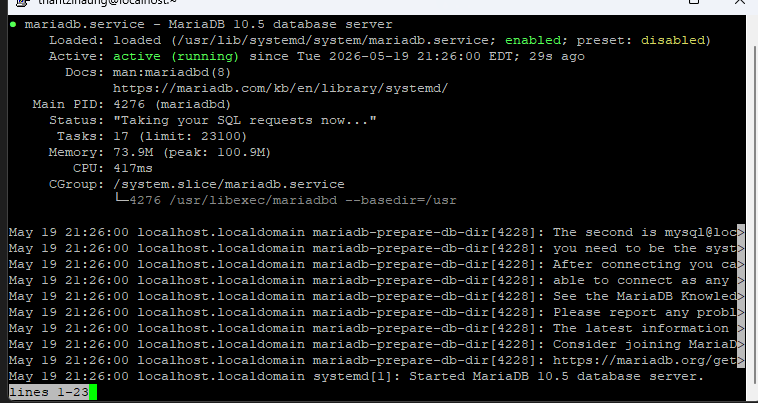
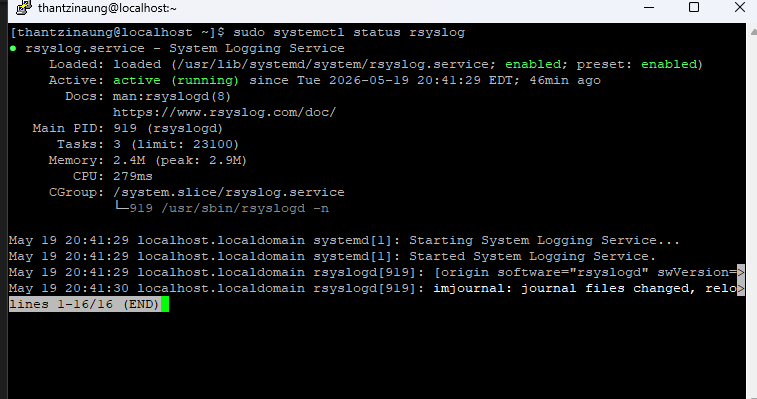
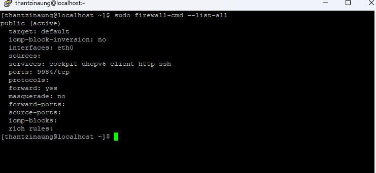

# Package Installation and Service Management on Rocky Linux — Hands-on Lab

## Overview

This hands-on lab introduces package installation and service management on Rocky Linux using the `dnf` package manager. 

- Install and manage software packages
- Run a web server
- Understand basic web hosting architecture
- Install and run a SQL database server
- Configure Rocky Linux for system logging (syslogs)

---

# Lab Environment

| Component | Example |
|---|---|
| Operating System | Rocky Linux 9.7 |
| User Account | sudo-enabled user |
| Package Manager | DNF |
| Web Server | Apache HTTP Server |
| SQL Server | MariaDB |
| Logging Service | rsyslog |

---

# Section 1 — Understanding Package Management

## What is Package Management?

Package management allows administrators to:

- Install software
- Update packages
- Remove applications
- Manage dependencies
- Verify installed software

Rocky Linux uses:

- RPM (Red Hat Package Manager)
- DNF (Dandified Yum)

---

# Section 2 — Updating the System

Before installing packages, update the system packages.

## Update Repository Metadata

```bash
sudo dnf check-update
```

## Upgrade Installed Packages

```bash
sudo dnf upgrade -y
```

Clean cach file 
```bash
sudo dnf autoremove
sudo dnf clean all
```
---

# Section 3 — Searching for Packages

## Search Available Packages

Example: Search Apache package

```bash
dnf search httpd
```

Example: Search MariaDB package

```bash
dnf search mariadb
```

---

# Section 4 — Installing Packages

## Install Apache Web Server

```bash
sudo dnf install httpd -y
```

## Verify Installation

```bash
rpm -qa | grep httpd
```

## Install MariaDB SQL Server

```bash
sudo dnf install mariadb-server -y
```

## Install rsyslog

```bash
sudo dnf install rsyslog -y
```

---

# Section 5 — Managing Services

Rocky Linux uses `systemd` for service management.

## Start Apache Web Server

```bash
sudo systemctl start httpd
```

## Enable Apache at Boot

```bash
sudo systemctl enable httpd
```

## Check Apache Status

```bash
sudo systemctl status httpd
```

---

## Start MariaDB Server

```bash
sudo systemctl start mariadb
```

## Enable MariaDB at Boot

```bash
sudo systemctl enable mariadb
```

## Check MariaDB Status

```bash
sudo systemctl status mariadb
```

---

## Start rsyslog Service

```bash
sudo systemctl start rsyslog
```

## Enable rsyslog

```bash
sudo systemctl enable rsyslog
```

---

# Section 6 — Configure Firewall Access

Allow HTTP traffic through the firewall.

## Allow HTTP Service

```bash
sudo firewall-cmd --permanent --add-service=http
```

(or)

if you need -

```bash
sudo firewall-cmd --permanent --add-service=dhcp
```

add Port 9984 what you want 
```bash
sudo firewall-cmd --permanent --add-port=9984/tcp
```


## Reload Firewall

```bash
sudo firewall-cmd --reload
```

## Verify Firewall Rules

```bash
sudo firewall-cmd --list-all
```
---

# Section 7 — Running a Web Server

## Apache Web Root Directory

Default web root:

```bash
/var/www/html/
```

## Create a Test Web Page

```bash
sudo nano /var/www/html/index.html
```

Example content:

```html
<h1>Welcome to Rocky Linux Web Server</h1>
```

---

## Test the Web Server

Open browser:

```text
http://YOUR_SERVER_IP
```
(or)
```text
192.168.1.100
```
You should see the web page.

---

# Section 8 — Understanding Web Hosting Architecture

## Basic Web Hosting Architecture

```text
Client Browser
       |
       v
   Firewall
       |
       v
Apache Web Server
       |
       v
Application Layer
       |
       v
MariaDB SQL Database
```

---

## Architecture Components

### Client Browser

- Sends HTTP/HTTPS requests
- Receives web pages

### Firewall

- Controls incoming traffic
- Protects the server

### Apache Web Server

- Serves website files
- Handles client requests

### Application Layer

- PHP, Python, Node.js applications
- Business logic

### MariaDB Database

- Stores website data
- Handles SQL queries

---

# Section 9 — Running a SQL Server

## Secure MariaDB Installation

Run security setup:

```bash
sudo mysql_secure_installation
```

Tasks include:

- Set root password
- Remove anonymous users
- Disable remote root login
- Remove test database

---

## Login to MariaDB

```bash
sudo mysql
```

---

## Create a Database

```sql
CREATE DATABASE mydbserver;
```

## Create Database User

```sql
CREATE USER 'thantzinaung'@'localhost' IDENTIFIED BY 'StrongPassword';
```

## Grant Permissions

```sql
GRANT ALL PRIVILEGES ON mydbserver.* TO 'thantzinaung'@'localhost';
```

## Reload Privileges

```sql
FLUSH PRIVILEGES;
```

## Exit MariaDB

```sql
EXIT;
```

---

# Section 10 — Using Rocky Linux for Syslogs

## What is Syslog?

Syslog is used for:

- System logging
- Service logs
- Security monitoring
- Troubleshooting

Rocky Linux commonly uses:

- rsyslog
- journald

---

# Section 11 — Viewing System Logs

## View General System Logs

```bash
sudo tail -f /var/log/messages
```

## View Secure Authentication Logs

```bash
sudo tail -f /var/log/secure
```

## View Boot Logs

```bash
journalctl -b
```

## View Apache Logs

Access logs:

```bash
sudo tail -f /var/log/httpd/access_log
```

Error logs:

```bash
sudo tail -f /var/log/httpd/error_log
```

---

# Section 12 — Restarting and Stopping Services

## Restart Apache

```bash
sudo systemctl restart httpd
```

## Stop Apache

```bash
sudo systemctl stop httpd
```

## Disable Apache at Boot

```bash
sudo systemctl disable httpd
```

---

# Section 13 — Removing Packages

## Remove Apache

```bash
sudo dnf remove httpd -y
```

## Remove MariaDB

```bash
sudo dnf remove mariadb-server -y
```

---

# Section 14 — Cleaning Package Cache

## Clean DNF Cache

```bash
sudo dnf clean all
```

## Rebuild Cache

```bash
sudo dnf makecache
```

---

# Troubleshooting Tips

## Service Fails to Start

Check logs:

```bash
journalctl -xe
```

---

## Port Already in Use

Check listening ports:

```bash
sudo ss -tulnp
```

---

## Verify Installed Services

```bash
systemctl list-units --type=service
```

---

# Best Practices

- Always update packages regularly
- Enable only required services
- Use strong database passwords
- Monitor logs frequently
- Restrict firewall access
- Backup configuration files
- Remove unused packages

---

# Lab Exercises

## Exercise 1

Install:

- Apache
- MariaDB
- rsyslog

Verify all services are running.

---

## Exercise 2

Create a custom HTML page in:

```bash
/var/www/html/
```

---

## Exercise 3

Create:

- One database
- One database user

Verify database access.

---

## Exercise 4

Monitor:

- Apache logs
- System logs
- Authentication logs

---

# Conclusion

In this lab, you learned how to:

- Install and manage packages using DNF
- Run Apache web server
- Understand web hosting architecture
- Configure MariaDB SQL server
- Use Rocky Linux for centralized system logging
- Manage services with systemctl
- Troubleshoot common service issues

Rocky Linux provides a stable and enterprise-grade platform for hosting web applications, databases, and logging infrastructure.






