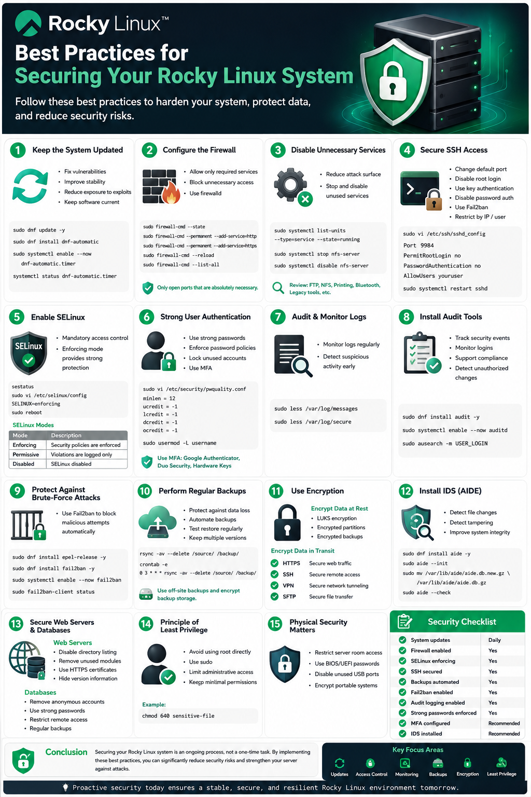

# Practices for Securing Rocky Linux System

Securing Rocky Linux system is essential to protect it from cyber threats, unauthorized access, malware, and data breaches. By applying proper security practices, you can improve the confidentiality, integrity, and availability of your server infrastructure.

---

# 1. Keep System Updated

Regular system updates help protect server from known vulnerabilities and security exploits.

## Update Installed Packages

```bash
sudo dnf update -y
```

## Install Automatic Security Updates

```bash
sudo dnf install dnf-automatic
sudo systemctl enable --now dnf-automatic.timer
```

## Verify Automatic Update Status

```bash
systemctl status dnf-automatic.timer
```

### Why It Matters

- Fixes security vulnerabilities
- Improves system stability
- Reduces exposure to exploits
- Keeps software versions current

---

# 2. Configure the Firewall

A firewall controls incoming and outgoing network traffic. Only allow required services and block unnecessary access.

Rocky Linux uses `firewalld` by default.

## Check Firewall Status

```bash
sudo firewall-cmd --state
```

## Allow Web Traffic

```bash
sudo firewall-cmd --permanent --add-service=http
sudo firewall-cmd --permanent --add-service=https
```

## Reload Firewall Rules

```bash
sudo firewall-cmd --reload
```

## View Active Rules

```bash
sudo firewall-cmd --list-all
```

### Recommended Practice

Only open ports that are absolutely necessary.

---

# 3. Disable Unnecessary Services

Unused services increase the attack surface of your system.

## View Running Services

```bash
sudo systemctl list-units --type=service --state=running
```

## Stop and Disable Unused Services

Example:

```bash
sudo systemctl stop nfs-server
sudo systemctl disable nfs-server
```

### Common Services to Review

- FTP servers
- NFS services
- Printing services
- Bluetooth services
- Legacy remote access tools

---

# 4. Secure SSH Access

OpenSSH is commonly targeted by attackers, so securing SSH is critical.

## Change the Default SSH Port

Edit the SSH configuration:

```bash
sudo vi /etc/ssh/sshd_config
```

Change:

```text
#Port 22
```

To:

```text
Port 9984
```

## Disable Root Login

Inside `/etc/ssh/sshd_config`:

```text
PermitRootLogin no
```

## Enable SSH Key Authentication

### Generate SSH Key Pair

```bash
ssh-keygen
```

### Copy Public Key to Server

```bash
ssh-copy-id user@yourserver
```

## Disable Password Authentication

Edit:

```bash
sudo vi /etc/ssh/sshd_config
```

Set:

```text
PasswordAuthentication no
```

## Restart SSH Service

```bash
sudo systemctl restart sshd
```

### Additional SSH Recommendations

- Limit login users with `AllowUsers`
- Enable idle timeout
- Use fail2ban protection
- Restrict SSH access by IP if possible

---

# 5. Enable SELinux

SELinux provides mandatory access control and significantly improves system security.

## Check SELinux Status

```bash
sestatus
```

## Enable Enforcing Mode

Edit:

```bash
sudo vi /etc/selinux/config
```

Set:

```text
SELINUX=enforcing
```

## Apply Changes

```bash
sudo reboot
```

### SELinux Modes

| Mode | Description |
|---|---|
| Enforcing | Security policies are enforced |
| Permissive | Violations are logged only |
| Disabled | SELinux disabled |

### Best Practice

Keep SELinux in **Enforcing** mode whenever possible.

---

# 6. Implement Strong User Authentication

Weak passwords are one of the most common security risks.

## Security Recommendations

### Use Strong Passwords

Strong passwords should include:

- Uppercase letters
- Lowercase letters
- Numbers
- Special characters
- Minimum 12 characters

## Configure Password Policies

Edit PAM password quality settings:

```bash
sudo vi /etc/security/pwquality.conf
```

Example:

```text
minlen = 12
ucredit = -1
lcredit = -1
dcredit = -1
ocredit = -1
```

## Review User Accounts

```bash
cat /etc/passwd
```

## Lock Unused Accounts

```bash
sudo usermod -L username
```

## Use Multi-Factor Authentication (MFA)

Consider integrating:

- Google Authenticator
- Duo Security
- Hardware security keys

---

# 7. Audit and Monitor System Logs

Monitoring logs helps detect suspicious activity early.

## View System Logs

```bash
sudo less /var/log/messages
```

## View Authentication Logs

```bash
sudo less /var/log/secure
```

---

# 8. Install Audit Tools

## Install auditd

```bash
sudo dnf install audit -y
```

## Enable auditd

```bash
sudo systemctl enable --now auditd
```

## Check Audit Logs

```bash
sudo ausearch -m USER_LOGIN
```

### Benefits of auditd

- Tracks security events
- Monitors authentication activity
- Helps with compliance auditing
- Detects unauthorized changes

---

# 9. Protect Against Brute-Force Attacks

Install Fail2ban to automatically block malicious login attempts.

## Install Fail2ban

```bash
sudo dnf install epel-release -y
sudo dnf install fail2ban -y
```

## Enable Fail2ban

```bash
sudo systemctl enable --now fail2ban
```

## Verify Status

```bash
sudo fail2ban-client status
```

---

# 10. Perform Regular Backups

Backups protect against:

- Hardware failure
- Ransomware
- Accidental deletion
- Data corruption

## Backup Files Using rsync

```bash
rsync -av --delete /source/ /backup/
```

## Automate Backups with Cron

```bash
crontab -e
```

Example:

```text
0 3 * * * rsync -av --delete /source/ /backup/
```

### Backup Best Practices

- Use off-site backups
- Encrypt backup storage
- Test backup restoration regularly
- Keep multiple backup versions

---

# 11. Use Encryption

Encryption protects sensitive information from unauthorized access.

## Encrypt Data at Rest

Use:

- LUKS full-disk encryption
- Encrypted partitions
- Encrypted backup storage

## Encrypt Data in Transit

Always use secure protocols:

| Protocol | Purpose |
|---|---|
| HTTPS | Secure web traffic |
| SSH | Secure remote access |
| VPN | Secure network tunneling |
| SFTP | Secure file transfer |

---

# 12. Install Intrusion Detection Systems (IDS)

IDS tools help detect suspicious activity and file tampering.

## Install AIDE

AIDE monitors file integrity.

### Install AIDE

```bash
sudo dnf install aide -y
```

### Initialize Database

```bash
sudo aide --init
```

### Activate Database

```bash
sudo mv /var/lib/aide/aide.db.new.gz /var/lib/aide/aide.db.gz
```

### Run Integrity Check

```bash
sudo aide --check
```

---

# 13. Secure Web Servers and Databases

If your Rocky Linux server hosts applications:

## Web Server Security

- Disable directory listing
- Remove unused modules
- Use HTTPS certificates
- Hide software version information

## Database Security

- Remove anonymous accounts
- Use strong database passwords
- Restrict remote access
- Perform regular backups

---

# 14. Principle of Least Privilege

Users and services should have only the permissions they absolutely need.

## Best Practices

- Avoid using root directly
- Use `sudo`
- Limit administrative access
- Assign minimal file permissions

## Example Secure Permissions

```bash
chmod 640 sensitive-file
```

---

# 15. Physical Security Matters

Even a secure operating system can be compromised through physical access.

## Recommendations

- Restrict server room access
- Use BIOS/UEFI passwords
- Disable unused USB ports
- Encrypt portable systems

---

# Security Checklist

| Task | Recommended |
|---|---|
| System updates | Daily |
| Firewall enabled | Yes |
| SELinux enforcing | Yes |
| SSH secured | Yes |
| Backups automated | Yes |
| Fail2ban enabled | Yes |
| Audit logging enabled | Yes |
| Strong passwords enforced | Yes |
| MFA configured | Recommended |
| IDS installed | Recommended |

---

# Conclusion

Securing your Rocky Linux system is an ongoing process, not a one-time task. By implementing these best practices, you can significantly reduce security risks and strengthen your server against attacks.

Key areas to focus on include:

- Keeping systems updated
- Restricting unnecessary access
- Hardening SSH
- Enabling SELinux
- Monitoring logs
- Automating backups
- Using encryption
- Applying least privilege principles

A proactive security strategy helps ensure your Rocky Linux environment remains stable, secure, and resilient against evolving threats.

