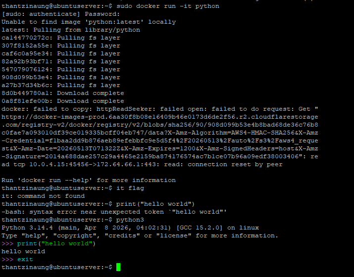

# Python Container on Docker (Without Installing Python on Host)

## Objective

This lab demonstrates how to run a Python container using Docker without installing Python directly on the Ubuntu host system.

---

## Environment

| Component | Details |
|---|---|
| Operating System | Ubuntu Server |
| Container Platform | Docker |
| Container Image | Python Official Image |
| Command Used | `sudo docker run -it python` |

---

## Introduction

Docker allows users to run applications inside isolated containers.  
Using the official Python container image, Python can be executed without installing it on the host operating system.

The command below automatically downloads the Python image (if not already available locally) and starts an interactive Python container.

---

## Command Used

```bash
sudo docker run -it python
```

---

## Command Explanation

| Option | Description |
|---|---|
| `sudo` | Executes the command with administrative privileges |
| `docker run` | Creates and starts a new container |
| `-it` | Runs the container in interactive terminal mode |
| `python` | Uses the official Python image from Docker Hub |

---

## Process Flow

1. Docker checks whether the Python image exists locally.
2. If the image is missing, Docker downloads it automatically from Docker Hub.
3. Docker creates a container from the Python image.
4. The Python interactive shell starts inside the container.

---

## Example Output

```text
Unable to find image 'python:latest' locally
latest: Pulling from library/python
...

Python 3.x.x (default, ...)
[GCC ...] on linux
Type "help", "copyright", "credits" or "license" for more information.
>>>
```

---

## Running Python Commands

Inside the container, Python commands can be executed directly.

Example:

```python
phthon3

print("Hello Docker Python Container")
```

Output:

```text
Hello Docker Python Container
```

---

## Exit the Python Container

To leave the Python interpreter:

```python
exit()
```

Or press:

```text
Ctrl + D
```

---

## Verify Running Containers

To check active containers:

```bash
sudo docker ps
```

To check all containers:

```bash
sudo docker ps -a
```

---

## Remove Stopped Container

```bash
sudo docker rm <container_id>
```

Example:

```bash
sudo docker rm 8a7b2f1c9d11
```

---

## Pull Python Image Manually (Optional)

Instead of automatic download, the image can also be pulled manually.

```bash
sudo docker pull python
```

---

## Benefits of Using Python Container

- No need to install Python on the host machine
- Isolated runtime environment
- Easy to test different Python versions
- Portable and lightweight
- Useful for development and lab environments

---

## Conclusion

Using Docker containers provides a simple and efficient way to run Python without installing it directly on Ubuntu Server.  
The `sudo docker run -it python` command creates an isolated Python environment quickly and efficiently for development, testing, and learning purposes.

