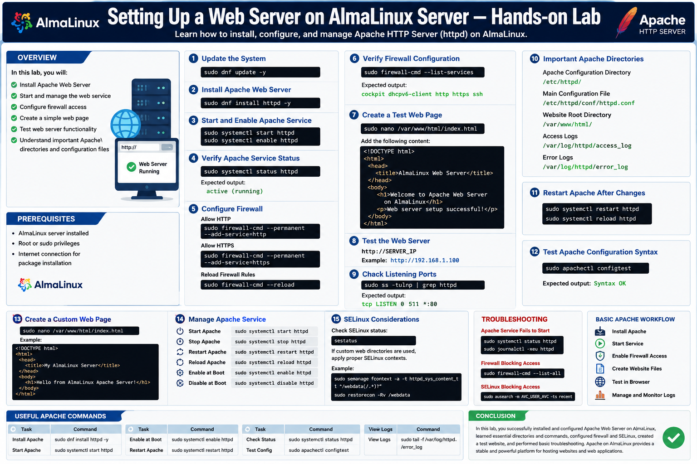
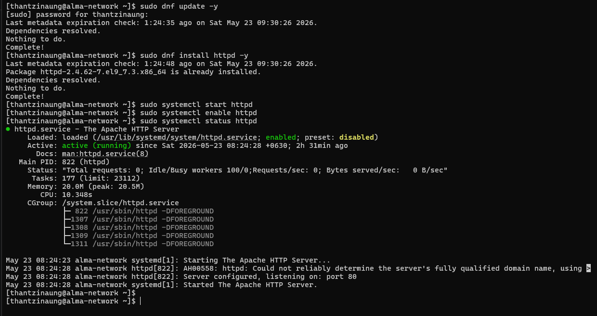

# Setting Up a Web Server on AlmaLinux Server — Hands-on Lab

## Overview

In this hands-on lab, install, configure, and manage a web server on an AlmaLinux system using the Apache HTTP Server (`httpd`).

A web server allows you to host websites, web applications, and internal services. Apache is one of the most widely used and reliable web servers in Linux environments.

In this lab:

- Install Apache Web Server
- Start and manage the web service
- Configure firewall access
- Create a simple web page
- Test web server functionality
- Understand important Apache directories and configuration files

---

# What is Apache HTTP Server?

The Apache HTTP Server (`httpd`) is open-source web server software used to deliver web pages over HTTP and HTTPS.

## Features include:

- Static website hosting
- Virtual hosting
- SSL/TLS support
- Logging and monitoring
- High reliability and scalability

---

# Prerequisites

Before starting:

- AlmaLinux server installed
- Root or sudo privileges
- Internet connection for package installation

---

# Step 1 — Update the System

Update all installed packages before configuring the server.

```bash
sudo dnf update -y
```

---

# Step 2 — Install Apache Web Server

Install the Apache package using `dnf`.

```bash
sudo dnf install httpd -y
```

---

# Step 3 — Start and Enable Apache Service

Start the Apache service immediately:

```bash
sudo systemctl start httpd
```

Enable Apache to start automatically during boot:

```bash
sudo systemctl enable httpd
```

---

# Step 4 — Verify Apache Service Status

Check whether the service is running correctly.

```bash
sudo systemctl status httpd
```

Expected output:

```text
active (running)
```

---

# Step 5 — Configure Firewall

Allow HTTP traffic through the firewall.

## Allow HTTP

```bash
sudo firewall-cmd --permanent --add-service=http
```

## Allow HTTPS

```bash
sudo firewall-cmd --permanent --add-service=https
```

## Reload Firewall Rules

```bash
sudo firewall-cmd --reload
```

---

# Step 6 — Verify Firewall Configuration

Check active firewall services.

```bash
sudo firewall-cmd --list-services
```

Expected output:

```text
cockpit dhcpv6-client http https ssh
```

---

# Step 7 — Create a Test Web Page

Apache stores website files in:

```text
/var/www/html/
```

Create a simple homepage.

```bash
sudo nano /var/www/html/index.html
```

Add the following content:

```html
<!DOCTYPE html>
<html>
<head>
    <title>AlmaLinux Web Server</title>
</head>
<body>
    <h1>Welcome to Apache Web Server on AlmaLinux</h1>
    <p>Web server setup successful!</p>
</body>
</html>
```

Save and exit.

---

# Step 8 — Test the Web Server

Open a browser and visit:

```text
http://SERVER_IP
```

Example:

```text
http://192.168.1.100
```

You should see the test webpage.

---

# Step 9 — Check Listening Ports

Verify Apache is listening on HTTP port 80.

```bash
sudo ss -tulnp | grep httpd
```

Expected output:

```text
tcp LISTEN 0 511 *:80
```

---

# Step 10 — Important Apache Directories

## Apache Configuration Directory

```text
/etc/httpd/
```

## Main Configuration File

```text
/etc/httpd/conf/httpd.conf
```

## Website Root Directory

```text
/var/www/html/
```

## Log Files

### Access Logs

```text
/var/log/httpd/access_log
```

### Error Logs

```text
/var/log/httpd/error_log
```

---

# Step 11 — Restart Apache After Configuration Changes

Whenever configuration changes are made:

```bash
sudo systemctl restart httpd
```

Reload configuration without interrupting connections:

```bash
sudo systemctl reload httpd
```

---

# Step 12 — Test Apache Configuration Syntax

Before restarting Apache, verify configuration syntax.

```bash
sudo apachectl configtest
```

Expected output:

```text
Syntax OK
```

---

# Step 13 — Create a Custom Web Page

Replace the default page with a custom HTML page.

```bash
sudo nano /var/www/html/index.html
```

Example:

```html
<!DOCTYPE html>
<html>
<head>
    <title>My AlmaLinux Server</title>
</head>
<body>
    <h1>Hello from AlmaLinux Apache Server!</h1>
</body>
</html>
```

---

# Step 14 — Manage Apache Service

## Stop Apache

```bash
sudo systemctl stop httpd
```

## Start Apache

```bash
sudo systemctl start httpd
```

## Restart Apache

```bash
sudo systemctl restart httpd
```

## Reload Apache

```bash
sudo systemctl reload httpd
```

## Disable Auto Start

```bash
sudo systemctl disable httpd
```

---

# Step 15 — SELinux Considerations

AlmaLinux uses SELinux for security.

Check SELinux status:

```bash
sestatus
```

If custom web directories are used, proper SELinux contexts must be applied.

Example:

```bash
sudo semanage fcontext -a -t httpd_sys_content_t "/webdata(/.*)?"
sudo restorecon -Rv /webdata
```

---

# Troubleshooting

## Apache Service Fails to Start

Check service status:

```bash
sudo systemctl status httpd
```

View error logs:

```bash
sudo journalctl -xeu httpd
```

---

## Firewall Blocking Access

Verify firewall rules:

```bash
sudo firewall-cmd --list-all
```

---

## SELinux Blocking Access

Check audit logs:

```bash
sudo ausearch -m AVC,USER_AVC -ts recent
```

---

# Basic Apache Workflow

```text
Install Apache
       ↓
Start Service
       ↓
Enable Firewall Access
       ↓
Create Website Files
       ↓
Test in Browser
       ↓
Manage and Monitor Logs
```

---

# Useful Apache Commands

| Task | Command |
|---|---|
| Install Apache | `sudo dnf install httpd -y` |
| Start Apache | `sudo systemctl start httpd` |
| Enable at Boot | `sudo systemctl enable httpd` |
| Restart Apache | `sudo systemctl restart httpd` |
| Check Status | `sudo systemctl status httpd` |
| Test Config | `sudo apachectl configtest` |
| View Logs | `sudo tail -f /var/log/httpd/error_log` |

---

# Conclusion

In this lab, you successfully:

- Installed Apache Web Server
- Managed Apache services using `systemctl`
- Configured firewall access
- Created and hosted a simple webpage
- Learned important Apache directories and commands
- Performed basic troubleshooting

Apache on AlmaLinux provides a stable and powerful platform for hosting websites and web applications in both development and production environments.


