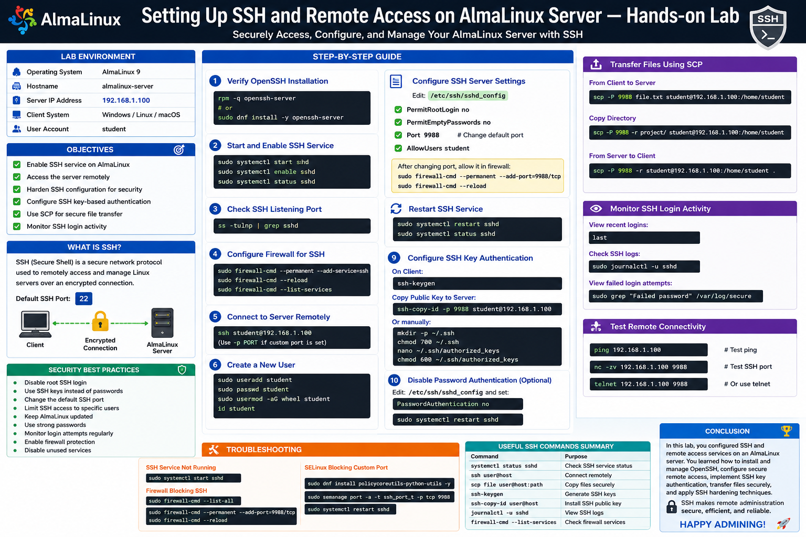
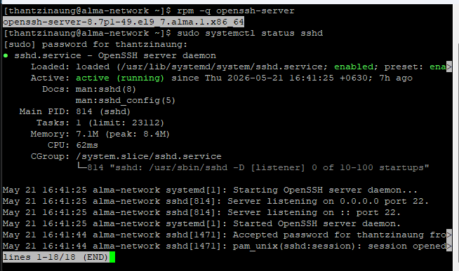
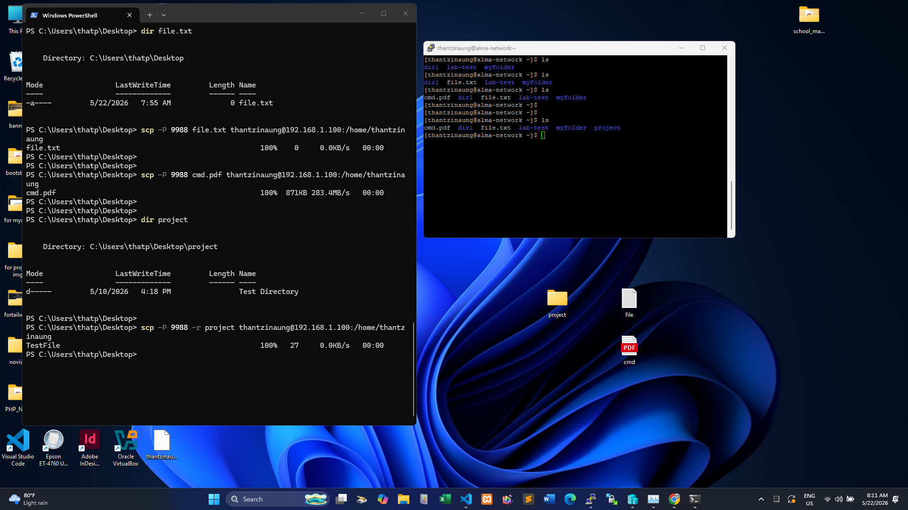
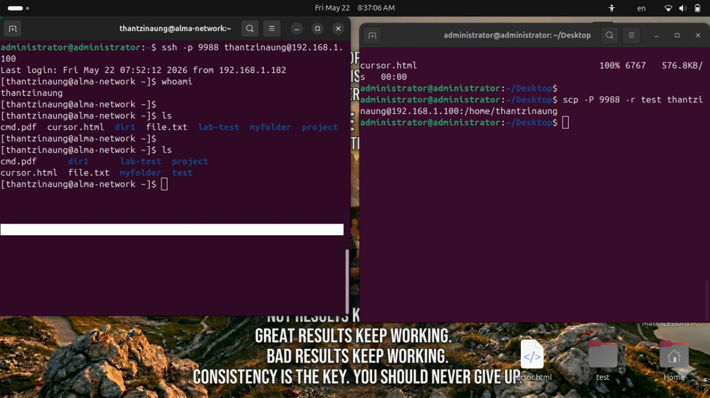
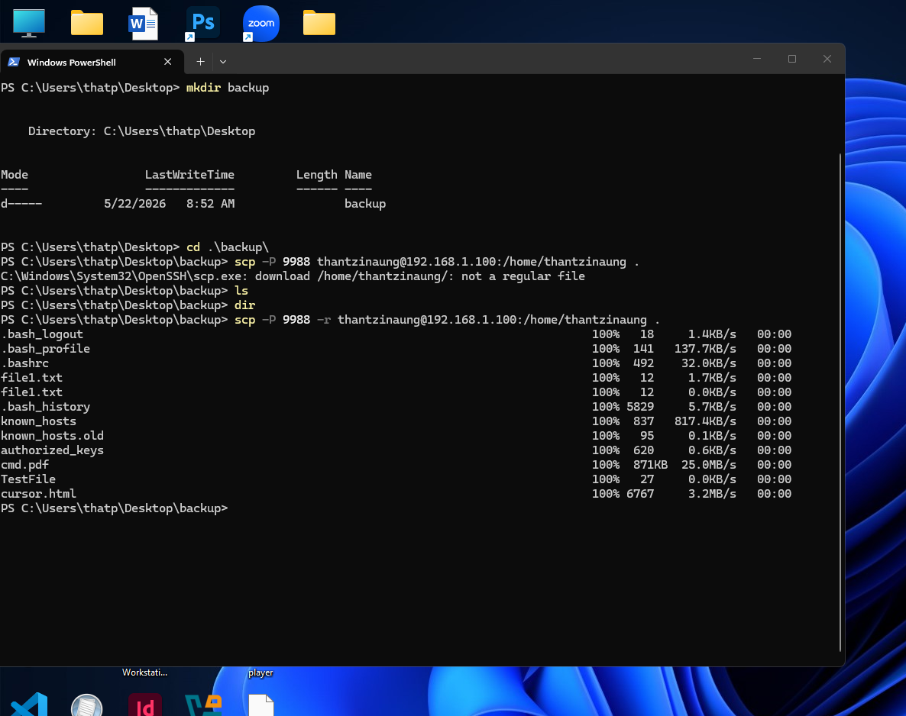

# Setting Up SSH and Remote Access on AlmaLinux Server — Hands-on Lab

## Overview

configure Secure Shell (SSH) and remote access services on an AlmaLinux server. SSH is one of the most important tools for Linux system administration because it allows administrators to securely manage servers remotely.

- Install and configure OpenSSH Server
- Connect remotely using SSH
- Configure SSH security settings
- Manage firewall rules for SSH access
- Use SSH key authentication
- Transfer files remotely using SCP
- Troubleshoot SSH connection issues

---

# Lab Environment

| Component | Example |
|---|---|
| Operating System | AlmaLinux 9 |
| Hostname | almalinux-server |
| Server IP Address | 192.168.1.100 |
| Client System | Windows/Linux/macOS |
| User Account | student |

---

# Objectives

This lab will be able to:

- Enable SSH service on AlmaLinux
- Access the server remotely
- Harden SSH configuration for security
- Configure SSH key-based authentication
- Use SCP for secure file transfer
- Monitor SSH login activity

---

# What is SSH?

SSH (Secure Shell) is a secure network protocol used to remotely access and manage Linux servers over an encrypted connection.

Default SSH port:

```bash
22
```

SSH provides:

- Secure remote terminal access
- File transfer capability
- Encrypted communication
- Remote command execution

---

# Step 1 — Verify OpenSSH Server Installation

Most AlmaLinux installations already include OpenSSH Server.

Check whether SSH is installed:

```bash
rpm -q openssh-server
```

Example output:

```bash
openssh-server-8.7p1-49.el9_7.alma.1.x86_64
```

If not installed:

```bash
sudo dnf install -y openssh-server
```

---

# Step 2 — Start and Enable SSH Service

Start the SSH daemon:

```bash
sudo systemctl start sshd
```

Enable SSH service at boot:

```bash
sudo systemctl enable sshd
```

Verify service status:

```bash
sudo systemctl status sshd
```

Expected output:

```bash
active (running)
```

---

# Step 3 — Check SSH Listening Port

Verify SSH is listening on port 22:

```bash
ss -tulnp
```

Example:

```bash
tcp    LISTEN  0       128               [::]:22             [::]:*
```

---

# Step 4 — Configure Firewall for SSH

Allow SSH through the firewall:

```bash
sudo firewall-cmd --permanent --add-service=ssh
```

Reload firewall rules:

```bash
sudo firewall-cmd --reload
```

Verify firewall rules:

```bash
sudo firewall-cmd --list-services
```

Expected output:

```bash
cockpit dhcpv6-client ssh
```

---

# Step 5 — Connect to AlmaLinux Server Remotely

## From Linux/macOS Client

Use SSH command:

```bash
ssh thantzinaung@192.168.1.100
```

Example first-time message:

```text
Are you sure you want to continue connecting (yes/no/[fingerprint])? yes

Warning: Permanently added '192.168.1.100' (ED25519) to the list of known hosts.

thantzinaung@192.168.1.100's password: password123
```

---

## From Windows Client

You can use:

- PowerShell SSH client
- Windows Terminal
- PuTTY

Example PowerShell command:

```powershell
ssh thantzinaung@192.168.1.100
```

---

# Step 6 — Create a New User for SSH Access

Create user:

```bash
sudo useradd thantzinaung
```

Set password:

```bash
sudo passwd thantzinaung
```

Add user to wheel group for sudo access:

```bash
sudo usermod -aG wheel thantzinaung
```

Verify:

```bash
id thantzinaung
```

---

# Step 7 — Configure SSH Server Settings

Main SSH configuration file:

```bash
/etc/ssh/sshd_config
```

Backup configuration before editing:

```bash
sudo cp /etc/ssh/sshd_config /etc/ssh/sshd_config.bak
```

Edit configuration:

```bash
sudo vi /etc/ssh/sshd_config
```

---

# Common SSH Security Settings

## Disable Root Login

Find:

```bash
#PermitRootLogin yes
```

Change to:

```bash
PermitRootLogin no
```

---

## Disable Empty Passwords

```bash
PermitEmptyPasswords no
```

---

## Change Default SSH Port

Example:

```bash
Port 9988
```

After changing port, update firewall:

```bash
sudo firewall-cmd --permanent --add-port=2222/tcp
```

Reload firewall:

```bash
sudo firewall-cmd --reload
```

---

## Limit SSH Access to Specific Users

Go to  /etc/ssh/sshd_config - and add -

```bash
sudo vi /etc/ssh/sshd_config

AllowUsers thantzinaung
```

---

# Step 8 — Restart SSH Service

After configuration changes:

```bash
sudo systemctl restart sshd
```

Verify:

```bash
sudo systemctl status sshd
```

---

# Step 9 — Configure SSH Key Authentication

SSH keys provide more secure authentication than passwords.

---

## Generate SSH Key on Client

On Linux/macOS:

```bash
ssh-keygen
```

Default key location:

```bash
~/.ssh/id_rsa
```

---

## Copy Public Key to Server

Use:

```bash
ssh-copy-id -p 9988 thantzinaung@192.168.1.100
```

Or manually:

```bash
mkdir -p ~/.ssh
chmod 700 ~/.ssh
```

Add public key:

```bash
nano ~/.ssh/authorized_keys
```

Set permissions:

```bash
chmod 600 ~/.ssh/authorized_keys
```
---
## On Windows 
with powershell : Copy Public Key to Server
```bash
cat C:\Users\thatp\.ssh\id_ed25519.pub | ssh -p 9988 thantzinaung@192.168.1.100 "mkdir -p ~/.ssh && cat >> ~/.ssh/authorized_keys"
```

try to logon :
```bash
ssh -p 9988 thantzinaung@192.168.1.100
```
---

with powershell : Copy Public Key to Server
```bash
open Puttygen
generate
save private key 
copy public key for pasting into OpenSSH authorized_keys file
open putty and login server
sudo vi ./ssh/authorized_keys
past public key what you copied
chmod 700 ~/.ssh
chomod 600 ~/.ssh/authorized_keys
```

---

# Step 10 — Disable Password Authentication (Optional)

Edit SSH configuration:

```bash
sudo vi /etc/ssh/sshd_config
```

Set:

```bash
PasswordAuthentication no
```

Restart SSH:

```bash
sudo systemctl restart sshd
```

---

# Step 11 — Transfer Files Using SCP

Copy file from client to server:

```bash
scp -P  9988 file.txt thantzinaung@192.168.1.100:/home/thantzinaung
```

Copy directory:

```bash
scp -P 9988 -r project/ thantzinaung@192.168.1.100:/home/thantzinaung
```

Copy file from server to client:

```bash
scp -P 9988 -r thantzinaung@192.168.1.100:/home/thantzinaung .
```

explanation : 
|Option|Meaning|
|---|---|
|-P|port|
|9988|custom port|
|-r|recursive|
|/home/thantzinaung|path where you want to copy form server|
|.|current location to store|

---

# Step 12 — Monitor SSH Login Activity

View recent login activity:

```bash
last
```

Check authentication logs:

```bash
sudo journalctl -u sshd
```

View failed login attempts:

```bash
sudo grep "Failed password" /var/log/secure
```

---

# Step 13 — Test Remote Connectivity

Test ping:

```bash
ping 192.168.1.100
```

Test SSH port:

```bash
nc -zv 192.168.1.100 9988
```

Or:

```bash
telnet 192.168.1.100 9988
```

---

# SSH Troubleshooting

## SSH Service Not Running

Start service:

```bash
sudo systemctl start sshd
```

---

## Firewall Blocking SSH

Verify firewall:

```bash
sudo firewall-cmd --list-all
```

---

Confirm ssh custom service in firewall :
```bash
sudo firewall-cmd --permanent --zone=public --add-port=9988/tcp
sudo firewall-cmd --reload
```

---

## SELinux Blocking Custom Port

If using custom SSH port:

Install semanage package not yet:
```bash
sudo dnf install policycoreutils-python-utils -y
```

```bash
sudo semanage port -a -t ssh_port_t -p tcp 9988
```

Restart SSH:

```bash
sudo systemctl restart sshd
```

---

# Security Best Practices

- Disable root SSH login
- Use SSH keys instead of passwords
- Change default SSH port
- Limit SSH users
- Keep AlmaLinux updated
- Use strong passwords
- Monitor login attempts
- Enable firewall protection

---

# Useful SSH Commands Summary

| Command | Purpose |
|---|---|
| `systemctl status sshd` | Check SSH service |
| `ssh user@host` | Connect remotely |
| `scp file user@host:path` | Copy files |
| `ssh-keygen` | Generate SSH keys |
| `ssh-copy-id user@host` | Install SSH key |
| `journalctl -u sshd` | View SSH logs |
| `firewall-cmd --list-services` | Check firewall |

---

# Conclusion

In this hands-on lab, I successfully configured SSH and remote access services on an AlmaLinux server. I learned how to install and manage OpenSSH, configure secure remote access, implement SSH key authentication, transfer files securely, and apply SSH security hardening techniques.

SSH is one of the most essential tools for Linux server administration and is widely used in enterprise environments for secure remote management.






