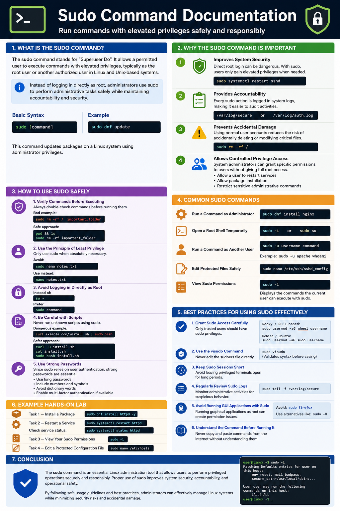

# Sudo Command Documentation

## Introduction to the `sudo` Command

The `sudo` command stands for **“Superuser Do”**. It allows a permitted user to execute commands with elevated privileges, typically as the **root user** or another authorized user in Linux and Unix-based systems.

Instead of logging in directly as the root user, administrators use `sudo` to safely perform administrative tasks while maintaining accountability and security.

### Basic Syntax

```bash
sudo [command]
```

### Example

```bash
sudo dnf update
```

This command updates packages on a Linux system using administrator privileges.

---

# Why the `sudo` Command Is Important

The `sudo` command is one of the most critical security and administration tools in Linux systems.

## 1. Improves System Security

Direct root login can be dangerous. With `sudo`, users only gain elevated privileges when needed.

Example:

```bash
sudo systemctl restart sshd
```

Instead of staying logged in as root permanently.

---

## 2. Provides Accountability

Every `sudo` action is logged in system logs, making it easier for administrators to audit activities.

Logs are commonly stored in:

```bash
/var/log/secure
```

or

```bash
/var/log/auth.log
```

depending on the Linux distribution.

---

## 3. Prevents Accidental Damage

Using normal user accounts reduces the risk of accidentally deleting or modifying critical system files.

Example of a dangerous root-level command:

```bash
sudo rm -rf /
```

Without caution, this could destroy the entire system.

---

## 4. Allows Controlled Privilege Access

System administrators can grant specific permissions to users without giving full root access.

Example:

- Allow a user to restart services
- Allow package installation
- Restrict sensitive administrative commands

---

# How to Use `sudo` Safely

Using `sudo` incorrectly can compromise system stability and security. Follow these safety guidelines carefully.

---

## 1. Verify Commands Before Executing

Always double-check commands before running them with `sudo`.

Bad example:

```bash
sudo rm -rf / important_folder
```

A misplaced space can cause severe system damage.

Safe approach:

```bash
pwd
ls
sudo rm -rf important_folder
```

---

## 2. Use the Principle of Least Privilege

Only use `sudo` when absolutely necessary.

Avoid:

```bash
sudo nano notes.txt
```

if editing a normal user file.

Use:

```bash
nano notes.txt
```

instead.

---

## 3. Avoid Logging in Directly as Root

Instead of:

```bash
su -
```

Prefer:

```bash
sudo command
```

This keeps administrative tasks controlled and logged.

---

## 4. Be Careful with Scripts

Never run unknown scripts using `sudo`.

Dangerous example:

```bash
curl example.com/install.sh | sudo bash
```

Always inspect scripts before execution.

Safer approach:

```bash
curl -O install.sh
cat install.sh
sudo bash install.sh
```

---

## 5. Use Strong Passwords

Since `sudo` relies on user authentication, strong passwords are essential.

Good password practices:

- Use long passwords
- Include numbers and symbols
- Avoid dictionary words
- Enable multi-factor authentication if available

---

# Common `sudo` Commands

## Run a Command as Administrator

```bash
sudo dnf install nginx
```

---

## Open a Root Shell Temporarily

```bash
sudo -i
```

or

```bash
sudo su
```

Use cautiously.

---

## Run a Command as Another User

```bash
sudo -u username command
```

Example:

```bash
sudo -u apache whoami
```

---

## Edit Protected Files Safely

```bash
sudo nano /etc/ssh/sshd_config
```

---

## View Sudo Permissions

```bash
sudo -l
```

Displays the commands the current user can execute with `sudo`.

---

# Best Practices for Using `sudo` Effectively

## 1. Grant Sudo Access Carefully

Only trusted users should have sudo privileges.

On Rocky Linux or RHEL-based systems:

```bash
sudo usermod -aG wheel username
```

On Debian/Ubuntu:

```bash
sudo usermod -aG sudo username
```

---

## 2. Use the `visudo` Command

Never edit the sudoers file directly.

Correct method:

```bash
sudo visudo
```

This validates syntax before saving.

---

## 3. Keep Sudo Sessions Short

Avoid leaving privileged terminals open for long periods.

Lock or close sessions when not in use.

---

## 4. Regularly Review Sudo Logs

Monitor administrative activities for suspicious behavior.

Example:

```bash
sudo tail -f /var/log/secure
```

---

## 5. Avoid Running GUI Applications with Sudo

Running graphical applications as root can create permission issues.

Avoid:

```bash
sudo firefox
```

Use alternatives like:

```bash
sudo -H
```

when necessary.

---

## 6. Understand the Command Before Running It

Never copy and paste commands from the internet without understanding them.

Research unfamiliar commands first.

---

# Example Hands-on Lab

## Task 1 — Install a Package

```bash
sudo dnf install httpd -y
```

---

## Task 2 — Restart a Service

```bash
sudo systemctl restart httpd
```

Check service status:

```bash
sudo systemctl status httpd
```

---

## Task 3 — View Your Sudo Permissions

```bash
sudo -l
```

---

## Task 4 — Edit a Protected Configuration File

```bash
sudo nano /etc/hosts
```

---

# Conclusion

The `sudo` command is an essential Linux administration tool that allows users to perform privileged operations securely and responsibly. Proper use of `sudo` improves system security, accountability, and operational safety.

By following safe usage guidelines and best practices, administrators can effectively manage Linux systems while minimizing security risks and accidental damage.

