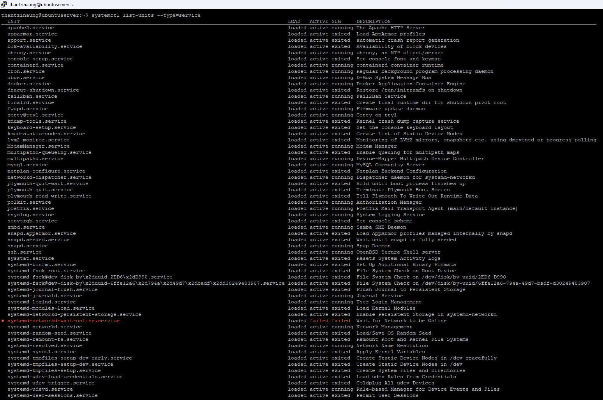
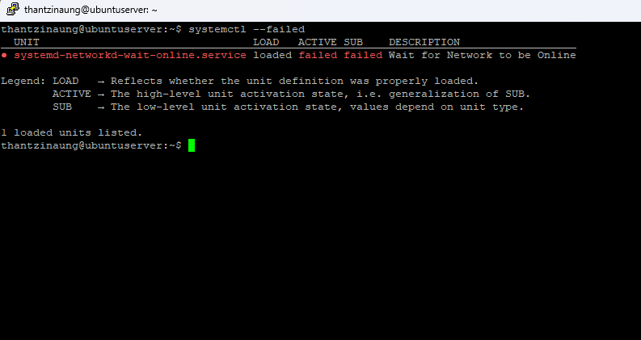

# Systemctl on Ubuntu Server 24.04

In Ubuntu Server 26.04, system processes such as the SSH service, Apache web server, and background jobs like cron are all controlled by a service manager called **systemd**. The main tool used to interact with systemd is the command-line utility:

```bash
systemctl
```

If you're administering a Linux server, knowing how to use `systemctl` is essential.

---

# What is systemctl?

`systemctl` is a utility used to start, stop, manage, and inspect services (also called **units**) on systems using `systemd`.

It replaces older tools like `service` and provides a more unified, powerful way to manage everything from web servers to system power events like rebooting and shutdown.

---

# Common systemctl Commands

Here are the most useful `systemctl` commands you'll need when managing an Ubuntu server.

---

## Start a Service

```bash
sudo systemctl start apache2
```

Starts the Apache web server immediately.

> Note: This does **not** make the service start automatically on boot.

---

## Stop a Service

```bash
sudo systemctl stop apache2
```

Stops the Apache service.

---

## Restart a Service

```bash
sudo systemctl restart apache2
```

Useful after changing configuration files or applying updates.

---

## Reload a Service Configuration

```bash
sudo systemctl reload apache2
```

Reloads configuration files without fully restarting the service.

> Some services support reload, while others require a full restart.

---

## Enable a Service at Boot

```bash
sudo systemctl enable apache2
```

Configures Ubuntu to automatically start the service during system boot.

---

## Disable a Service at Boot

```bash
sudo systemctl disable apache2
```

Prevents the service from starting automatically after reboot.

---

## Check the Status of a Service

```bash
sudo systemctl status apache2
```

Displays detailed information about the service, including:

- Running state
- Process ID (PID)
- Startup time
- Recent logs
- Error messages

Example output:

```bash
● apache2.service - The Apache HTTP Server
     Loaded: loaded (/lib/systemd/system/apache2.service; enabled)
     Active: active (running)
```

---

## Check if a Service is Enabled

```bash
sudo systemctl is-enabled apache2
```

Shows whether the service is configured to start automatically at boot.

Possible outputs:

```bash
enabled
disabled
static
```

---

# Example: Managing SSH

SSH is one of the most important services on a server because it allows remote access.

---

## Restart SSH

```bash
sudo systemctl restart ssh
```

---

## Check SSH Status

```bash
sudo systemctl status ssh
```

---

## Enable SSH at Boot

```bash
sudo systemctl enable ssh
```

---

# View Running Services

To list all active running services:

```bash
systemctl list-units --type=service
```

To include inactive services as well:

```bash
systemctl list-units --type=service --all
```

---

# View Failed Services

You can quickly identify failed services with:

```bash
systemctl --failed
```

This is useful for troubleshooting startup issues and crashed services.

---

# View Service Logs

To see logs for a specific service:

```bash
journalctl -u apache2
```

View live logs in real time:

```bash
journalctl -u apache2 -f
```

---

# Reload systemd After Editing Service Files

If you create or modify a custom service file:

```bash
sudo systemctl daemon-reload
```

This reloads the systemd manager configuration.

---

# Working with Custom Services

Service files are usually stored in:

```bash
/etc/systemd/system/
```

Example custom service:

```bash
sudo nano /etc/systemd/system/myapp.service
```

After creating the file:

```bash
sudo systemctl daemon-reload
sudo systemctl enable myapp
sudo systemctl start myapp
```

---

# Reboot and Shutdown Commands

`systemctl` can also manage system power operations.

---

## Reboot the Server

```bash
sudo systemctl reboot
```

---

## Power Off the Server

```bash
sudo systemctl poweroff
```

---

## Suspend the System

```bash
sudo systemctl suspend
```

---

# Security Tip

Only users with `sudo` or `root` privileges can manage most system services using `systemctl`.

Be careful when restarting or stopping critical services such as:

- `ssh`
- `networking`
- `mysql`
- `apache2`

Stopping the wrong service on a remote server may disconnect your session or make the server inaccessible.

---

# Helpful Tips

## Check Boot Time

```bash
systemd-analyze
```

---

## See Services Starting at Boot

```bash
systemctl list-unit-files --type=service
```

---

## Mask a Service

Masking completely prevents a service from being started.

```bash
sudo systemctl mask apache2
```

Unmask it:

```bash
sudo systemctl unmask apache2
```

---

# Summary

`systemctl` is the primary tool for managing services on Ubuntu Server.

With it, you can:

- Start and stop services
- Restart and reload configurations
- Enable or disable startup services
- View logs and service status
- Troubleshoot failed services
- Manage system power operations

Mastering `systemctl` is an essential skill for Linux system administrators and DevOps engineers.

## Resources
[systemctl_cheat_sheet](./asset/pdf/systemctl%2BCheat%2BSheet.pdf)


