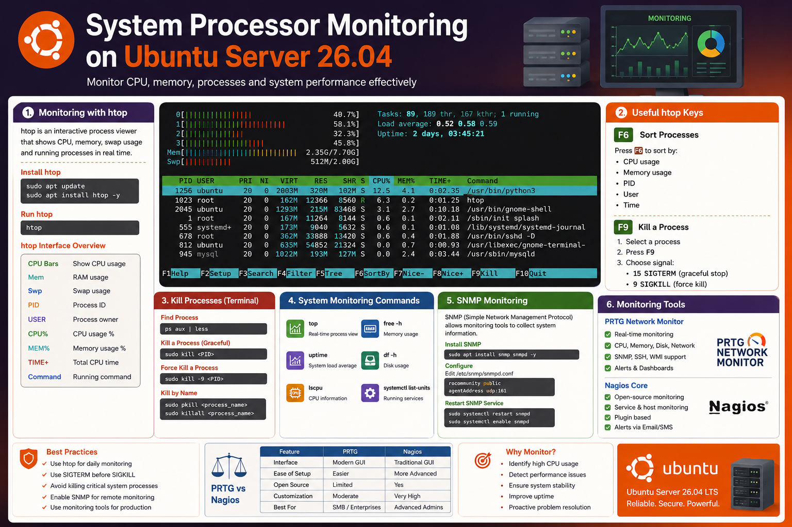
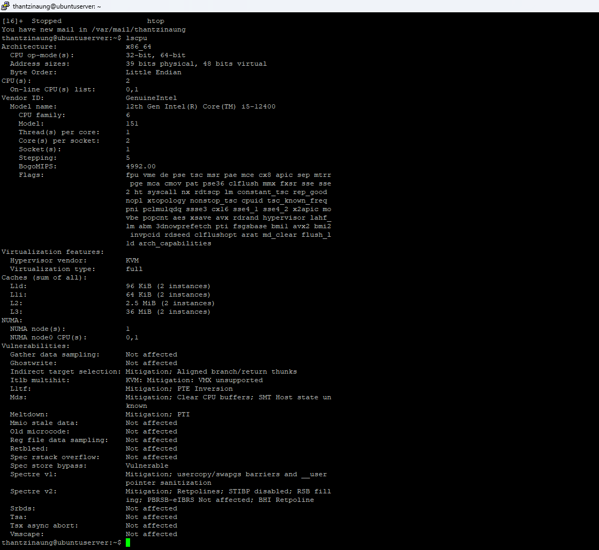
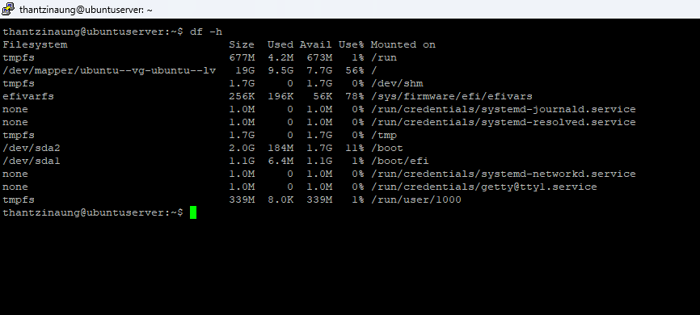
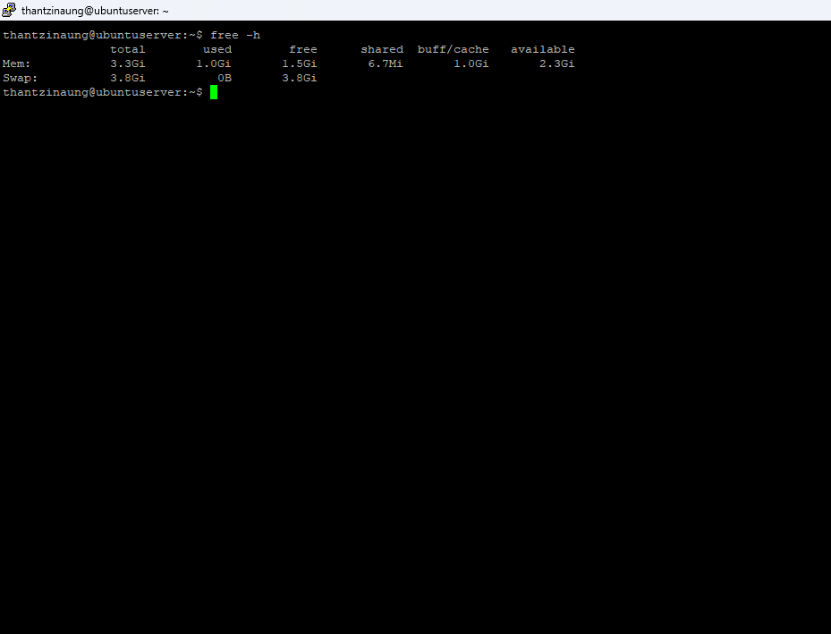
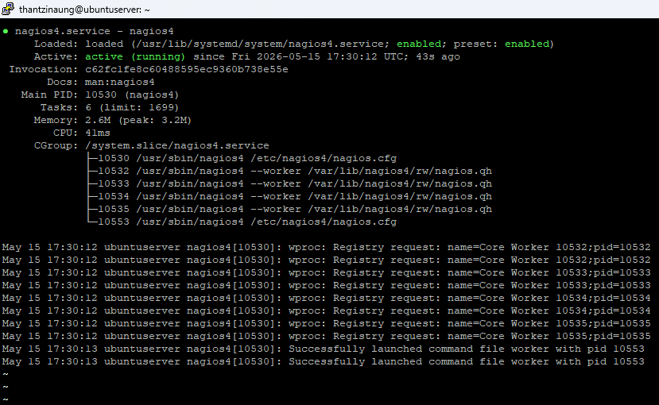
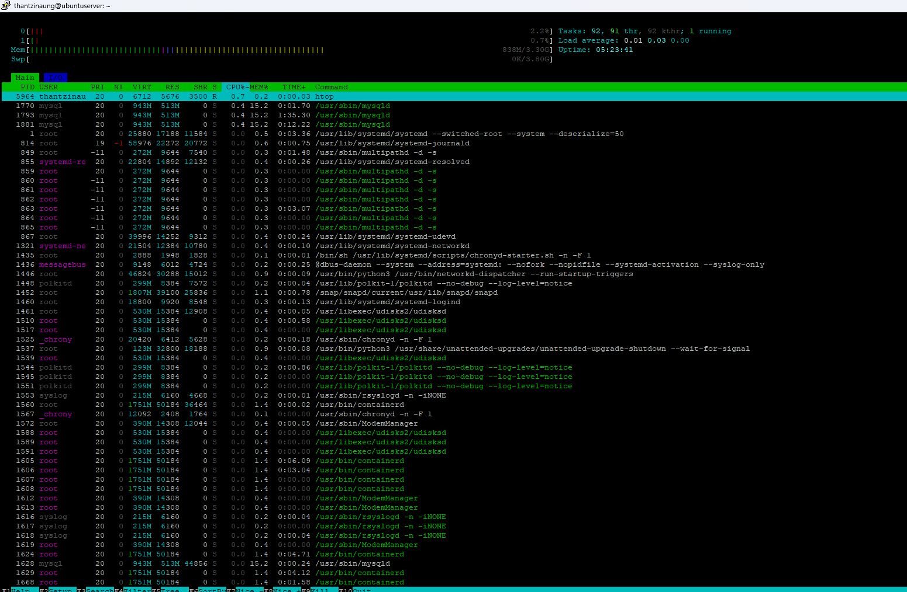
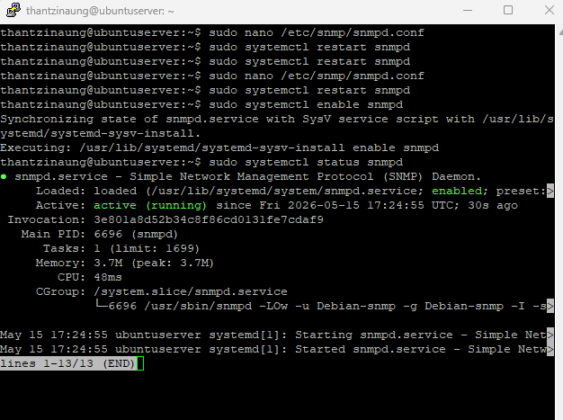
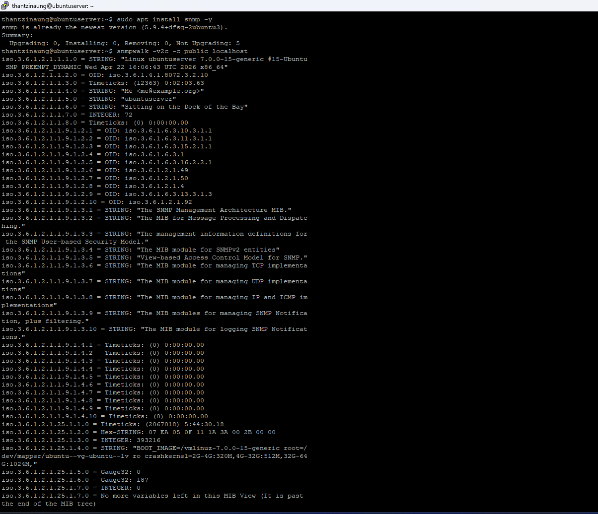

# System Processor Monitoring on Ubuntu Server 26.04

Monitoring CPU and system processes is an important part of Ubuntu Server administration. It helps you identify high CPU usage, troubleshoot performance issues, manage running processes, and monitor server health in real time.

## Header:

- Installing and using `htop`
- Understanding CPU and memory usage
- Killing processes with `kill`
- Using `F6` and `F9` inside `htop`
- Introduction to:
  - PRTG
  - Nagios
  - SNMP

---

# What Is Process Monitoring?

Process monitoring means watching:

- CPU usage
- RAM usage
- Running services
- Process IDs (PID)
- Load average
- System performance

Ubuntu provides several tools for this, but one of the easiest and most powerful is:

```bash
htop
```

---

# Install htop

## Update Your System

```bash
sudo apt update
sudo apt upgrade -y
```

## Install htop

```bash
sudo apt install htop -y
```

## Run htop

```bash
htop
```

---

# Understanding htop

When you launch `htop`, you will see:

- CPU usage bars
- Memory usage
- Swap usage
- Running processes
- PID numbers
- User ownership
- CPU and RAM consumption

Example:

```bash
htop
```

---

# htop Interface Overview

| Section | Description |
|---|---|
| CPU Bars | Show processor usage |
| Mem | RAM usage |
| Swp | Swap memory usage |
| PID | Process ID |
| USER | Process owner |
| CPU% | CPU usage percentage |
| MEM% | Memory usage percentage |
| TIME+ | Total CPU time used |
| Command | Running command |

---

# Useful htop Commands

## Sort Processes — F6

Press:

```text
F6
```

This allows you to sort processes by:

- CPU usage
- Memory usage
- PID
- User
- Time

### Common Usage

Sort by CPU to find heavy processes.

---

## Kill a Process — F9

Press:

```text
F9
```

This opens the signal menu to terminate a process.

### Steps

1. Select a process
2. Press `F9`
3. Choose signal:
   - `15 SIGTERM`
   - `9 SIGKILL`

---

# Difference Between SIGTERM and SIGKILL

| Signal | Description |
|---|---|
| SIGTERM (15) | Gracefully stop process |
| SIGKILL (9) | Forcefully kill process |

Recommended:

```text
Use SIGTERM first
```

Use SIGKILL only if the process does not stop.

---

# Kill Processes Using Terminal

## Find Process

```bash
ps aux
```

Or:

```bash
top
```

Or:

```bash
htop
```

---

# Kill a Process

Syntax:

```bash
sudo kill PID
```

Example:

```bash
sudo kill 2451
```

---

# Force Kill a Process

```bash
sudo kill -9 PID
```

Example:

```bash
sudo kill -9 2451
```

---

# Kill All Processes by Name

Example:

```bash
sudo pkill apache2
```

Or:

```bash
sudo killall apache2
```

---

# Monitor CPU Usage

## Using top

```bash
top
```

Important keys:

| Key | Action |
|---|---|
| q | Quit |
| k | Kill process |
| P | Sort by CPU |
| M | Sort by memory |

---

# Monitor System Load

```bash
uptime
```

Example Output:

```text
load average: 0.52, 0.40, 0.35
```

These values represent:

- 1 minute load
- 5 minute load
- 15 minute load

---

# Check CPU Information

## CPU Details

```bash
lscpu
```

---

# Check RAM Usage

```bash
free -h
```

---

# Check Disk Usage

```bash
df -h
```

---

# Advanced Monitoring Tools

For enterprise environments and large infrastructures, monitoring tools are commonly used.

---

# What Is SNMP?

## SNMP = Simple Network Management Protocol

SNMP allows monitoring tools to collect information from servers and network devices.

SNMP can monitor:

- CPU usage
- RAM usage
- Network traffic
- Disk usage
- Temperature
- Services

---

# Install SNMP on Ubuntu Server 26.04

## Install Packages

```bash
sudo apt install snmp snmpd -y
```

---

# Configure SNMP

Edit configuration:

```bash
sudo nano /etc/snmp/snmpd.conf
```

Example configuration:

```conf
rocommunity public
agentAddress udp:161
```

Restart service:

```bash
sudo systemctl restart snmpd
```

Enable at boot:

```bash
sudo systemctl enable snmpd
```

Check status:

```bash
sudo systemctl status snmpd
```

---

# Test SNMP

Install SNMP tools:

```bash
sudo apt install snmp -y
```

Test locally:

```bash
snmpwalk -v2c -c public localhost
```

---

# What Is PRTG?

PRTG Network Monitor is a network and server monitoring tool developed by Paessler AG.

It provides:

- Real-time monitoring
- CPU monitoring
- Memory monitoring
- Network monitoring
- Alerts and notifications
- Dashboard visualization

---

# Features of PRTG

| Feature | Description |
|---|---|
| CPU Monitoring | Monitor processor usage |
| RAM Monitoring | Monitor memory consumption |
| SNMP Support | Collect data using SNMP |
| Email Alerts | Send notifications |
| Dashboard | Visual monitoring |
| Sensors | Custom monitoring checks |

---

# How PRTG Works

PRTG uses:

- SNMP
- WMI
- SSH
- APIs

to collect information from servers.

Ubuntu servers are usually monitored using:

```text
SNMP or SSH
```

---

# Basic PRTG Monitoring Flow

```text
Ubuntu Server → SNMP/SSH → PRTG Server Dashboard
```

---

# What Is Nagios?

Nagios is an open-source infrastructure monitoring system.

It monitors:

- Servers
- Services
- Applications
- CPU usage
- Network devices
- Databases

---

# Features of Nagios

| Feature | Description |
|---|---|
| Open Source | Free community edition |
| Alerting | Email/SMS alerts |
| Service Checks | Monitor services |
| Plugin System | Highly extensible |
| Web Dashboard | Browser-based monitoring |

---

# Install Nagios on Ubuntu

## Install Apache and PHP

```bash
sudo apt install apache2 php unzip -y
```

## Install Nagios Core

```bash
sudo apt install nagios4 -y
```

---

# Start Nagios

```bash
sudo systemctl enable nagios4
sudo systemctl start nagios4
```

Check status:

```bash
sudo systemctl status nagios4
```

---

# Nagios Monitoring Example

Nagios can monitor:

- CPU load
- Disk usage
- SSH service
- HTTP service
- MySQL
- Ping response

---

# PRTG vs Nagios

| Feature | PRTG | Nagios |
|---|---|---|
| Interface | Modern GUI | Traditional GUI |
| Ease of Setup | Easier | More advanced |
| Open Source | Limited | Yes |
| SNMP Support | Yes | Yes |
| Best For | Small/Medium Business | Advanced Admins |
| Customization | Moderate | Very High |

---

# Recommended Monitoring Commands

## Real-Time Monitoring

```bash
htop
```

## Process List

```bash
ps aux
```

## CPU Information

```bash
lscpu
```

## Memory Usage

```bash
free -h
```

## Disk Usage

```bash
df -h
```

## Running Services

```bash
systemctl list-units --type=service
```

---

# Best Practices

## Use htop for Daily Monitoring

Easy and interactive.

---

## Avoid Killing Critical Processes

Do NOT kill:

- systemd
- sshd
- network services

unless necessary.

---

## Use SIGTERM Before SIGKILL

Graceful shutdown is safer.

---

## Monitor Continuously

For production servers:

- Use Nagios
- Use PRTG
- Enable SNMP

---

# Conclusion

Ubuntu Server 26.04 provides powerful tools for monitoring CPU and system processes.

Key tools covered:

- `htop`
- `kill`
- `F6`
- `F9`
- `SNMP`
- `PRTG`
- `Nagios`

These tools help administrators:

- Monitor performance
- Troubleshoot issues
- Manage processes
- Build enterprise monitoring systems

Using both command-line tools and enterprise monitoring platforms gives you complete visibility into your Ubuntu server infrastructure.








