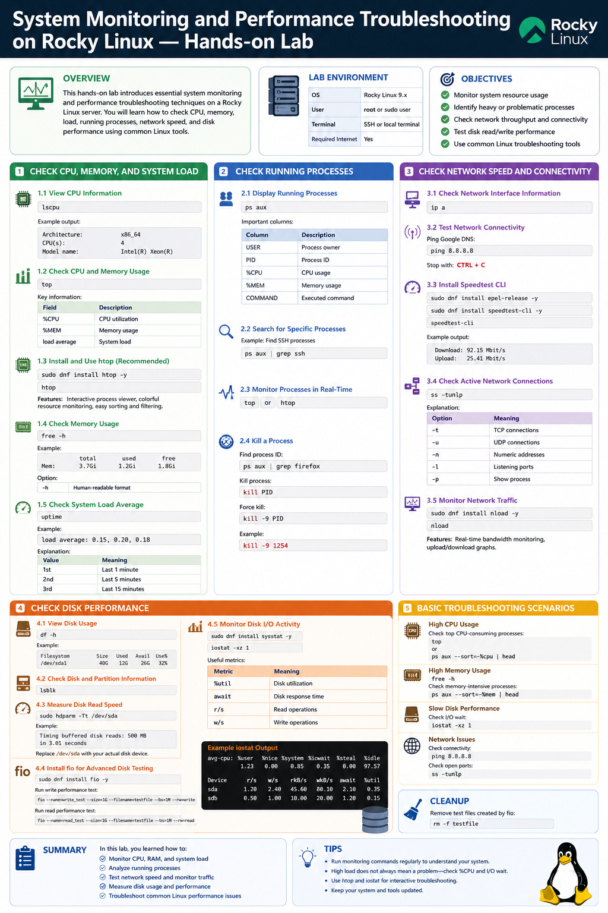
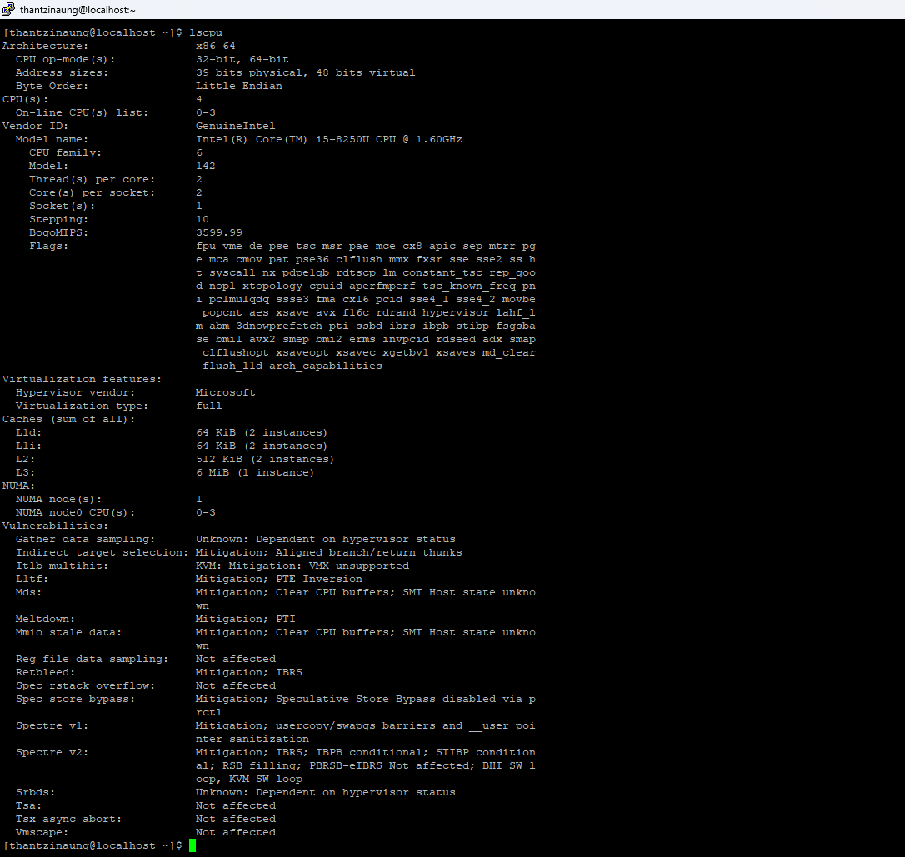
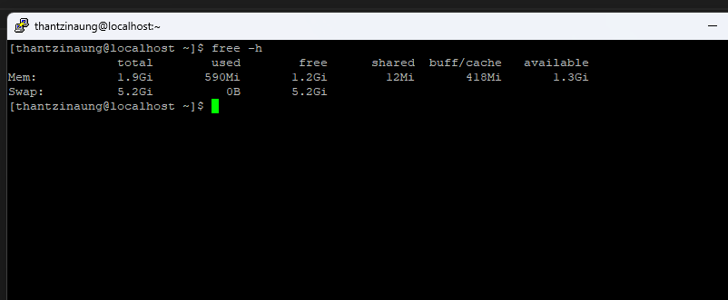
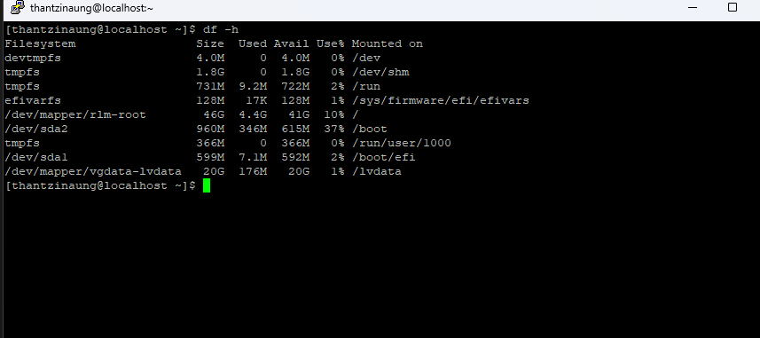
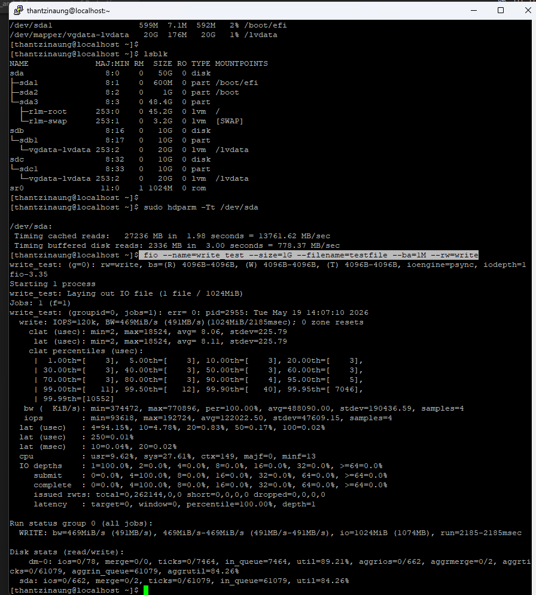
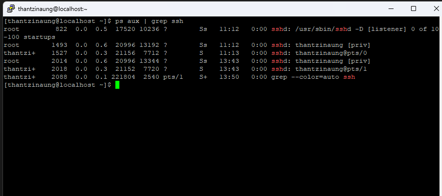
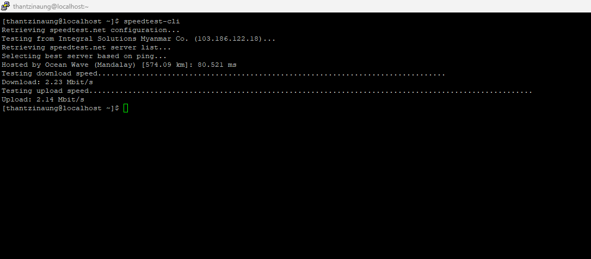
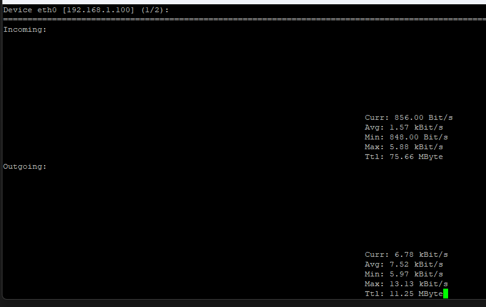
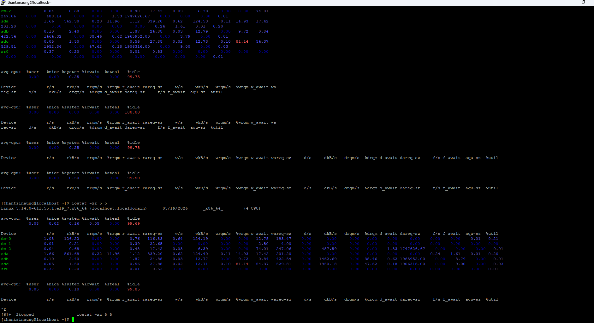

# System Monitoring and Performance Troubleshooting on Rocky Linux — Hands-on Lab

## Overview

This hands-on lab introduces essential system monitoring and performance troubleshooting techniques on a Rocky Linux server.

- Check CPU usage, memory usage, and system load
- Monitor running processes
- Test network speed and connectivity
- Measure disk performance

This lab is useful for Linux administrators, DevOps engineers, and students preparing for real-world server management.

---

# Lab Environment

| Component | Example |
|---|---|
| OS | Rocky Linux 9.x |
| User | root or sudo user |
| Terminal | SSH or local terminal |
| Required Internet | Yes |

---

# Objectives

By the end of this lab, you will be able to:

- Monitor system resource usage
- Identify heavy or problematic processes
- Check network throughput and connectivity
- Test disk read/write performance
- Use common Linux troubleshooting tools

---

# Section 1 — Check CPU, Memory, and System Load

## 1.1 View CPU Information

Display detailed CPU information:

```bash
lscpu
```

Example output:

```bash
Architecture:        x86_64
CPU(s):              4
Model name:          Intel(R) Xeon(R)
```

---

## 1.2 Check CPU and Memory Usage in Real-Time

Use the `top` command:

```bash
top
```

Key information:

| Field | Description |
|---|---|
| %CPU | CPU utilization |
| %MEM | Memory usage |
| load average | System load |

---

## 1.4 Check Memory Usage

Display RAM usage:

```bash
free -h
```

Example:

```bash
              total        used        free
Mem:           3.7Gi       1.2Gi       1.8Gi
```

Options:

| Option | Meaning |
|---|---|
| -h | Human-readable format |

---

## 1.5 Check System Load Average

```bash
uptime
```

Example:

```bash
load average: 0.15, 0.20, 0.18
```

Explanation:

| Value | Meaning |
|---|---|
| 1st | Last 1 minute |
| 2nd | Last 5 minutes |
| 3rd | Last 15 minutes |

---

# Section 2 — Check Running Processes

## 2.1 Display Running Processes

```bash
ps aux
```

Important columns:

| Column | Description |
|---|---|
| USER | Process owner |
| PID | Process ID |
| %CPU | CPU usage |
| %MEM | Memory usage |
| COMMAND | Executed command |

---

## 2.2 Search for Specific Processes

Example: Find SSH processes

```bash
ps aux | grep ssh
```

---

## 2.3 Monitor Processes in Real-Time

```bash
top
```

or

```bash
htop
```

---

## 2.4 Kill a Process

Find process ID:

```bash
ps aux | grep firefox
```

Kill process:

```bash
kill PID
```

Force kill:

```bash
kill -9 PID
```

Example:

```bash
kill -9 1254
```

---

# Section 3 — Check Network Speed and Connectivity

## 3.1 Check Network Interface Information

```bash
ip a
```

---

## 3.2 Test Network Connectivity

Ping Google DNS:

```bash
ping 8.8.8.8
```

Stop with:

```bash
CTRL + C
```

---

## 3.3 Install Speedtest CLI

Install repository:

```bash
sudo dnf install epel-release -y
```

Install speedtest:

```bash
sudo dnf install speedtest-cli -y
```

Run network speed test:

```bash
speedtest-cli
```

Example output:

```bash
Download: 92.15 Mbit/s
Upload: 25.41 Mbit/s
```

---

## 3.4 Check Active Network Connections

```bash
ss -tunlp
```

Explanation:

| Option | Meaning |
|---|---|
| -t | TCP connections |
| -u | UDP connections |
| -n | Numeric addresses |
| -l | Listening ports |
| -p | Show process |

---

## 3.5 Monitor Network Traffic

Install `nload`:

```bash
sudo dnf install nload -y
```

Run:

```bash
nload
```

Features:

- Real-time bandwidth monitoring
- Upload/download graphs

---

# Section 4 — Check Disk Performance

## 4.1 View Disk Usage

```bash
df -h
```

Example:

```bash
Filesystem      Size  Used Avail Use%
/dev/sda1        40G   12G   26G  32%
```

---

## 4.2 Check Disk and Partition Information

```bash
lsblk
```

---

## 4.3 Measure Disk Read Speed

```bash
sudo hdparm -Tt /dev/sda
```

Example:

```bash
Timing buffered disk reads: 500 MB in 3.01 seconds
```

> Replace `/dev/sda` with your actual disk device.

---

## 4.4 Install fio for Advanced Disk Testing

Install:

```bash
sudo dnf install fio -y
```

Run write performance test:

```bash
fio --name=write_test --size=1G --filename=testfile --bs=1M --rw=write
```

Run read performance test:

```bash
fio --name=read_test --size=1G --filename=testfile --bs=1M --rw=read
```

---

## 4.5 Monitor Disk I/O Activity

Install sysstat tools:

```bash
sudo dnf install sysstat -y
```

Use `iostat`:

```bash
iostat -xz 1
```

Useful metrics:

| Metric | Meaning |
|---|---|
| %util | Disk utilization |
| await | Disk response time |
| r/s | Read operations |
| w/s | Write operations |

---

# Section 5 — Basic Troubleshooting Scenarios

## High CPU Usage

Check top CPU-consuming processes:

```bash
top
```

or

```bash
ps aux --sort=-%cpu | head
```

---

## High Memory Usage

```bash
free -h
```

Check memory-intensive processes:

```bash
ps aux --sort=-%mem | head
```

---

## Slow Disk Performance

Check I/O wait:

```bash
iostat -xz 1
```

---

## Network Issues

Check connectivity:

```bash
ping 8.8.8.8
```

Check open ports:

```bash
ss -tunlp
```

---

# Cleanup

Remove test files created by fio:

```bash
rm -f testfile
```

---

# Summary

In this lab, you learned how to:

- Monitor CPU, RAM, and system load
- Analyze running processes
- Test network speed and monitor traffic
- Measure disk usage and performance
- Troubleshoot common Linux performance issues

These commands are essential for daily Linux server administration and troubleshooting tasks on Rocky Linux systems.









