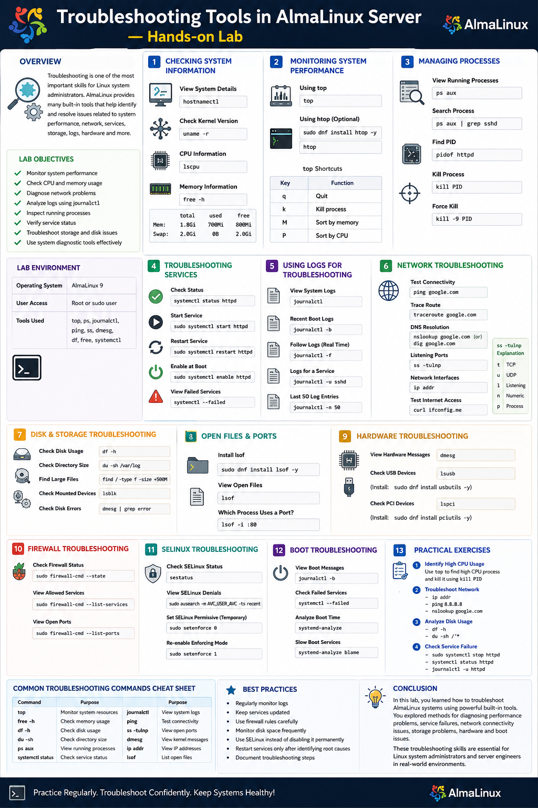

# Troubleshooting Tools in AlmaLinux Server — Hands-on Lab

## Overview

Troubleshooting is one of the most important skills for Linux system administrators. AlmaLinux provides many built-in tools that help identify and resolve issues related to:

- System performance
- Network connectivity
- Services and processes
- Storage and disk usage
- Logs and system errors
- Hardware information

---

# Lab Objectives

- Monitor system performance
- Check CPU and memory usage
- Diagnose network problems
- Analyze logs using `journalctl`
- Inspect running processes
- Verify service status
- Troubleshoot storage and disk issues
- Use system diagnostic commands effectively

---

# Lab Environment

| Component | Details |
|---|---|
| Operating System | AlmaLinux 9 |
| User Access | Root or sudo user |
| Tools Used | top, ps, journalctl, ping, ss, dmesg, df, free, systemctl |

---

# 1. Checking System Information

## View System Details

```bash
hostnamectl
```

Example Output:

```bash
 Static hostname: almalinux-server
 Operating System: AlmaLinux 9
 Kernel: Linux 5.x
 Architecture: x86-64
```

---

## Check Kernel Version

```bash
uname -r
```

example output :
```text
5.14.0-611.55.1.el9_7.x86_64
```

---

## Display CPU Information

```bash
lscpu
```

---

## Display Memory Information

```bash
free -h
```

Example Output:

```bash
              total        used        free
Mem:          1.8Gi       700Mi       800Mi
Swap:         2.0Gi       0B          2.0Gi
```

### Explanation

| Option | Meaning |
|---|---|
| total | Total memory |
| used | Used memory |
| free | Available memory |

---

# 2. Monitoring System Performance

## Using top

```bash
top
```

The `top` command shows:

- CPU usage
- Memory usage
- Running processes
- System load

### Important Shortcuts

| Key | Function |
|---|---|
| q | Quit |
| k | Kill process |
| M | Sort by memory |
| P | Sort by CPU |

---

## Using htop (Optional)

Install `htop`:

```bash
sudo dnf install htop -y
```

Run:

```bash
htop
```

`htop` provides an interactive and colorful system monitor.

---

# 3. Managing and Troubleshooting Processes

## View Running Processes

```bash
ps aux
```

---

## Search for a Specific Process

Example:

```bash
ps aux | grep sshd
```

---

## Kill a Process

### Find Process ID (PID)

```bash
pidof httpd
```

### Kill Process

```bash
kill PID
```

Force kill:

```bash
kill -9 PID
```

---

# 4. Troubleshooting Services

## Check Service Status

Example using Apache:

```bash
sudo systemctl status httpd
```

---

## Start a Service

```bash
sudo systemctl start httpd
```

---

## Restart a Service

```bash
sudo systemctl restart httpd
```

---

## Enable Service at Boot

```bash
sudo systemctl enable httpd
```

---

## View Failed Services

```bash
systemctl --failed
```

---

# 5. Using Logs for Troubleshooting

System logs help identify errors and failures.

---

## View System Logs

```bash
journalctl
```

---

## View Recent Boot Logs

```bash
journalctl -b
```

---

## Follow Logs in Real Time

```bash
journalctl -f
```

---

## Check Logs for a Specific Service

Example:

```bash
journalctl -u sshd
```

---

## View Last 50 Log Entries

```bash
journalctl -n 50
```

---

# 6. Network Troubleshooting Tools

## Test Connectivity with ping

```bash
ping google.com
```

Stop with:

```bash
CTRL + C
```

---

## Trace Network Route

Install tool:

```bash
sudo dnf install traceroute -y
```

Run:

```bash
traceroute google.com
```

---

## Check DNS Resolution

```bash
nslookup google.com
```

or

```bash
dig google.com
```

Install `dig` if needed:

```bash
sudo dnf install bind-utils -y
```

---

## View Listening Ports

```bash
ss -tulnp
```

### Explanation

| Option | Meaning |
|---|---|
| t | TCP |
| u | UDP |
| l | Listening |
| n | Numeric |
| p | Process |

---

## Check Network Interfaces

```bash
ip addr
```

---

## Test Internet Access

```bash
curl ifconfig.me
```

Displays your public IP address.

---

# 7. Disk and Storage Troubleshooting

## Check Disk Usage

```bash
df -h
```

Example Output:

```bash
Filesystem      Size  Used Avail Use%
/dev/sda1        20G   10G   9G   55%
```

---

## Check Directory Size

```bash
du -sh /var/log
```

---

## Find Large Files

```bash
find / -type f -size +500M
```

---

## Check Mounted Devices

```bash
lsblk
```

---

## Check Disk Errors

```bash
dmesg | grep error
```

---

# 8. Checking Open Files and Ports

## Install lsof

```bash
sudo dnf install lsof -y
```

---

## View Open Files

```bash
lsof
```

---

## Check Which Process Uses a Port

Example:

```bash
lsof -i :80
```

---

# 9. Hardware Troubleshooting

## View Hardware Messages

```bash
dmesg
```

---

## Check USB Devices

```bash
lsusb
```

Install if missing:

```bash
sudo dnf install usbutils -y
```

---

## Check PCI Devices

```bash
lspci
```

Install if missing:

```bash
sudo dnf install pciutils -y
```

---

# 10. Firewall Troubleshooting

## Check Firewall Status

```bash
sudo firewall-cmd --state
```

---

## View Allowed Services

```bash
sudo firewall-cmd --list-services
```

---

## View Open Ports

```bash
sudo firewall-cmd --list-ports
```

---

# 11. SELinux Troubleshooting

## Check SELinux Status

```bash
sestatus
```

---

## View SELinux Denials

```bash
sudo ausearch -m AVC,USER_AVC -ts recent
```

---

## Temporarily Set SELinux to Permissive

```bash
sudo setenforce 0
```

Re-enable enforcing mode:

```bash
sudo setenforce 1
```

---

# 12. Troubleshooting Boot Problems

## View Boot Messages

```bash
journalctl -b
```

---

## Check Failed Services During Boot

```bash
systemctl --failed
```

---

## Analyze Boot Time

```bash
systemd-analyze
```

---

## Display Slow Boot Services

```bash
systemd-analyze blame
```

---

# 13. Practical Hands-on Exercises

## Exercise 1 — Identify High CPU Usage

1. Run:

```bash
top
```

2. Identify the process consuming the most CPU.

3. Kill the process using:

```bash
kill PID
```

---

## Exercise 2 — Troubleshoot Network Connectivity

1. Check interface:

```bash
ip addr
```

2. Ping gateway or internet:

```bash
ping 8.8.8.8
```

3. Test DNS:

```bash
nslookup google.com
```

---

## Exercise 3 — Analyze Disk Usage

1. Check disk space:

```bash
df -h
```

2. Find large directories:

```bash
du -sh /*
```

---

## Exercise 4 — Check Service Failure

1. Stop Apache service:

```bash
sudo systemctl stop httpd
```

2. Verify status:

```bash
systemctl status httpd
```

3. Review logs:

```bash
journalctl -u httpd
```

---

# Common Troubleshooting Commands Cheat Sheet

| Command | Purpose |
|---|---|
| top | Monitor system resources |
| free -h | Check memory usage |
| df -h | Check disk usage |
| du -sh | Check directory size |
| ps aux | View running processes |
| systemctl status | Check service status |
| journalctl | View system logs |
| ping | Test connectivity |
| ss -tulnp | View open ports |
| dmesg | View kernel messages |
| ip addr | View IP addresses |
| lsof | List open files |

---

# Best Practices

- Regularly monitor logs
- Keep services updated
- Use firewall rules carefully
- Monitor disk space frequently
- Use SELinux instead of disabling it permanently
- Restart services only after identifying root causes
- Document troubleshooting steps

---

# Conclusion

In this lab, you learned how to troubleshoot AlmaLinux systems using powerful built-in tools. You explored methods for diagnosing:

- Performance problems
- Service failures
- Network connectivity issues
- Storage problems
- Hardware and boot issues

These troubleshooting skills are essential for Linux system administrators and server engineers in real-world environments.

