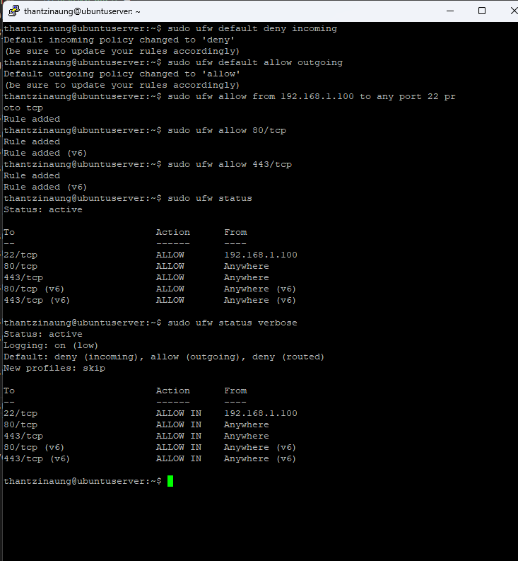

# Ubuntu Server Firewall Management (UFW)

## Introduction

A firewall helps protect your Ubuntu Server by controlling incoming and outgoing network traffic.  
Ubuntu provides **UFW (Uncomplicated Firewall)** as an easy-to-use firewall management tool built on top of `iptables`.

UFW allows administrators to:
- Allow or deny network connections
- Restrict access by IP address
- Secure SSH access
- Open ports for web servers and applications
- Improve overall server security

---

# What is UFW?

**UFW** stands for:

> **Uncomplicated Firewall**

It provides a simpler interface for managing Linux firewall rules.

---

# Installing UFW

UFW is usually pre-installed on Ubuntu Server.  
If it is not installed, use:

```bash
sudo apt update
sudo apt install ufw -y
```

---

# Check Firewall Status

Display whether the firewall is active or inactive.

```bash
sudo ufw status
```

Example output:

```bash
Status: inactive
```

or

```bash
Status: active
```

---

# Enable the Firewall

Enable UFW on the server.

```bash
sudo ufw enable
```

Example output:

```bash
Firewall is active and enabled on system startup
```

> ⚠️ Important:  
> Always allow SSH before enabling the firewall, otherwise remote access may be blocked.

---

# Disable the Firewall

Disable UFW temporarily.

```bash
sudo ufw disable
```

---

# Allow SSH Connections

Allow OpenSSH service through the firewall.

```bash
sudo ufw allow OpenSSH
```

Alternative method using port number:

```bash
sudo ufw allow 22/tcp
```

Check rules:

```bash
sudo ufw status
```

Example:

```bash
22/tcp                     ALLOW       Anywhere
OpenSSH                    ALLOW       Anywhere
```

---

# Allow Specific Ports

## Allow HTTP Web Traffic

```bash
sudo ufw allow 80/tcp
```

## Allow HTTPS Secure Traffic

```bash
sudo ufw allow 443/tcp
```

## Allow Custom Port

Example: Allow port 8080

```bash
sudo ufw allow 8080/tcp
```

---

# Allow Connections from Specific IP Address

Allow access only from a trusted IP address.

Example:

```bash
sudo ufw allow from 192.168.1.100
```

Allow a specific IP to access a specific port:

```bash
sudo ufw allow from 192.168.1.100 to any port 22
```

Allow subnet range:

```bash
sudo ufw allow from 192.168.1.0/24
```

---

# Deny Connections

## Deny Specific Port

```bash
sudo ufw deny 23/tcp
```

This blocks Telnet access.

---

## Deny Access from Specific IP

```bash
sudo ufw deny from 192.168.1.50
```

---

# Delete Firewall Rules

## Delete by Rule

Example:

```bash
sudo ufw delete allow 8080/tcp
```

Delete SSH rule:

```bash
sudo ufw delete allow OpenSSH
```

---

# List Firewall Rules with Numbers

Display numbered firewall rules.

```bash
sudo ufw status numbered
```

Example:

```bash
[ 1] 22/tcp                     ALLOW IN    Anywhere
[ 2] 80/tcp                     ALLOW IN    Anywhere
```

---

# Delete Rule by Number

Delete a rule using its number.

Example:

```bash
sudo ufw delete 2
```

---

# Default Firewall Policies

## Deny All Incoming Connections

```bash
sudo ufw default deny incoming
```

---

## Allow All Outgoing Connections

```bash
sudo ufw default allow outgoing
```

These are recommended default security settings.

---

# Reload Firewall Rules

Apply firewall rule changes without disabling the firewall.

```bash
sudo ufw reload
```

---

# Reset UFW Configuration

Remove all firewall rules and restore defaults.

```bash
sudo ufw reset
```

> ⚠️ Warning:  
> This deletes all existing firewall configurations.

---

# Check Application Profiles

View application profiles available in UFW.

```bash
sudo ufw app list
```

Example output:

```bash
Available applications:
  OpenSSH
  Apache
  Apache Full
```

---

# Allow Apache Web Server

## Allow HTTP Only

```bash
sudo ufw allow "Apache"
```

---

## Allow HTTPS and HTTP

```bash
sudo ufw allow "Apache Full"
```

---

# Logging Firewall Activity

Enable firewall logging.

```bash
sudo ufw logging on
```

Check logs:

```bash
sudo less /var/log/ufw.log
```

---

# Useful UFW Commands Summary

| Command | Description |
|---|---|
| `sudo ufw status` | Check firewall status |
| `sudo ufw enable` | Enable firewall |
| `sudo ufw disable` | Disable firewall |
| `sudo ufw allow OpenSSH` | Allow SSH |
| `sudo ufw allow 80/tcp` | Allow HTTP |
| `sudo ufw allow 443/tcp` | Allow HTTPS |
| `sudo ufw deny 23/tcp` | Deny Telnet |
| `sudo ufw delete allow 80/tcp` | Delete rule |
| `sudo ufw status numbered` | Show numbered rules |
| `sudo ufw reload` | Reload rules |
| `sudo ufw reset` | Reset firewall |

---

# Recommended Basic Firewall Setup

A common secure setup for Ubuntu Server:

```bash
sudo ufw default deny incoming
sudo ufw default allow outgoing
sudo ufw allow OpenSSH
sudo ufw allow 80/tcp
sudo ufw allow 443/tcp
sudo ufw enable
```

---

# Best Practices

- Always allow SSH before enabling UFW
- Remove unused firewall rules
- Allow only necessary ports
- Use specific IP restrictions when possible
- Regularly review firewall rules
- Enable logging for security monitoring

---

# Conclusion

UFW is a simple yet powerful firewall management tool for Ubuntu Server.  
By configuring proper firewall rules, administrators can secure servers against unauthorized access while allowing legitimate network traffic.

Using commands such as:

```bash
sudo ufw allow
sudo ufw deny
sudo ufw delete
sudo ufw status
```

```bash
sudo ufw default deny incoming
sudo ufw default allow outgoing

sudo ufw allow from [သင့်_IP_လိပ်စာ] to any port 22

sudo ufw allow 80/tcp
sudo ufw allow 443/tcp

sudo ufw enable

sudo ufw status verbose
```

you can effectively manage server security and network access.

