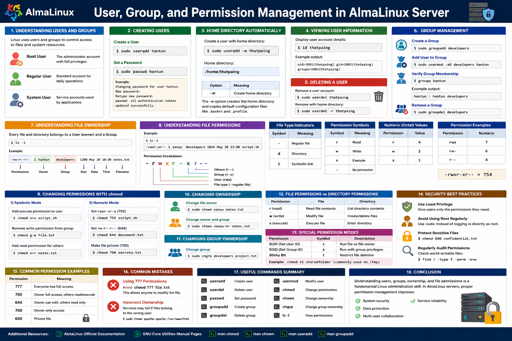

# User, Group, and Permission Management in AlmaLinux Server  
## Understanding File Permissions in AlmaLinux  

## Overview

Linux is a multi-user operating system, which means controlling who can access files and directories is essential for system security and stability. In an AlmaLinux server environment, proper user and permission management helps protect sensitive data, prevent unauthorized access, and maintain secure system administration practices.

---

In this lab:

- How Linux users and groups work
- How to create and manage users
- How to create and manage groups
- Understanding file ownership
- How to read file permissions
- Using `chmod`, `chown`, and `chgrp`
- Numeric and symbolic permission modes
- Practical permission management examples
- Basic Linux security best practices

---

# 👥 Understanding Users and Groups in AlmaLinux

Linux uses users and groups to control access to files and system resources.

## Types of Users

| User Type | Description |
|---|---|
| Root User | The administrator account with full privileges |
| Regular User | Standard account for daily operations |
| System User | Service accounts used by applications |

---

# 👨‍💻 Creating Users in AlmaLinux

Use the `useradd` command to create a new user.

## Create a User

```bash
sudo useradd hantun
```

## Set a Password

```bash
sudo passwd hantun
```

Example:

```bash
Changing password for user hantun.
New password:
Retype new password:
passwd: all authentication tokens updated successfully.
```

---

# 🏠 Creating a Home Directory Automatically

Create a user with a home directory:

```bash
sudo useradd -m thatpaing
```

The home directory will be:

```bash
/home/thatpaing
```
| Option | Meaning |
|---|---|
| -m | make home directory|

When you include -m, the system automatically does two things:

 - It creates a personal home directory for the new user (by default, at /home/thatpaing).

 - It copies a set of default configuration files (like .bashrc and .profile) into that new directory so the user has a working terminal setup right away.

---

# 🧾 Viewing User Information

Display user account details:

```bash
id thatpaing
```

Example output:

```bash
uid=1001(john) gid=1001(john) groups=1001(john)
```

---

## Rename user with home directory (recommented)
```bash
sudo usermod -l thatpaing-tech -d /home/thatpaing-tech -m thatpaing
```

## Rename user only
```bash
sudo usermod -l thatpaing-tech thatpaing
```

| Option | Meaning |
|---|---|
| -l | login name |
| -d | home directory |
| -m | move |
| thatpaing-tech | new-name |
| thatpaing | old-name |

* note : new-name come form before old-name


## Comfirm 
```bash 
id thatpaing-tech
```
---

* Note :: when you change username , you can also change default group name - as follow :
```bash 
sudo groupmod -n thatpaing-tech thatpaing
```
 

# ❌ Deleting a User

Remove a user account:

```bash
sudo userdel thatpaing
```

Remove the user along with the home directory:

```bash
sudo userdel -r thatpaing
```

---

# 👥 Understanding Groups

Groups allow multiple users to share permissions on files and directories.

---

# ➕ Creating Groups

Create a new group:

```bash
sudo groupadd developers
```

---

# 👤 Add a User to a Group

```bash
sudo usermod -aG developers hantun
```

Verify group membership:

```bash
groups hantun
```

Example output:

```bash
hantun : hantun developers
```
---

## remove a user from the group

```bash
sudo gpasswd -d hantun developers
```
| Option | Meaning |
|---|---|
| -d | delete |
| hantun | a user you want to remove from |
| developer | group |

---

## check users in the group
```bash
getent group groupname
```

example :
```bash
gentent group developers
```

(or)

```bash
sudo  lid -g developer
```

| Option | Meaning | 
|---|---|
| lid | listen id |
| -g | group |

---

## Rename Group

```bash
sudo groupmod -n sales marketing
```

| Option | Meaning | 
|---|---|
| -n | name |
| sales | new-group |
| marketing | old-group |

## Comfirm
```bash 
getent group sales
```

---

# ❌ Removing a Group

```bash
sudo groupdel developers
```

---

# 📂 Understanding File Ownership

Every file and directory in AlmaLinux belongs to:

- A **User (Owner)**
- A **Group**

View ownership using:

```bash
ls -l
```

Example:

```bash
-rw-r--r-- 1 hantun developers 1200 May 20 10:30 notes.txt
```

Breakdown:

| Section | Meaning |
|---|---|
| hantun | File owner |
| developers | Assigned group |

---

# 🔐 Understanding File Permissions

Each file has permissions assigned for:

- User (Owner)
- Group
- Others

---

# 🔎 Reading File Permissions with `ls -l`

Run:

```bash
ls -l
```

Example output:

```bash
-rwxr-xr-- 1 sanyu developers 1024 May 20 12:00 script.sh
```

Permission breakdown:

```text
-rwxr-xr--
 |  | | |
 |  | | └── Others permissions (r--)
 |  | └──── Group permissions (r-x)
 |  └────── User permissions (rwx)
 └───────── File type
```

---

# 📄 File Type Indicators

| Symbol | Meaning |
|---|---|
| - | Regular file |
| d | Directory |
| l | Symbolic link |

---

# 🔤 Permission Symbols

| Symbol | Meaning |
|---|---|
| r | Read |
| w | Write |
| x | Execute |
| - | No permission |

---

# 🔢 Numeric (Octal) Permission Values

Each permission has a numeric value:

| Permission | Value |
|---|---|
| r | 4 |
| w | 2 |
| x | 1 |

Examples:

| Permission | Numeric |
|---|---|
| rwx | 7 |
| rw- | 6 |
| r-- | 4 |

So:

```text
-rwxr-xr--
```

becomes:

```text
754
```

---

# ✍️ Changing Permissions with `chmod`

The `chmod` command modifies file or directory permissions.

---

# 1️⃣ Symbolic Mode

## Add Execute Permission to User

```bash
chmod u+x script.sh
```

## Remove Write Permission from Group

```bash
chmod g-w file.txt
```

## Add Read Permission for Others

```bash
chmod o+r notes.txt
```

sample :

| Numeric | Symbol | symbol |
|---|---|---|
| 4775 | u+s | rwsrwxr_x |
| 2775 | g+s | rwxrwxsr_x |
| 1775 | o+t | rwxrwxr_t |

---

# 2️⃣ Numeric Mode

## Set rwxr-xr-x Permissions

```bash
chmod 755 script.sh
```

## Set rw-r--r-- Permissions

```bash
chmod 644 document.txt
```

## Make a File Private

```bash
chmod 700 secrets.txt
```

---

# 👑 Changing Ownership with `chown`

Use `chown` to change file ownership.

Only root or sudo users can perform this action.

---

# Change File Owner

```bash
sudo chown sanyu notes.txt
```

---

# Change Owner and Group

```bash
sudo chown sanyu:hr notes.txt
```

---

# 👥 Changing Group Ownership with `chgrp`

Use `chgrp` to modify the assigned group.

```bash
sudo chgrp developers project.txt
```

---

# 📁 File Permissions vs Directory Permissions

Permissions behave differently on directories.

| Permission | File | Directory |
|---|---|---|
| r | Read file contents | List directory contents |
| w | Modify file | Create/delete files |
| x | Execute file | Enter directory |


---

# 🔒 Special Permission Modes

Linux also supports advanced permissions.

| Permission | Symbol | Description |
|---|---|---|
| SUID (set User ID) | s | Run file as file owner |
| SGID (Set Group ID) | s | Run with group privileges |
| Sticky Bit | t | Restrict file deletion |

Example:

```bash
chmod +t sharedfolder
```

Commonly used on `/tmp`.

---

# 🛡️ Security Best Practices

## Use Least Privilege

Give users only the permissions they need.

---

## Avoid Using Root Regularly

Use `sudo` instead of logging in directly as root.

---

## Protect Sensitive Files

Example:

```bash
chmod 600 confidential.txt
```

---

## Regularly Audit Permissions

Check world-writable files:

```bash
find / -type f -perm -o+w
```

(or)

```bash
find / -xdev -type f -perm -o+w ! -path "/proc/*" ! -path "/sys/*" ! -path "/tmp/*" ! -path "/var/tmp/*" 2>/dev/null
```
(or)

```bash
find /etc -type f -perm -o+w 2>/dev/null
```


To find /bin and /usr/bin(executable commands)
```bash
find /bin /usr/bin /sbin /usr/sbin -type f -perm -o+w 2>/dev/null
```

| Option | Meaning |
|---|---|
| find / | find all start from root |
| -type f | not folder (directory) display only regular file |
| -perm -o+w | check permission |
| o | other (not owner or group) |
| w | write permission |

`Optional :`
You can disallow (disable) if you find that you given wrong permission or anyway :
```bash
chmod o-w /path/to/file.txt
```
---

# 📌 Common Permission Examples

| Permission | Meaning |
|---|---|
| 777 | Everyone has full access |
| 755 | Owner full access, others read/execute |
| 644 | Owner can edit, others read only |
| 700 | Owner only access |
| 600 | Private file |

---

# 🚨 Common Mistakes

## Using 777 Permissions

Avoid:

```bash
chmod 777 file.txt
```

This allows anyone to modify the file.

---

## Incorrect Ownership

Services may fail if files belong to the wrong user.

Example:

```bash
sudo chown apache:apache /var/www/html
```

---

# 📖 Useful Commands Summary

| Command | Purpose |
|---|---|
| useradd | Create user |
| userdel | Delete user |
| passwd | Set password |
| groupadd | Create group |
| groupdel | Delete group |
| usermod | Modify user |
| chmod | Change permissions |
| chown | Change ownership |
| chgrp | Change group ownership |
| ls -l | View permissions |

---

# 🎯 Conclusion

Understanding users, groups, ownership, and file permissions is a fundamental Linux administration skill. In AlmaLinux servers, proper permission management improves:

- System security
- Data protection
- Multi-user collaboration
- Service reliability

By mastering commands like `chmod`, `chown`, `chgrp`, `useradd`, and `groupadd`, you gain full control over how users interact with files and directories on your system.

---

# 📚 Additional Resources

- AlmaLinux Official Documentation
- GNU Core Utilities Manual Pages
- `man chmod`
- `man chown`
- `man useradd`
- `man groupadd`


[Linux+File+Permissions+Cheat+Sheet](./asset//image/Linux+File+Permissions+Cheat+Sheet.pdf)