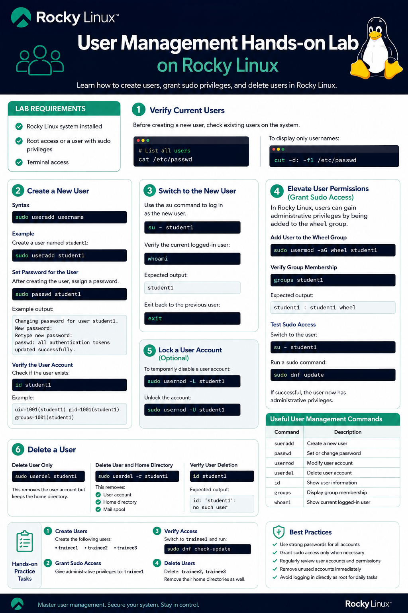
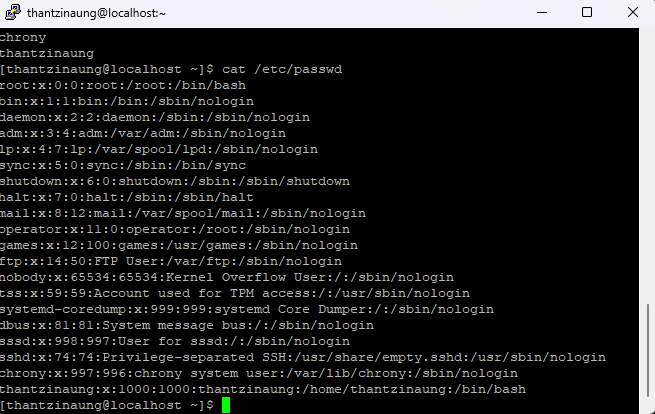
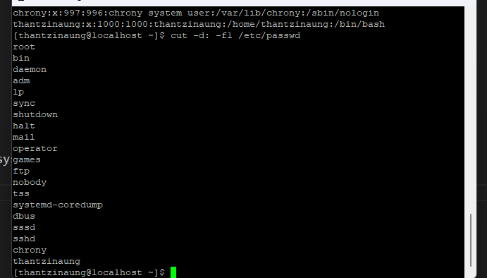
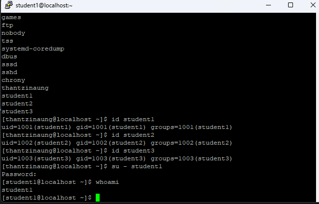
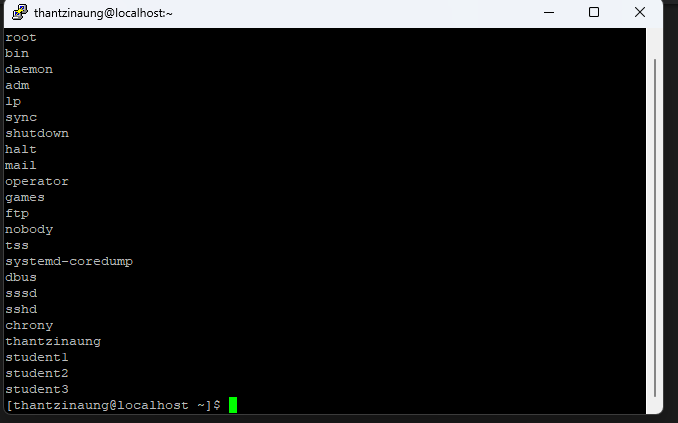
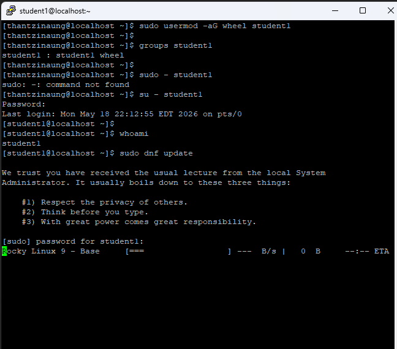
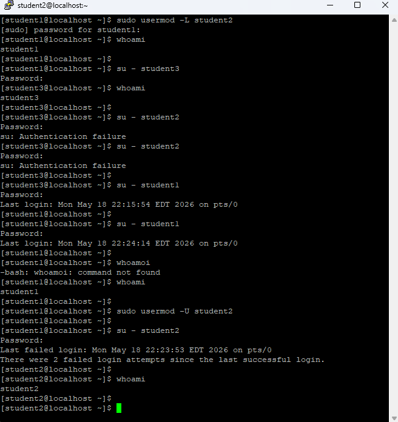
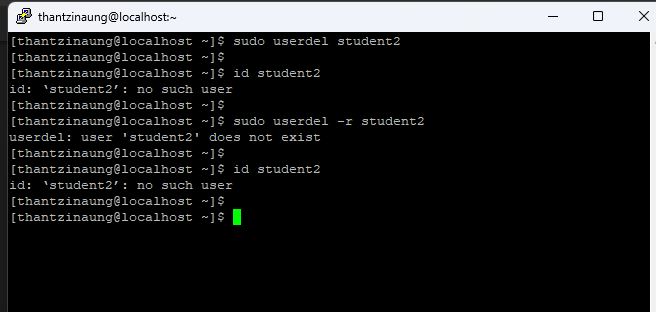

# User Management Hands-on Lab on Rocky Linux

## Overview

This hands-on lab introduces basic user management tasks in **Rocky Linux**. 

- Create a new user account
- Grant administrative (sudo) privileges to a user
- Delete a user account

---

# Lab Requirements

- Rocky Linux system installed
- Root access or a user with sudo privileges
- Terminal access

---

# Step 1 — Verify Current Users

Before creating a new user, you can check existing users on the system.

```bash
cat /etc/passwd
```

To display only usernames:

```bash
cut -d: -f1 /etc/passwd
```

---

# Step 2 — Create a New User

## Syntax

```bash
sudo useradd username
```

## Example

Create a user named `student1`:

```bash
sudo useradd student1
```

---

## Set Password for the User

After creating the user, assign a password.

```bash
sudo passwd student1
```

Example output:

```text
Changing password for user student1.
New password:
Retype new password:
passwd: all authentication tokens updated successfully.
```

---

## Verify the User Account

Check if the user exists:

```bash
id student1
```

Example:

```text
uid=1001(student1) gid=1001(student1) groups=1001(student1)
```

---

# Step 3 — Switch to the New User

Use the `su` command to log in as the new user.

```bash
su - student1
```

Verify the current logged-in user:

```bash
whoami
```

Expected output:

```text
student1
```

Exit back to the previous user:

```bash
exit
```

---

# Step 4 — Elevate User Permissions (Grant Sudo Access)

In Rocky Linux, users can gain administrative privileges by being added to the `wheel` group.

---

## Add User to the Wheel Group

```bash
sudo usermod -aG wheel student1
```

---

## Verify Group Membership

```bash
groups student1
```

Expected output:

```text
student1 : student1 wheel
```

---

## Test Sudo Access

Switch to the user:

```bash
su - student1
```

Run a sudo command:

```bash
sudo dnf update
```

If successful, the user now has administrative privileges.

---

# Step 5 — Lock a User Account (Optional)

To temporarily disable a user account:

```bash
sudo usermod -L student1
```

Unlock the account:

```bash
sudo usermod -U student1
```

---

# Step 6 — Delete a User

## Delete User Only

```bash
sudo userdel student1
```

This removes the user account but keeps the home directory.

---

## Delete User and Home Directory

```bash
sudo userdel -r student1
```

This removes:

- User account
- Home directory
- Mail spool

---

## Verify User Deletion

```bash
id student1
```

Expected output:

```text
id: ‘student1’: no such user
```

---

# Useful User Management Commands

| Command | Description |
|---|---|
| `useradd` | Create a new user |
| `passwd` | Set or change password |
| `usermod` | Modify user account |
| `userdel` | Delete user account |
| `id` | Show user information |
| `groups` | Display group membership |
| `whoami` | Show current logged-in user |

---

# Hands-on Practice Tasks

## Task 1 — Create Users

Create the following users:

- student1
- student2
- student3

---

## Task 2 — Grant Sudo Access

Give administrative privileges to:

- student1

---

## Task 3 — Verify Access

Switch to `student1` and run:

```bash
sudo dnf check-update
```

---

## Task 4 — Delete Users

Delete:

- student2
- student3

Remove their home directories as well.

---

# Best Practices

- Use strong passwords for all accounts
- Grant sudo access only when necessary
- Regularly review user accounts and permissions
- Remove unused accounts immediately
- Avoid logging in directly as root for daily tasks

---

# Conclusion

In this lab, I learned how to manage users in Rocky Linux by:

- Creating users
- Assigning passwords
- Granting administrative privileges
- Deleting user accounts

These foundational Linux administration skills are critical for managing servers securely and efficiently.








