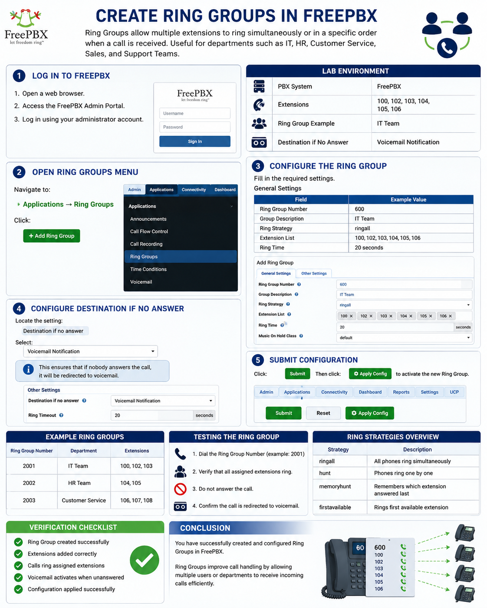
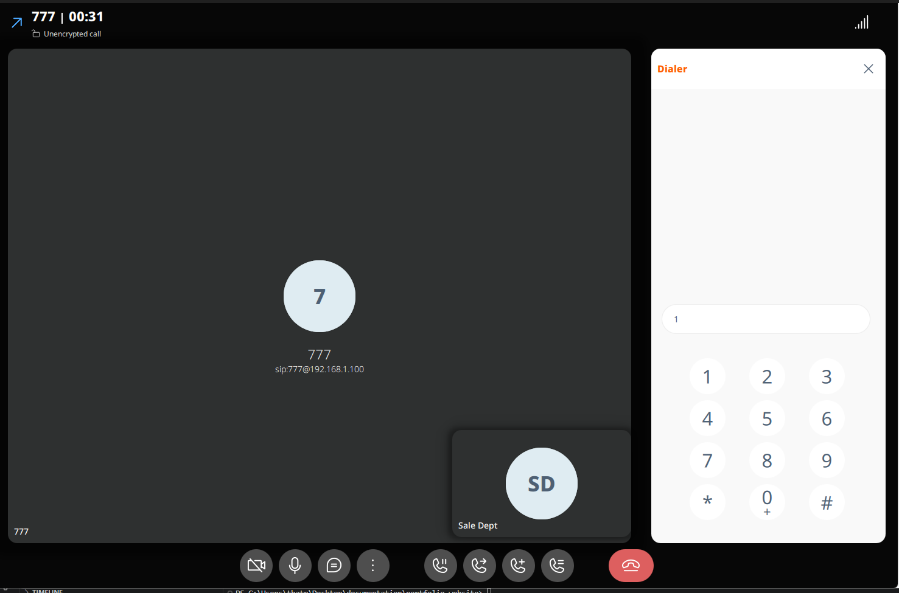
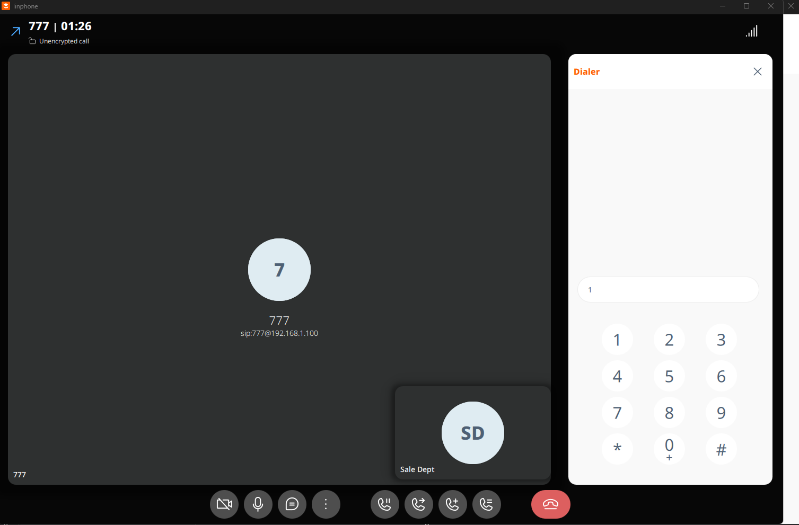

# IVR (Interactive Voice Response) Configuration in FreePBX — Hands-on Lab

## Objective
In this hands-on lab, you will learn how to:

- Create a custom voice announcement using **System Recordings**
- Configure an **IVR Menu**
- Create a test route using **Misc Applications**
- Test IVR functionality using a Softphone such as **Linphone**

At the end of this lab, users dialing **777** will hear a welcome greeting and can press options to reach different departments.

---

# Lab Topology

```text
[Softphone/Linphone]
        │
        ▼ Dial '777'
[Misc Application (777)]
        │
        ▼ Routes to
[IVR: Welcome_IVR] ───► (Plays: "မင်္ဂလာပါ...TZA မှ ကြိုဆိုပါတယ်။")
        │
        ├─── User presses '1' ───► [Extension: 103 Office Dept]
        ├─── User presses '2' ───► [Extension: 102 Marketing Dept]
        └─── Invalid/Timeout  ───► Loops back to [Welcome_IVR]
```

---

# Prerequisites

Before starting this lab, ensure:

- FreePBX server is installed and running
- Extensions already exist:
  - Extension **102** — Marketing Dept
  - Extension **103** — Office Dept
- Softphone/Linphone is registered successfully
- You can log in to the FreePBX Admin Web Interface

---

# Step 1 — Create System Recording

System Recordings are voice prompts used by the IVR.

## Navigate to System Recordings

```text
Admin → System Recordings → Add New System Recording
```

---

## Option A — Record Directly from Extension

1. Dial `*77` from an extension phone
2. Record your greeting message

Example:

```text
"မင်္ဂလာပါ...
TZA မှ ကြိုဆိုပါတယ်။
Office Department အတွက် 1 ကိုနှိပ်ပါ။
Marketing Department အတွက် 2 ကိုနှိပ်ပါ။"
```

3. Press `#` to stop recording
4. Save the recording

---

## Option B — Upload Audio File

You may also upload a `.wav` or `.mp3` file.

---

## Save Recording in FreePBX

After recording:

1. Return to:

   ```text
   Admin → System Recordings
   ```

2. Select the recorded audio
3. Set:

| Field | Value |
|---|---|
| Name | Welcome_Message |

4. Click:

```text
Save
```

---

# Step 2 — Configure IVR

## Navigate to IVR Menu

```text
Applications → IVR → Add IVR
```

---

## IVR General Settings

Configure the following:

| Field | Value |
|---|---|
| Change Name | Welcome_IVR |
| Announcement | Welcome_Message |
| Timeout | 10 Seconds |
| Invalid Retries | 3 |
| Invalid Destination | Welcome_IVR |
| Timeout Destination | Welcome_IVR |

---

## Configure IVR Options

### Option 1 — Office Department

| Digit | Destination |
|---|---|
| 1 | Extension 103 Office Dept |

---

### Option 2 — Marketing Department

| Digit | Destination |
|---|---|
| 2 | Extension 102 Marketing Dept |

---

## Submit Configuration

Click:

```text
Submit
```

Then click:

```text
Apply Config
```

---

# Step 3 — Create Testing Route (Misc Application)

The Misc Application will allow users to dial `777` to access the IVR.

---

## Navigate to Misc Applications

```text
Applications → Misc Applications → Add Misc Application
```

---

## Configure Misc Application

| Field | Value |
|---|---|
| Description | IVR_Test |
| Feature Code | 777 |
| Destination | IVR → Welcome_IVR |

---

## Save Configuration

Click:

```text
Submit
```

Then:

```text
Apply Config
```

---

# Step 4 — Testing the IVR

## Open Linphone / Softphone

Ensure the SIP account is registered successfully.

Example:

| Setting | Value |
|---|---|
| Username | 101 |
| Password | Extension Secret |
| Domain/IP | FreePBX Server IP |

---

## Dial the IVR

Dial:

```text
777
```

---

# Expected Result

The caller should hear:

```text
"မင်္ဂလာပါ...
TZA မှ ကြိုဆိုပါတယ်။
Office Department အတွက် 1 ကိုနှိပ်ပါ။
Marketing Department အတွက် 2 ကိုနှိပ်ပါ။"
```

---

# IVR Call Flow

```text
Caller Dials 777
        │
        ▼
Misc Application (777)
        │
        ▼
Welcome_IVR
        │
 ┌──────┴──────┐
 ▼             ▼
Press 1      Press 2
 │             │
 ▼             ▼
Ext 103      Ext 102
Office Dept  Marketing Dept
```

---

# Invalid or Timeout Handling

If the caller:

- Presses an invalid key
- Does not press any key within timeout

The IVR will:

```text
Loop back to Welcome_IVR
```

This allows the caller to try again.

---

# Troubleshooting Tips

## IVR Not Playing Audio

Check:

- Recording exists in System Recordings
- Audio file format is supported
- Announcement is selected correctly

---

## Extension Not Ringing

Verify:

- Extension is registered
- Destination points to correct extension
- Network connectivity is working

---

## Cannot Dial 777

Check:

- Misc Application feature code is correct
- Apply Config was clicked
- Dial plan reloaded successfully

---

# Conclusion

In this lab, you successfully learned how to:

- Create system recordings
- Configure IVR menus
- Route calls using Misc Applications
- Test IVR functionality using Linphone

This setup can be expanded into a complete business phone system with:

- Multi-level IVRs
- Department routing
- Queue systems
- Voicemail integration
- Time conditions
- Call center features




