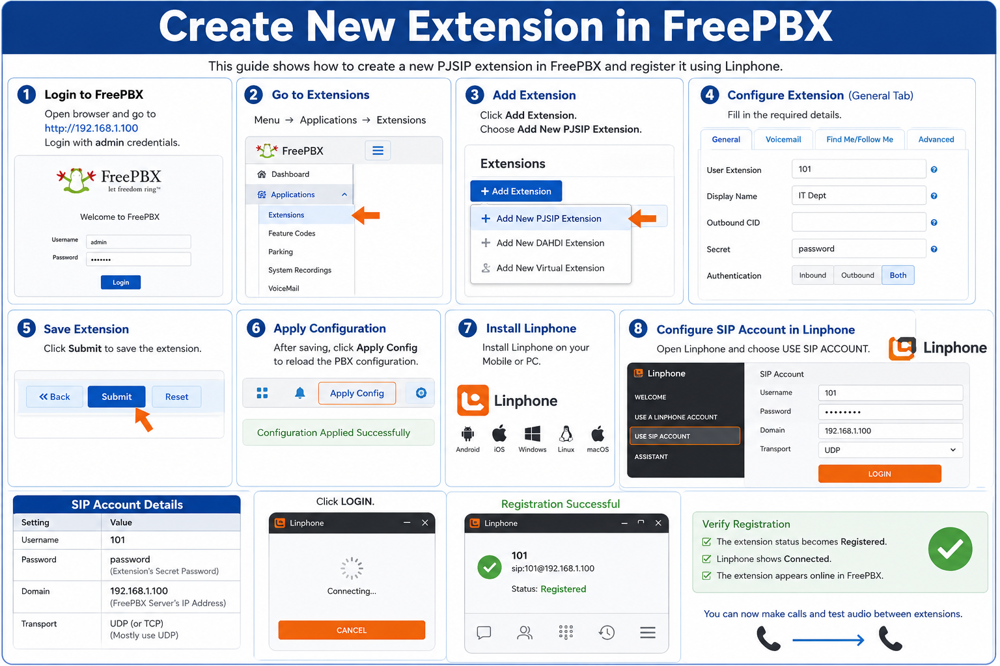
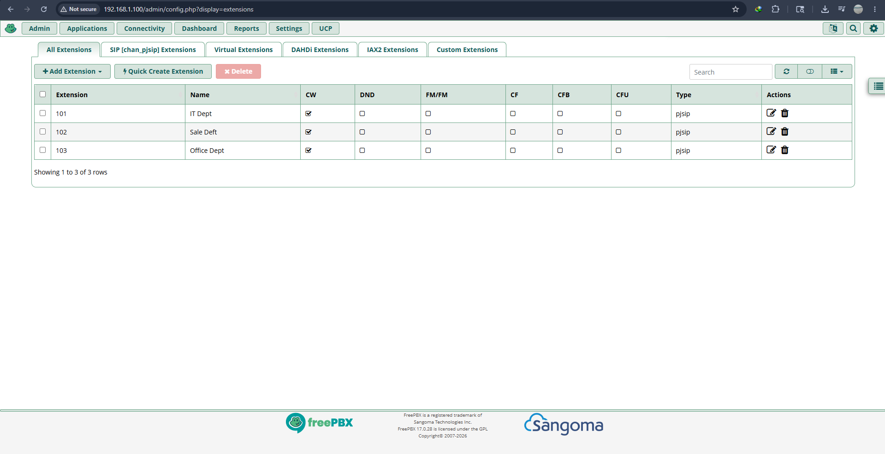
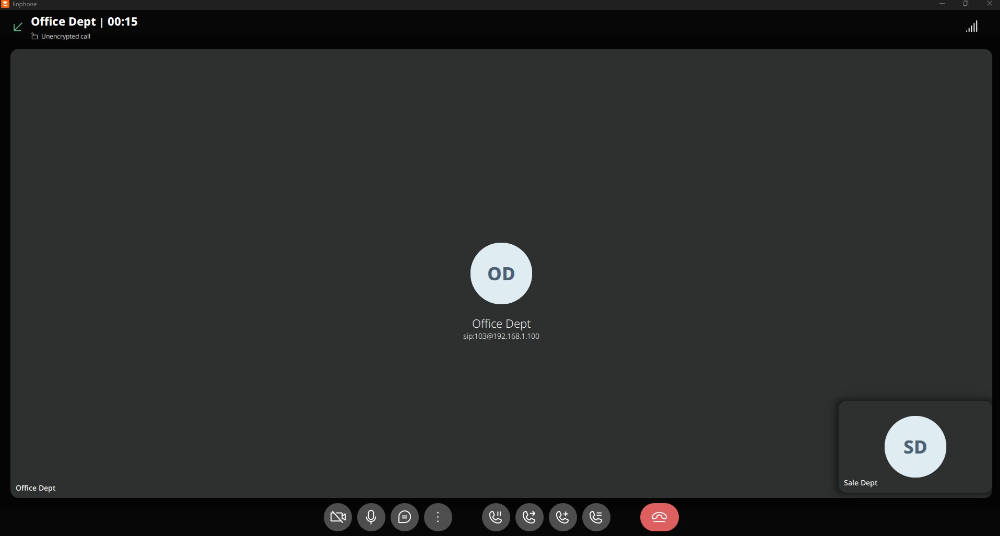

# Create New Extension in FreePBX — Hands-on Lab

## Overview

This hands-on lab demonstrates how to create a new PJSIP extension in FreePBX and connect it using the Linphone application on a mobile device or PC.

After completing this lab, users will be able to:

- Create a new SIP extension in FreePBX
- Configure authentication credentials
- Apply PBX configuration changes
- Connect a softphone client using Linphone
- Test VoIP registration successfully

---

# Lab Environment

| Component | Value |
|---|---|
| PBX Server | FreePBX |
| FreePBX Server IP | 192.168.1.100 |
| Extension Number | 101 |
| Display Name | IT Dept |
| Secret Password | password |
| Softphone Application | Linphone |

---

# Objective

Create a new PJSIP extension in FreePBX and connect it using Linphone.

---

# Step 1 — Log in to FreePBX Admin Portal

Open a web browser and access the FreePBX server.

Example:

```bash
http://192.168.1.100
```

Log in using the administrator credentials.

---

# Step 2 — Open Extension Management

From the FreePBX dashboard:

```text
Menu → Connectivity → Extensions
```

---

# Step 3 — Add New PJSIP Extension

Click:

```text
Add Extension
```

Choose:

```text
Add New PJSIP Extension
```

---

# Step 4 — Configure the Extension

Inside the **General** tab, enter the following information:

| Field | Value |
|---|---|
| User Extension | 101 |
| Display Name | IT Dept |
| Secret | password |

Example configuration:

```text
User Extension: 101
Display Name: IT Dept
Secret: password
```

---

# Step 5 — Save the Extension

Click:

```text
Submit
```

After saving, click:

```text
Apply Config
```

This reloads the PBX configuration and activates the new extension.

---

# Step 6 — Install Linphone

Install the Linphone application on:

- Android
- iPhone
- Windows
- Linux
- macOS

---

# Step 7 — Configure SIP Account in Linphone

Open Linphone and choose:

```text
USE SIP ACCOUNT
```

Enter the following SIP account details:

| Setting | Value |
|---|---|
| Username | 101 |
| Password | password |
| Domain | 192.168.1.100 |
| Transport | UDP or TCP |

Recommended transport:

```text
UDP
```

Example:

```text
Username: 101
Password: password
Domain: 192.168.1.100
Transport: UDP
```

Click:

```text
LOGIN
```

---

# Step 8 — Verify Registration

If the configuration is correct:

- The extension status becomes **Registered**
- Linphone shows **Connected**
- The extension appears online in FreePBX

---

# Testing the Extension

You can now:

- Make VoIP calls between extensions
- Test audio communication
- Verify SIP registration

---

# Troubleshooting Tips

## Cannot Register Extension

Check:

- Correct extension number
- Correct password
- FreePBX server IP address
- Network connectivity
- Firewall settings

---

## No Audio During Calls

Verify:

- Microphone permissions
- Speaker settings
- RTP ports are allowed through firewall

---

## Wrong Transport Protocol

If UDP fails, try:

```text
TCP
```

---

# Conclusion

In this lab, you successfully:

- Created a new PJSIP extension in FreePBX
- Applied FreePBX configuration changes
- Connected a softphone using Linphone
- Registered the SIP account successfully

This setup forms the foundation for building and testing VoIP communication systems in a lab environment.




