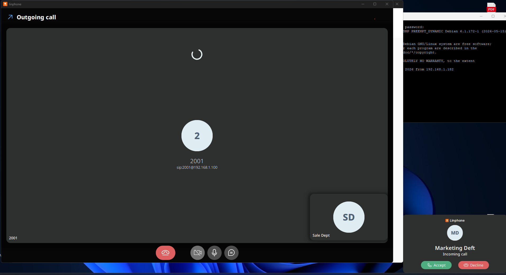
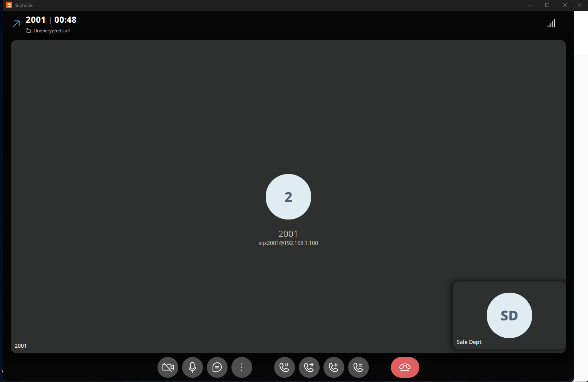

# Create Ring Groups in FreePBX — Hands-on Lab

## Objective
In this hands-on lab, you will learn how to create and configure Ring Groups in FreePBX. Ring Groups allow multiple extensions to ring simultaneously or in a specific order when a call is received.

This is useful for departments such as:
- IT Team
- HR Team
- Customer Service
- Sales Team
- Support Team

---

# Lab Environment

| Component | Description |
|---|---|
| PBX System | FreePBX |
| Extensions | 100,102,103,104,105,106 |
| Ring Group Example | IT Team |
| Destination if No Answer | Voicemail Notification |

---

# Step 1 — Log in to FreePBX

1. Open a web browser.
2. Access the FreePBX Admin Portal.
3. Log in using your administrator account.

---

# Step 2 — Open Ring Groups Menu

Navigate to:

```text
Applications → Ring Groups
```

Click:

```text
Add Ring Group
```

---

# Step 3 — Configure the Ring Group

Fill in the required settings.

## General Settings

| Field | Example Value |
|---|---|
| Ring Group Number | 600 |
| Group Description | IT Team |
| Ring Strategy | ringall |
| Extension List | 100,102,103,104,105,106 |
| Ring Time | 20 seconds |

---

# Step 4 — Configure Destination if No Answer

Locate the setting:

```text
Destination if no answer
```

Select:

```text
Voicemail Notification
```

This ensures that if nobody answers the call, it will be redirected to voicemail.

---

# Step 5 — Submit Configuration

Click:

```text
Submit
```

Then click:

```text
Apply Config
```

to activate the new Ring Group.

---

# Example Ring Groups

| Ring Group Number | Department | Extensions |
|---|---|---|
| 2001 | IT Team | 100,102,103 |
| 2002 | HR Team | 104,105 |
| 2003 | Customer Service | 106,107,108 |

---

# Testing the Ring Group

1. Dial the Ring Group Number (example: `2001`)
2. Verify that all assigned extensions ring.
3. Do not answer the call.
4. Confirm the call is redirected to voicemail.

---

# Ring Strategies Overview

| Strategy | Description |
|---|---|
| ringall | All phones ring simultaneously |
| hunt | Phones ring one by one |
| memoryhunt | Remembers which extension answered last |
| firstavailable | Rings first available extension |

---

# Verification Checklist

✅ Ring Group created successfully  
✅ Extensions added correctly  
✅ Calls ring assigned extensions  
✅ Voicemail activates when unanswered  
✅ Configuration applied successfully  

---

# Conclusion

I have successfully created and configured Ring Groups in FreePBX. Ring Groups improve call handling by allowing multiple users or departments to receive incoming calls efficiently.



