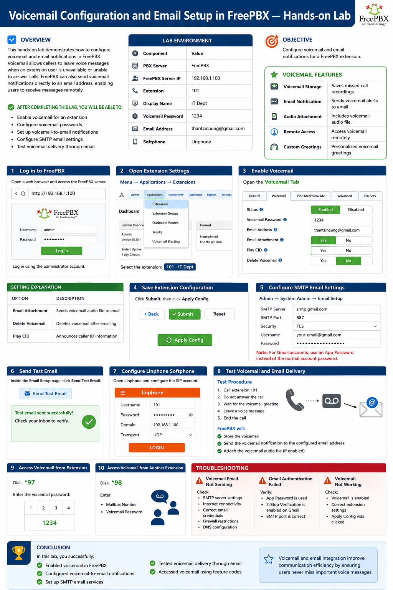
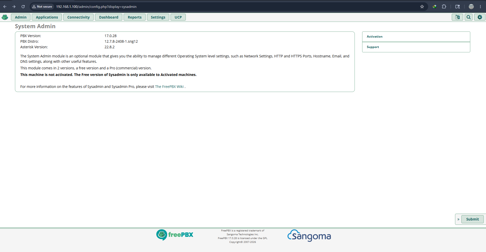
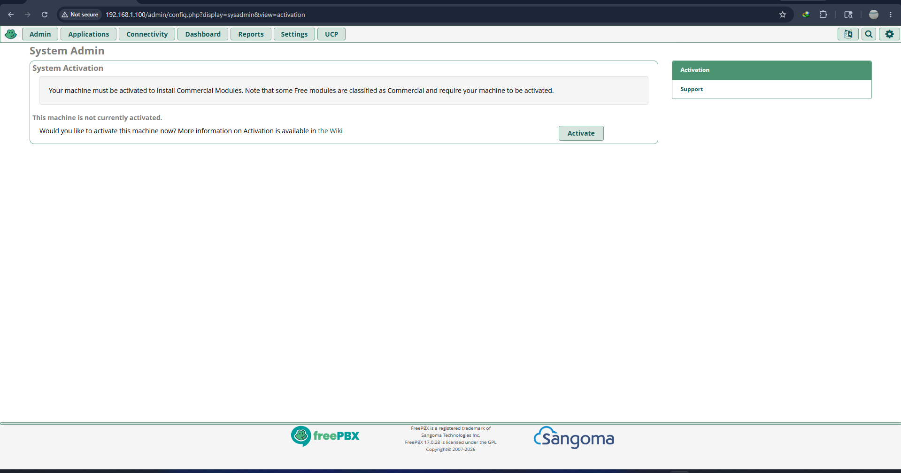
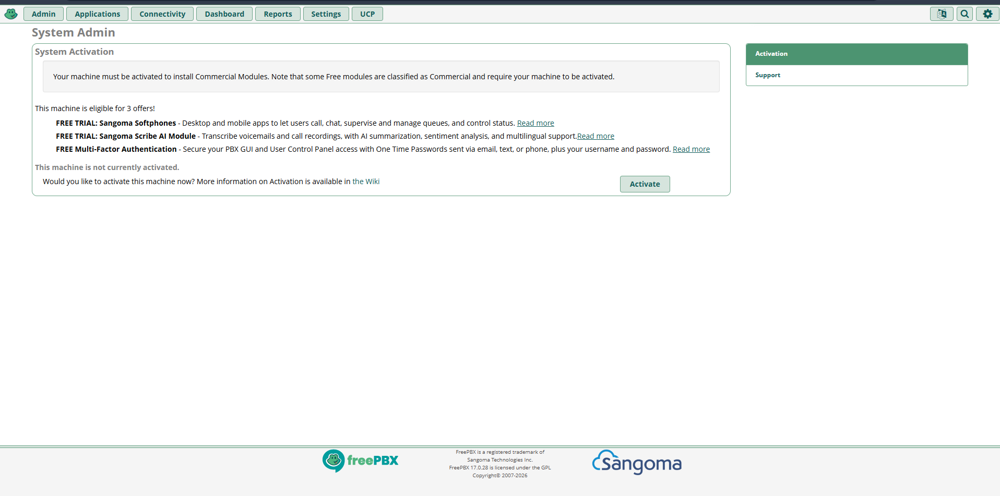
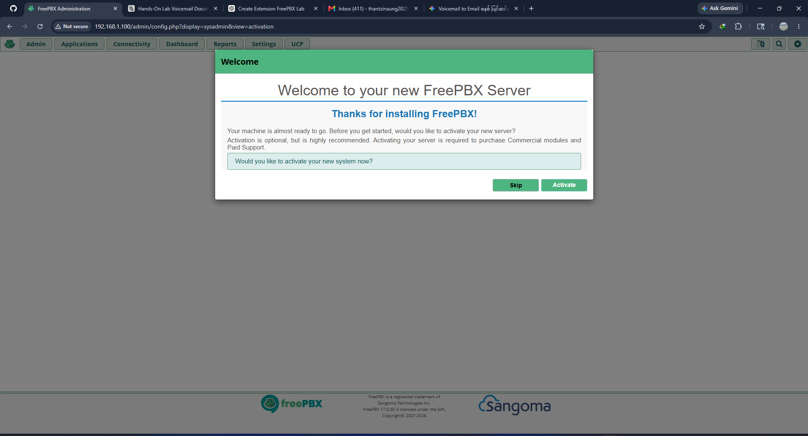
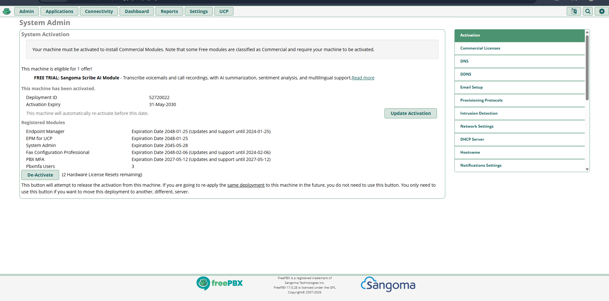
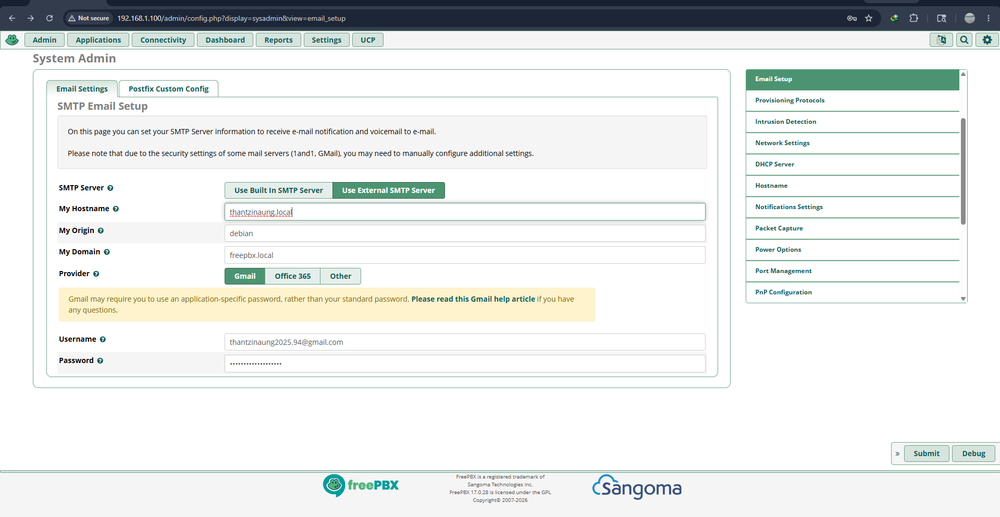
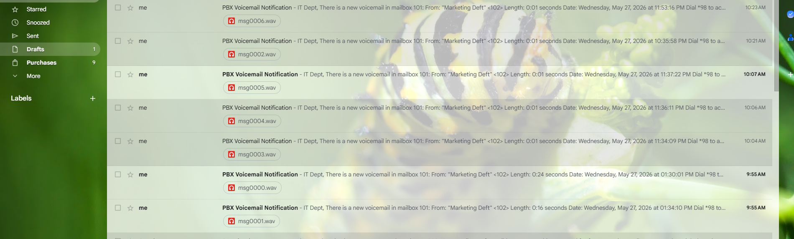
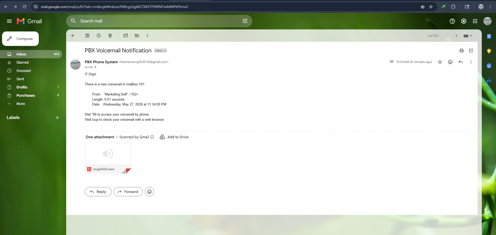

# Voicemail Configuration and Email Setup in FreePBX — Hands-on Lab

## Overview

This hands-on lab demonstrates how to configure voicemail and email notifications in FreePBX.

Voicemail allows callers to leave voice messages when an extension user is unavailable or unable to answer calls. FreePBX can also send voicemail notifications directly to an email address, enabling users to receive messages remotely.

After completing this lab, users will be able to:

- Enable voicemail for an extension
- Configure voicemail passwords
- Set up voicemail-to-email notifications
- Configure SMTP email settings
- Test voicemail delivery through email

---

# Lab Environment

| Component | Value |
|---|---|
| PBX Server | FreePBX |
| FreePBX Server IP | 192.168.1.100 |
| Extension | 101 |
| Display Name | IT Dept |
| Voicemail Password | 1234 |
| Email Address | admin@example.com |
| Softphone | Linphone |

---

# Objective

Configure voicemail and email notifications for a FreePBX extension.

---

# Step 1 — Log in to FreePBX

Open a web browser and access the FreePBX server.

Example:

```bash
http://192.168.1.100
```

Log in using the administrator account.

---

# Step 2 — Open Extension Settings

From the FreePBX dashboard:

```text
Menu → Applications → Extensions
```

Select the extension:

```text
101 - IT Dept
```

---

# Step 3 — Enable Voicemail

Open the:

```text
Voicemail Tab
```

Configure the following settings:

| Setting | Value |
|---|---|
| Status | Enabled |
| Email Address | thantzinaung@gmail.com |
| Voicemail Password | need to get G-mail app-password |
| Email Attachment | Yes |
| Play CID | Yes |
| Delete Voicemail | No |

Example:

```text
Status: Enabled
Voicemail Password: 1234
Email Address: thantzinaung@gmail.com
Email Attachment: Yes
Delete Voicemail: No
```

### Setting Explanation

| Option | Description |
|---|---|
| Email Attachment | Sends voicemail audio file to email |
| Delete Voicemail | Deletes voicemail after emailing |
| Play CID | Announces caller ID information |

---

# Step 4 — Save Extension Configuration

Click:

```text
Submit
```

Then click:

```text
Apply Config
```

This reloads the PBX configuration.

---

# Step 5 — Configure SMTP Email Settings

To allow FreePBX to send emails, configure the email server settings.

Navigate to:

```text
Admin → System Admin → Email Setup
```

Configure the SMTP server information.

Example Gmail SMTP configuration:

| Setting | Value |
|---|---|
| SMTP Server | smtp.gmail.com |
| SMTP Port | 587 |
| Security | TLS |
| Username | your-email@gmail.com |
| Password | Gmail App Password |

Example:

```text
SMTP Server: smtp.gmail.com
Port: 587
Security: TLS
Username: your-email@gmail.com
Password: App Password
```

> Note: For Gmail accounts, use an App Password instead of the normal account password.

---

# Step 6 — Send Test Email

Inside the Email Setup page:

Click:

```text
Send Test Email
```

Verify that the email is received successfully.

---

# Step 7 — Configure Linphone Softphone

Open Linphone and configure the SIP account.

| Setting | Value |
|---|---|
| Username | 101 |
| Password | Extension Secret Password |
| Domain | 192.168.1.100 |
| Transport | UDP |

Click:

```text
LOGIN
```

---

# Step 8 — Test Voicemail and Email Delivery

## Test Procedure

1. Call extension **101**
2. Do not answer the call
3. Wait for the voicemail greeting
4. Leave a voice message
5. End the call

FreePBX will:

- Store the voicemail
- Send the voicemail notification to the configured email address
- Attach the voicemail audio file (if enabled)

---

# Step 9 — Access Voicemail from Extension

Dial:

```text
*97
```

Enter the voicemail password:

```text
1234
```

---

# Step 10 — Access Voicemail from Another Extension

Dial:

```text
*98
```

Enter:

- Mailbox Number
- Voicemail Password

---

# Voicemail Features

| Feature | Description |
|---|---|
| Voicemail Storage | Saves missed call recordings |
| Email Notification | Sends voicemail alerts to email |
| Audio Attachment | Includes voicemail audio file |
| Remote Access | Access voicemail remotely |
| Custom Greetings | Personalized voicemail greetings |

---

# Troubleshooting

## Voicemail Email Not Sending

Check:

- SMTP server settings
- Internet connectivity
- Correct email credentials
- Firewall restrictions
- DNS configuration

---

## Gmail Authentication Failed

Verify:

- App Password is used
- 2-Step Verification is enabled on Gmail
- SMTP port is correct

---

## Voicemail Not Working

Check:

- Voicemail is enabled
- Correct extension settings
- Apply Config was clicked

---

# Conclusion

In this lab, you successfully:

- Enabled voicemail in FreePBX
- Configured voicemail-to-email notifications
- Set up SMTP email services
- Tested voicemail delivery through email
- Accessed voicemail using feature codes

Voicemail and email integration improve communication efficiency by ensuring users never miss important voice messages.










